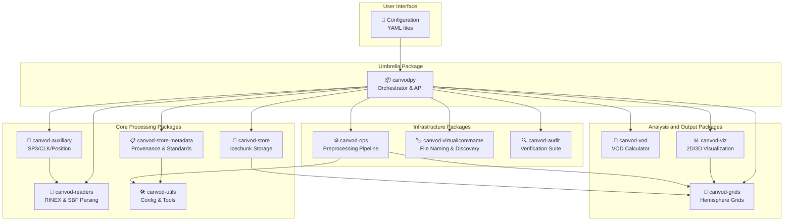
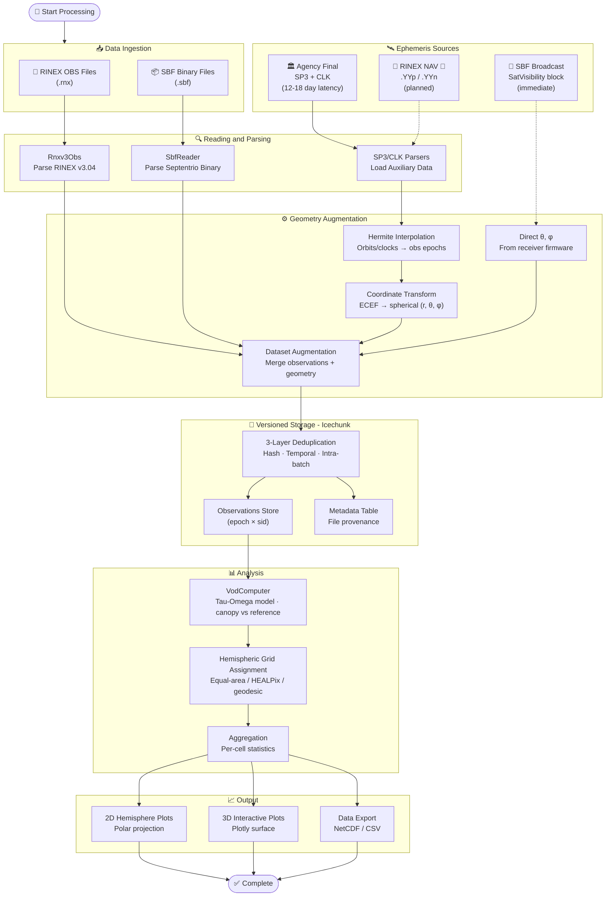
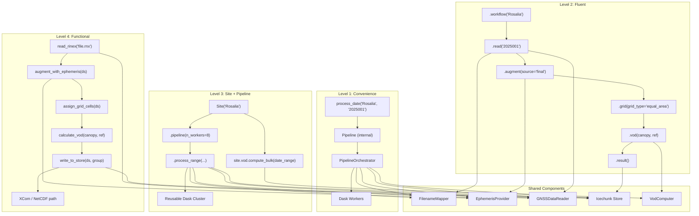

<!-- CI/CD & Quality -->
[](https://github.com/nfb2021/canvodpy/actions/workflows/test_platforms.yml)
[](https://github.com/nfb2021/canvodpy/actions/workflows/test_coverage.yml)
[](https://github.com/nfb2021/canvodpy/actions/workflows/fair-software.yml)

<!-- Python, Platforms & Package Manager -->
[](https://pypi.org/project/canvodpy/)
[](https://www.python.org/)
[](https://github.com/nfb2021/canvodpy/actions/workflows/test_platforms.yml)
[](https://github.com/astral-sh/uv)

<!-- Identity -->
[](https://doi.org/10.5281/zenodo.18496233)
[](https://opensource.org/licenses/Apache-2.0)
[](https://www.tuwien.at/en/mg/geo/climers)
[![VODnet](https://img.shields.io/badge/-VODnet-2d6a4f?labelColor=555555&logo=data:image/png;base64,iVBORw0KGgoAAAANSUhEUgAAAA4AAAAOCAYAAAAfSC3RAAAAAXNSR0IArs4c6QAAAHhlWElmTU0AKgAAAAgABAEaAAUAAAABAAAAPgEbAAUAAAABAAAARgEoAAMAAAABAAIAAIdpAAQAAAABAAAATgAAAAAAAABIAAAAAQAAAEgAAAABAAOgAQADAAAAAQABAACgAgAEAAAAAQAAAA6gAwAEAAAAAQAAAA4AAAAAjn8NzQAAAAlwSFlzAAALEwAACxMBAJqcGAAAAflJREFUKBWtUEtoE1EUPe+9SczHiam/aixtqi1E7aai4kK0CAVBDFZwrQs3xp2KIriYtiKuav3QRVxYKIjFVihWrCBIaaWioKidQBsxi3SwYmMmkxidYWaemYEEKUgRPHDhXu4575x3gf+NKfVD3UQ2u/Zv7wrLF8mPfV2ZH1ZCNIM7xUCAHHjyfN6wQ8mZo3vvE4Av57tzOjfd/WZpivfJSW5wkzvomnzFe2SFTyyU+iFJtCpk1eaRfOIw84TuRsN7kEkVMDzyEjPvUtga2YiDTRFM5+m+F8XYHMZuzDqaWlQf8yVMpmJ0/DUu9g6hVNQAy8au3W04NHAV85oFRulZS+LDkIjtWmcyHT6vQHYoXwrouTWKkv4LLOAHE4N4K6dxZ2AISl4DpawVDVrYcXSFZtTPGSV8IatjUVErJ+Cwbdstx3Vw8CG+pmQIHg+HUVlWo7aSp/qz9Kn3W5p5S/x4DJ8/lfGt4kAow7bmBpQ9fuQ3RUFtM4Uz61Qk/vijbpLbgtc61n05zjQ1hCvXHmB9fT3OnT8NOWfi+uxP0IJxE4S4jrXzxrffm1xlb75Aud/cEFmD9vYW6KaNUoUmCpS3BblUPNk45sR0UBM6Qzx2qd9LVnfqujGS+64puaX8olEuj4uMHHnc2dTrcFZGtCOMxv11KxP/kfEbTTzNcyb5ar0AAAAASUVORK5CYII=&logoColor=white)](https://vodnet.netlify.app)
<!-- [![VODnet](https://img.shields.io/badge/VODnet-GNSS--T%20network-2d6a4f?logo=data:image/png;base64,iVBORw0KGgoAAAANSUhEUgAAAA4AAAAOCAYAAAAfSC3RAAAAAXNSR0IArs4c6QAAAHhlWElmTU0AKgAAAAgABAEaAAUAAAABAAAAPgEbAAUAAAABAAAARgEoAAMAAAABAAIAAIdpAAQAAAABAAAATgAAAAAAAABIAAAAAQAAAEgAAAABAAOgAQADAAAAAQABAACgAgAEAAAAAQAAAA6gAwAEAAAAAQAAAA4AAAAAjn8NzQAAAAlwSFlzAAALEwAACxMBAJqcGAAAAflJREFUKBWtUEtoE1EUPe+9SczHiam/aixtqi1E7aai4kK0CAVBDFZwrQs3xp2KIriYtiKuav3QRVxYKIjFVihWrCBIaaWioKidQBsxi3SwYmMmkxidYWaemYEEKUgRPHDhXu4575x3gf+NKfVD3UQ2u/Zv7wrLF8mPfV2ZH1ZCNIM7xUCAHHjyfN6wQ8mZo3vvE4Av57tzOjfd/WZpivfJSW5wkzvomnzFe2SFTyyU+iFJtCpk1eaRfOIw84TuRsN7kEkVMDzyEjPvUtga2YiDTRFM5+m+F8XYHMZuzDqaWlQf8yVMpmJ0/DUu9g6hVNQAy8au3W04NHAV85oFRulZS+LDkIjtWmcyHT6vQHYoXwrouTWKkv4LLOAHE4N4K6dxZ2AISl4DpawVDVrYcXSFZtTPGSV8IatjUVErJ+Cwbdstx3Vw8CG+pmQIHg+HUVlWo7aSp/qz9Kn3W5p5S/x4DJ8/lfGt4kAow7bmBpQ9fuQ3RUFtM4Uz61Qk/vijbpLbgtc61n05zjQ1hCvXHmB9fT3OnT8NOWfi+uxP0IJxE4S4jrXzxrffm1xlb75Aud/cEFmD9vYW6KaNUoUmCpS3BblUPNk45sR0UBM6Qzx2qd9LVnfqujGS+64puaX8olEuj4uMHHnc2dTrcFZGtCOMxv11KxP/kfEbTTzNcyb5ar0AAAAASUVORK5CYII=&logoColor=white)](https://vodnet.netlify.app) -->

<!-- Trust & FAIR -->
[](https://fair-software.eu)
[](https://bestpractices.coreinfrastructure.org/projects/12329)
[](https://securityscorecards.dev/viewer/?uri=github.com/nfb2021/canvodpy)


# canVODpy

An open Python ecosystem for GNSS-Transmissometry (GNSS-T) canopy VOD retrievals. canVODpy is a community-driven software suite for deriving and analyzing Vegetation Optical Depth from GNSS signal-to-noise ratio observations.

| Toolchain                                                                                                                                                                                                                                                                                                                                                                                                                            | Scientific Stack                                                                                                                                                                                                                                                                                                                                                | Standards                                                                                                                                                                                                                           | Notebooks                                                                                  | AI                                                                                                                                           |
| ------------------------------------------------------------------------------------------------------------------------------------------------------------------------------------------------------------------------------------------------------------------------------------------------------------------------------------------------------------------------------------------------------------------------------------ | --------------------------------------------------------------------------------------------------------------------------------------------------------------------------------------------------------------------------------------------------------------------------------------------------------------------------------------------------------------- | ----------------------------------------------------------------------------------------------------------------------------------------------------------------------------------------------------------------------------------- | ------------------------------------------------------------------------------------------ | -------------------------------------------------------------------------------------------------------------------------------------------- |
| [](https://github.com/astral-sh/ruff) [](https://github.com/astral-sh/ty)[](https://github.com/casey/just) | [](https://xarray.dev/) [](https://www.dask.org/) [](https://pola.rs/)                                          | [](https://schema.datacite.org/) [](https://wiki.esipfed.org/Attribute_Convention_for_Data_Discovery_1-3) | [](https://molab.marimo.io/github/nfb2021/canvodpy) | [](https://claude.com/claude-code) |
| [](https://conventionalcommits.org)                                                                                                                                                                                                                                                             | [](https://airflow.apache.org/) [](https://docs.pydantic.dev/) [](https://icechunk.io/) | [](https://stacspec.org/) [](https://reuse.software/)                                                                 |                                                                                            |                                                                                                                                              |

---

> [!IMPORTANT]
> Development requires `uv` and `just`:
> - Install `uv`: [uv documentation](https://docs.astral.sh/uv/getting-started/installation/)
> - Install `just`: [just documentation](https://github.com/casey/just)

---

## Overview

canVODpy is organized as a monorepo with independent, composable packages:



## How it works



## Installation

```bash
uv add canvodpy

# Or install specific components
uv add canvod-readers canvod-grids
```

## Quick Start

```python
from canvodpy import process_date, calculate_vod

# Process one day: read + augment + write to Icechunk store
process_date("Rosalia", "2025001")

# Compute VOD from stored data
vod = calculate_vod("Rosalia", "canopy_01", "reference_01", "2025001")
```

Four API levels are available — from one-liners to Airflow-ready stateless functions:



See the [API Levels guide](https://nfb2021.github.io/canvodpy/guides/api-levels/) for details.

## Development Setup

```bash
# Clone repository (with submodules for demo notebooks and test data)
git clone --recurse-submodules https://github.com/nfb2021/canvodpy.git
cd canvodpy

# Verify required tools
just check-dev-tools

# Install dependencies + pre-commit hooks
uv sync
just hooks

# Run tests and code quality checks
just test
just check
```

### Common Commands

```bash
just --list              # Show all commands
just test                # Run all tests
just check               # Lint + format + type-check
just docs                # Preview documentation locally
just open-notebook NAME  # Edit a marimo notebook interactively
just app-notebook NAME   # Run a marimo notebook as read-only app
just notebooks           # List available notebooks
```

## Documentation

Full documentation is available at **[nfb2021.github.io/canvodpy](https://nfb2021.github.io/canvodpy/)**.

Key pages:

- [Getting Started](https://nfb2021.github.io/canvodpy/guides/getting-started/)
- [Architecture & Design Patterns](https://nfb2021.github.io/canvodpy/guides/architecture-design/)
- [API Levels](https://nfb2021.github.io/canvodpy/guides/api-levels/)
- [Configuration Guide](https://nfb2021.github.io/canvodpy/guides/configuration/)
- [Contributing](CONTRIBUTING.md)

## Project Structure

<details>
<summary>Directory layout</summary>

```text
canvodpy/                       # Monorepo root
├── packages/                   # Independent packages
│   ├── canvod-readers/         #   RINEX & SBF parsing
│   ├── canvod-auxiliary/       #   Ephemeris & coordinate transforms
│   ├── canvod-grids/           #   Hemispheric grid operations
│   ├── canvod-vod/             #   VOD retrieval algorithms
│   ├── canvod-store/           #   Icechunk versioned storage
│   ├── canvod-store-metadata/  #   Store provenance & compliance
│   ├── canvod-viz/             #   Visualisation
│   ├── canvod-ops/             #   Preprocessing pipeline
│   ├── canvod-utils/           #   Configuration & utilities
│   ├── canvod-virtualiconvname/#   Filename mapping
│   └── canvod-audit/           #   Three-tier verification suite
├── canvodpy/                   # Umbrella package + orchestrator
├── demo/                       # marimo notebooks (submodule)
├── config/                     # YAML configuration files
├── docs/                       # Zensical documentation
├── .github/                    # CI/CD workflows
├── CONTRIBUTORS.md             # Project contributors
├── NOTICE                      # Apache 2.0 attribution
└── LICENSE                     # Apache License 2.0
```

</details>

## AI-Assisted Development

This project uses [Claude Code](https://claude.com/claude-code) as a development and maintenance tool. The repository includes a comprehensive `CLAUDE.md` that provides the AI agent with:

- **Scientific domain knowledge** — GNSS-T, VOD, signal processing concepts
- **Architecture context** — monorepo structure, API levels, data contracts
- **15+ domain skills** — xarray, Zarr, Pydantic, pytest, marimo, and more
- **Persistent memory** — project decisions, conventions, and known issues across sessions

New contributors can run `claude` in the repo root to get an AI assistant with full project context — it can explain any module, run tests, generate diagrams, and navigate the 12-package monorepo.

## Contributing

Contributions of all kinds are welcome. See [CONTRIBUTING.md](CONTRIBUTING.md) for guidelines.

First-time contributors: add yourself to [CONTRIBUTORS.md](CONTRIBUTORS.md) in your PR.

## License

Licensed under the [Apache License 2.0](LICENSE).

This software is provided "as is" without warranty of any kind. See the
[Impressum](https://nfb2021.github.io/canvodpy/impressum/) for full legal notice
and AI disclosure.

## Affiliation

Founded by **Nicolas François Bader**

[Climate and Environmental Remote Sensing Research Unit (CLIMERS)](https://www.tuwien.at/en/mg/geo/climers)
Department of Geodesy and Geoinformation, TU Wien
