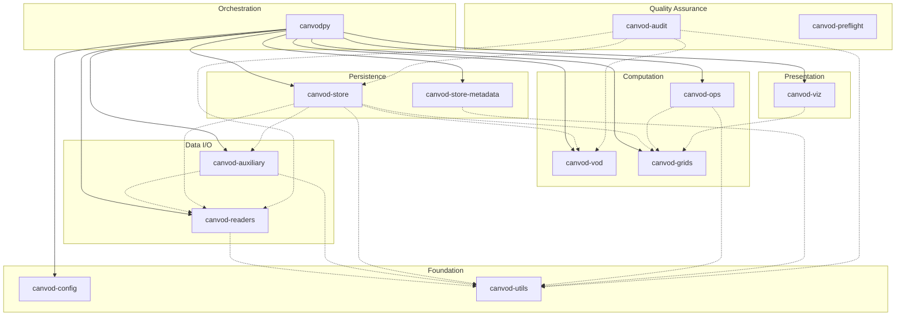
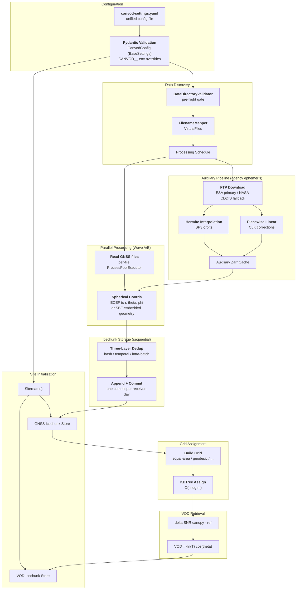

# Architecture

## Overview

canVODpy is organized as a monorepo containing twelve Python packages plus one umbrella package (`canvodpy`) for GNSS vegetation optical depth analysis. All packages reside in a single repository while maintaining technical independence: each can be developed, tested, and published separately.

!!! info "Core technologies, in plain language"

    canVODpy is built on three open-source foundations. If you are new to them:

    - **xarray** — labeled N-dimensional arrays. Think of a NumPy array where every
      dimension has a name and coordinates: instead of `data[3812, 47]` you write
      `data.sel(epoch="2025-01-01T12:00", sid="G01|L1|C")`. All canVODpy datasets
      carry two dimensions: `epoch` (observation timestamps) and `sid` (signal
      identifier, `SV|Band|Code`, e.g. `G01|L1|C` — satellite G01, band L1, tracking code C).
    - **Zarr** — chunked, compressed array storage for datasets too large for memory.
      Conceptually similar to HDF5/NetCDF, but designed for cloud object storage and
      parallel access.
    - **Icechunk** — a transactional, versioned layer on top of Zarr. Every write ends
      with a **commit**: an immutable snapshot of the entire store, exactly like a git
      commit. You can list the history, check out any past snapshot, and branch —
      so a processing mistake never destroys data, and every published result can
      cite the precise store version it was computed from. canVODpy uses the
      Icechunk v2 API (`repo.writable_session()` → write → `session.commit()`).

---

## Package Layers



| Layer | Packages | Role |
|-------|----------|------|
| **Orchestration** | canvodpy | Pipeline orchestrator, Wave A/B parallel processing, 4-level public API |
| **Computation** | canvod-vod, canvod-grids, canvod-ops | VOD retrieval (Tau-Omega model), hemispheric grids, preprocessing pipeline |
| **Persistence** | canvod-store, canvod-store-metadata | Icechunk versioned storage, three-layer deduplication, provenance metadata (DataCite/ACDD/STAC) |
| **Data I/O** | canvod-readers, canvod-auxiliary | RINEX/SBF parsing, SP3/CLK retrieval |
| **Presentation** | canvod-viz | 2D polar projections, 3D interactive surfaces, store viewer |
| **Quality Assurance** | canvod-audit, canvod-preflight | Three-tier scientific verification suite; naming convention parsing and pre-run data checks |
| **Foundation** | canvod-config, canvod-utils | Configuration loading/validation; date utilities and diagnostics |

Two more packages — `canvod-filemap` (non-canonical filename mapping) and
`canvod-airflow` (Airflow DAG definitions) — are optional and published
separately in
[canvodpy-extensions](https://github.com/nfb2021/canvodpy-extensions), not
part of this twelve-package core.

---

## Key Design Decisions

<div class="grid cards" markdown>

-   :fontawesome-solid-cubes: &nbsp; **Namespace Packages**

    ---

    All packages share the `canvod.*` namespace — a coherent import API
    backed by separate installable packages:

    ```python
    from canvod.readers import Rnxv3Obs
    from canvod.readers.sbf import SbfReader
    from canvod.grids import EqualAreaBuilder
    from canvod.vod import TauOmegaZerothOrder
    ```

    [:octicons-arrow-right-24: Namespace details](namespace-packages.md)

-   :fontawesome-solid-lock: &nbsp; **Workspace Architecture**

    ---

    One `uv sync` installs all packages in editable mode with a shared lockfile.
    Dependencies are resolved together — no version conflicts possible.

    Each package keeps its own `pyproject.toml` for independent PyPI publishing.

-   :fontawesome-solid-plug: &nbsp; **Independent Install**

    ---

    Install only what you need:

    ```bash
    pip install canvod-readers          # Readers only
    pip install canvod-grids canvod-vod # Grid + VOD
    pip install canvodpy                # Everything
    ```

-   :fontawesome-solid-sitemap: &nbsp; **Layered Dependency Graph**

    ---

    Four packages have zero inter-package dependencies
    (`canvod-utils`, `canvod-vod`, `canvod-config`,
    `canvod-preflight`). The remaining packages build on them in
    shallow layers; only the umbrella package depends on everything.

</div>

---

## Directory Structure

```
canvodpy/                           # Repository root
  packages/                         # Independent packages
    canvod-readers/
      src/
        canvod/                     # Namespace root (no __init__.py)
          readers/                  # Package code
            __init__.py

      tests/
      pyproject.toml
    canvod-auxiliary/               # Same structure
    canvod-grids/
    canvod-vod/
    canvod-store/
    canvod-store-metadata/
    canvod-viz/
    canvod-config/
    canvod-utils/
    canvod-ops/
    canvod-audit/
    canvod-preflight/
  canvodpy/                         # Umbrella package
    src/
      canvodpy/
        __init__.py                 # Re-exports all subpackages
  docs/                             # Centralized documentation
  pyproject.toml                    # uv workspace config
  uv.lock                           # Shared lockfile
  Justfile                          # Task runner
```

---

## Dependency Graph

Inter-package dependencies as declared in each package's `pyproject.toml`:

```
canvod-config           ──── no inter-package deps
canvod-preflight        ──── no inter-package deps
canvod-utils            ──── no inter-package deps
canvod-vod              ──── no inter-package deps
canvod-readers          ──── depends on canvod-config, canvod-utils
canvod-auxiliary        ──── depends on canvod-config, canvod-readers, canvod-utils
canvod-grids            ──── depends on canvod-store (workflow adapters)
canvod-store            ──── depends on canvod-auxiliary, canvod-config, canvod-grids,
                              canvod-readers, canvod-utils, canvod-vod
canvod-store-metadata   ──── depends on canvod-config
canvod-viz              ──── depends on canvod-grids
canvod-ops              ──── depends on canvod-config, canvod-grids
canvod-audit            ──── depends on canvod-readers, canvod-store,
                              canvod-utils, canvod-vod
canvodpy                ──── depends on all core packages
```

---

## Complete Processing Flow

The pipeline turns raw GNSS receiver files into gridded vegetation optical
depth. Each stage exists for a scientific reason, summarized below the diagram.



### Why each stage exists

| Stage | What it does | Why it matters scientifically |
|-------|--------------|-------------------------------|
| **Configuration** | A single `canvod-settings.yaml` is validated by `CanvodConfig`, a Pydantic `BaseSettings` model; any field can be overridden via `CANVOD__`-prefixed environment variables | Every run is fully described by one validated document — a prerequisite for reproducible processing |
| **Data discovery** | `DataDirectoryValidator` blocks runs with unrecognized or temporally overlapping files; `FilenameMapper` maps physical filenames to the IGS-style naming convention | Overlapping input files would double-count observations and bias SNR statistics; the gate makes this impossible |
| **Auxiliary pipeline** | Downloads agency orbit (SP3) and, by default, clock (CLK) products from public data centers (ESA primary, NASA CDDIS fallback), then interpolates: Hermite splines for orbits, piecewise linear for clocks | Satellite positions are needed to compute where each signal pierced the canopy (θ, φ); receivers only record *what* they saw, not *where from*. Alternatively, SBF files carry broadcast ephemeris, avoiding the download. Clock is orbit-independent and unused by the VOD formula — disable with `aux_data.fetch_clock: false` to skip its download/interpolation entirely |
| **Reading & transform** | RINEX v2/v3 or SBF files are parsed into `xarray.Dataset(epoch, sid)`; satellite ECEF positions become receiver-relative spherical coordinates (r, θ, φ) | The polar angle θ enters the VOD formula directly; azimuth φ locates the observation on the hemisphere for gridding |
| **Storage** | Datasets are appended to an Icechunk store; three deduplication layers (file-hash match, temporal overlap vs. store metadata, intra-batch overlap) guard every write; one commit per receiver-day | Duplicate epochs would corrupt the canopy/reference alignment. Each commit is an immutable, citable snapshot of the archive |
| **Grid assignment** | A hemispheric grid is built and each observation is assigned to a cell via KDTree nearest-neighbor lookup | Canopy structure varies with direction; gridding lets VOD be resolved per sky sector rather than smeared over the hemisphere |
| **VOD retrieval** | Canopy and reference SNR are aligned by (epoch, sid); transmittance T follows from their difference, and VOD = −ln(T)·cos(θ) (Tau-Omega zeroth-order model) | This is the core measurement: canopy attenuation of L-band signals, a proxy for biomass and vegetation water content |

### Parallelism model

Processing is parallelized at two levels, using only the Python standard
library — there is no distributed cluster to configure:

- **Outer level (threads):** receivers are grouped into **Wave A** (parse — one
  job per unique data directory) and **Wave B** (recompute of spherical
  coordinates from Wave A's cached results). Wave A jobs run concurrently in a
  `ThreadPoolExecutor`, one worker per receiver.
- **Inner level (processes):** within each receiver job, individual files are
  parsed in a `ProcessPoolExecutor`, giving true multi-core parallelism for the
  CPU-bound parsing work. Core budget is split between levels
  (`inner_workers = total_cores // outer_workers`).
- **Writes are sequential by design:** Icechunk on a local filesystem admits
  one writer at a time, so all receiver results are committed one after
  another — one commit per receiver-day. This serialization point is what
  guarantees the deduplication guardrails see a consistent store state.

### Hemispheric grids

`canvod-grids` provides five grid tessellations designed for hemispheric VOD
analysis — **equal-area** (ring-based, equal solid angle; the default),
**geodesic** (icosahedral subdivision), **HTM** (hierarchical triangular mesh),
**HEALPix**, and **Fibonacci** (golden-spiral + Voronoi) — plus two simple
rectangular tessellations (equal-angle, equirectangular) kept for comparison
and not recommended for analysis. Equal-area cells matter because a fixed
solid angle per cell means each cell receives a comparable observation
density, avoiding polar oversampling artifacts in VOD maps.

### API levels

Two supported surfaces, plus the CLI on top of one of them:

| Surface | Entry point | Use case |
|-------|-------------|----------|
| CLI | `canvodpy run --site ...` | Running the pipeline — recommended |
| `Site.pipeline()` (L3) | `Site(name).pipeline()` | Python-native configured pipeline runs — what the CLI wraps |
| Functional (L4) | `canvodpy.functional.*` | Pure functions for custom pipelines, testing, and analysis |

`FluentWorkflow` (L2), the flat `process_date()`/`calculate_vod()`/`preview_processing()`
functions (L1), and `VODWorkflow` are deprecated — see [API Levels](guides/api-levels.md)
for details and migration notes.

---

## Trade-offs

!!! success "Advantages"

    - Clear separation of concerns between packages
    - Users install only the components they need
    - Independent testing and development per package
    - Smaller dependency trees for individual packages

!!! warning "Costs"

    - Additional `pyproject.toml` per package
    - Developers must understand the namespace package mechanism
    - Coordinated releases required for consistent versioning

---

**Next in the trail:** [Design Principles](principles.md) · [API Levels](guides/api-levels.md) · [Contributor Setup](guides/contributor-setup.md) · [AI Development](guides/ai-development.md)
