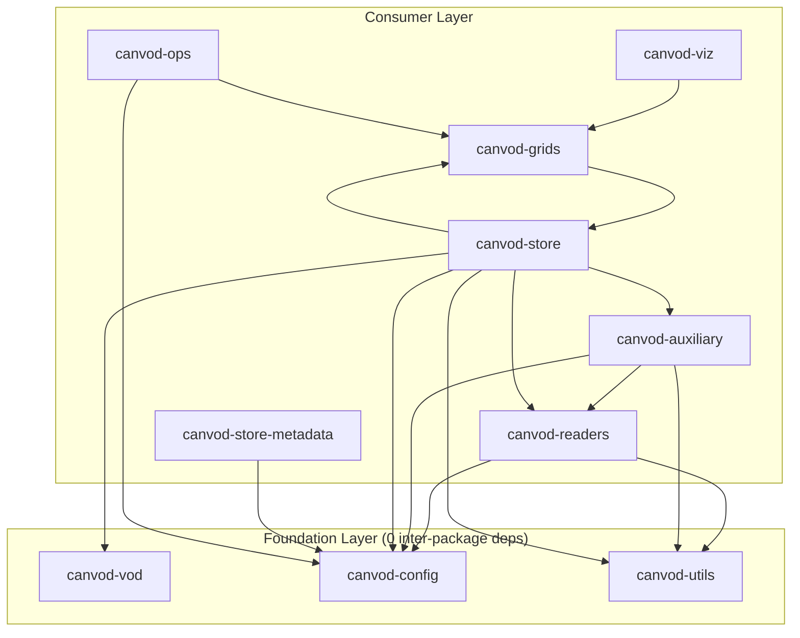

# Package Dependencies

Inter-package dependency relationships and independence metrics for the canVODpy monorepo.

---

## Dependency Graph

This covers the 10 packages `canvodpy` itself directly depends on (verified
against each package's `pyproject.toml`). `canvod-audit` and `canvod-preflight`
are separate monorepo packages `canvodpy` doesn't depend on directly, so
they're out of scope here — see [Architecture](architecture.md) for the
full twelve-package picture.



!!! warning "canvod-grids ↔ canvod-store is circular"
    `canvod-store` depends on `canvod-grids` for grid assignment, and
    `canvod-grids` depends on `canvod-store` for its `AdaptedVODWorkflow`
    store-integration adapter (see `canvod-grids/CLAUDE.md`). This is
    intentional, not a bug — but it means the dependency graph is not a
    strict DAG, and "layer" below means "closer to zero-Ce", not a strict
    topological level.

---

## Independence Metrics

| Package | Ce (deps) | Ca (dependents) | Instability | Independence |
|---------|:---------:|:---------------:|:-----------:|:------------:|
| canvod-vod | 0 | 1 | 0.00 | 1.00 |
| canvod-config | 0 | 5 | 0.00 | 1.00 |
| canvod-utils | 0 | 3 | 0.00 | 1.00 |
| canvod-grids | 1 | 3 | 0.25 | 0.90 |
| canvod-store-metadata | 1 | 0 | 1.00 | 0.90 |
| canvod-viz | 1 | 0 | 1.00 | 0.90 |
| canvod-readers | 2 | 2 | 0.50 | 0.80 |
| canvod-ops | 2 | 0 | 1.00 | 0.80 |
| canvod-auxiliary | 3 | 1 | 0.75 | 0.70 |
| canvod-store | 6 | 1 | 0.86 | 0.40 |

??? note "Metric definitions"
    - **Ce (efferent coupling)** — packages this package depends on. Lower = more independent.
    - **Ca (afferent coupling)** — packages that depend on this one. Higher = more reusable.
    - **Instability** — `Ce / (Ce + Ca)`. 0.0 = maximally stable (foundation). 1.0 = maximally unstable (leaf).
    - **Independence** — `1 − (Ce / total_packages)`. 1.0 = no inter-package dependencies.

---

## Architecture Summary

!!! warning "One circular dependency"
    - **canvod-grids ↔ canvod-store** — intentional (workflow adapters), see above
    - 3 of 10 packages (30 %) have zero inter-package dependencies: `canvod-vod`, `canvod-config`, `canvod-utils`
    - 16 total internal dependency edges
    - `canvod-config` and `canvod-utils` are the most depended-on packages (Ca = 5 and 3) — changes there have the widest blast radius

---

## Extractability

Most packages can be extracted to independent repositories with zero or minimal changes:

=== "Foundation packages"

    ```bash
    # Extract directly — no internal dependencies
    packages/canvod-vod/     → independent repo
    packages/canvod-config/  → independent repo
    packages/canvod-utils/   → independent repo
    ```

=== "Consumer packages"

    ```bash
    # Extract + add PyPI dependencies
    packages/canvod-readers/         → independent repo (+ canvod-config, canvod-utils on PyPI)
    packages/canvod-auxiliary/       → independent repo (+ canvod-config, canvod-readers, canvod-utils on PyPI)
    packages/canvod-store-metadata/  → independent repo (+ canvod-config on PyPI)
    packages/canvod-viz/             → independent repo (+ canvod-grids on PyPI)
    packages/canvod-ops/             → independent repo (+ canvod-config, canvod-grids on PyPI)
    ```

=== "Circular pair"

    ```bash
    # canvod-grids and canvod-store depend on each other — extract together,
    # or break the cycle first by moving AdaptedVODWorkflow out of canvod-grids
    packages/canvod-grids/  ─┐
    packages/canvod-store/  ─┘→ independent repo(s) (+ canvod-auxiliary,
                                 canvod-config, canvod-readers, canvod-utils,
                                 canvod-vod on PyPI)
    ```

---

## Regenerate Reports

!!! warning "Currently broken"
    `scripts/analyze_dependencies.py` and `scripts/generate_all_graphs.py`,
    which this page's numbers were originally generated from, no longer exist
    in `scripts/`. The commands below are Justfile recipes that reference
    them — they will fail until the scripts are restored. Until then, this
    page was corrected by hand against each package's `pyproject.toml`.

```bash
just deps-report    # Full metrics report (broken — see above)
just deps-mermaid   # Mermaid dependency diagram (broken — see above)
```
