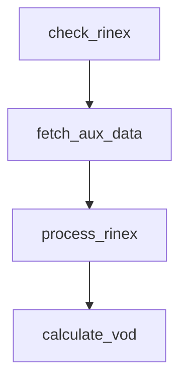

# Airflow Integration

canVODpy ships with Airflow-compatible task functions and a DAG template that automate the daily GNSS processing pipeline. One DAG is generated per configured research site.

---

## How It Works

The pipeline mirrors what `PipelineOrchestrator` does internally, but broken into four independently retriable Airflow tasks:



1. **check_rinex** — Scans the configured receiver directories for the requested date. Both canopy **and** reference must have RINEX files present (same logic as `PairDataDirMatcher`). Raises `RuntimeError` if either is missing — Airflow retries later.

2. **fetch_aux_data** — Downloads SP3 orbit and CLK clock products from public FTP servers, Hermite-interpolates ephemerides and piecewise-linear-interpolates clocks to match the RINEX sampling rate, writes to a temporary Zarr store. If products are not yet available (data too recent), the FTP download raises `RuntimeError` — Airflow retries on the next scheduled run.

3. **process_rinex** — Reads each RINEX file, augments it with satellite positions + clock offsets + spherical coordinates from the Zarr store, and writes to the site's Icechunk RINEX store. Deduplication via `"File Hash"` makes re-runs safe.

4. **calculate_vod** — Reads canopy + reference from the RINEX store, runs the `TauOmegaZerothOrder` retrieval for each active analysis pair, writes results to the VOD store.

---

## Retry-Driven Scheduling

The DAG runs **every 6 hours** with 3 retries per task. This handles two common lag scenarios:

| Scenario | Typical lag | What happens |
|----------|-------------|--------------|
| RINEX files not yet transferred | Hours | `check_rinex` fails, retried next run |
| SP3/CLK products not yet published | 1-14 days (rapid/final) | `fetch_aux_data` fails, retried next run |

Once both RINEX files and orbit/clock products are available, the full chain completes in a single run. Already-processed dates are skipped via `"File Hash"` deduplication.

!!! info "Expected failures are normal"
    `check_rinex` and `fetch_aux_data` failing on recent dates is **by design**. IGS final orbit products lag ~12-14 days, rapid products ~1 day. The DAG retries until the data appears.

---

## Directory Structure

Task functions expect the directory layout defined in `canvod-settings.yaml` under `sites:`:

```
gnss_site_data_root/              # from sites.<name>.gnss_site_data_root
├── 01_reference/                 # from receivers.reference_01.directory
│   ├── 25001/                    # YYDDD date subdirectory
│   │   ├── ROSA00TUW_R_...rnx
│   │   └── ...
│   ├── 25002/
│   └── ...
├── 02_canopy/                    # from receivers.canopy_01.directory
│   ├── 25001/
│   │   └── ROSA00TUW_R_...rnx
│   └── ...
└── (aux data stored separately via config)
```

`check_rinex` uses the same `_has_rinex_files()` function that `PairDataDirMatcher` uses — it globs for `*.??o`, `*.rnx`, `*.RNX`, and related patterns in each receiver's `YYDDD` subdirectory. A date is "ready" only when **all** configured receivers have at least one RINEX file.

---

## Task Functions

All four functions live in `canvodpy.workflows.tasks`. They accept only primitives (`str`, `dict`, `list`, `None`) and return JSON-serializable dicts suitable for Airflow XCom. Internally they delegate to existing canVODpy machinery.

```python
from canvodpy.workflows.tasks import (
    check_rinex,
    fetch_aux_data,
    process_rinex,
    calculate_vod,
)
```

### `check_rinex`

```python
result = check_rinex(site="Rosalia", yyyydoy="2025001")
# {
#     "site": "Rosalia",
#     "yyyydoy": "2025001",
#     "ready": True,
#     "receivers": {
#         "canopy_01": {"has_files": True, "files": [...], "count": 1},
#         "reference_01": {"has_files": True, "files": [...], "count": 4},
#     }
# }
```

Raises `RuntimeError` when any receiver is missing files — Airflow marks the task as failed and retries according to `retry_delay`.

---

### `fetch_aux_data`

```python
result = fetch_aux_data(site="Rosalia", yyyydoy="2025001")
# {
#     "site": "Rosalia",
#     "yyyydoy": "2025001",
#     "aux_zarr_path": "/tmp/canvod/aux_2025001.zarr",
#     "sampling_interval_s": 30.0,
#     "n_epochs": 2880,
#     "n_sids": 384,
# }
```

The sampling interval is auto-detected from the RINEX v3 long filename (e.g. `05S` = 5 s). Falls back to 30 s if detection fails.

!!! warning "FTP credentials"
    Downloads from NASA CDDIS require an Earthdata account email.
    Set `nasa_earthdata_acc_mail` in `config/.env` (preferred) or `config/canvod-settings.yaml`.
    Without it, the pipeline falls back to ESA/BKG mirrors.

---

### `process_rinex`

```python
result = process_rinex(
    site="Rosalia",
    yyyydoy="2025001",
    aux_zarr_path="/tmp/canvod/aux_2025001.zarr",
    receiver_files=rinex_info["receivers"],  # from check_rinex
)
# {
#     "site": "Rosalia",
#     "yyyydoy": "2025001",
#     "receivers_processed": ["canopy_01", "reference_01"],
#     "files_written": 5,
# }
```

Processing is **sequential within the task** — Airflow handles parallelism across sites and dates via its executor.

!!! info "Store group naming"
    Canopy receivers write to a group named after the receiver
    (e.g. `canopy_01`). Reference receivers are expanded via `scs_from`
    in the config and write to groups like `reference_01_canopy_01`.

---

### `calculate_vod`

```python
result = calculate_vod(site="Rosalia", yyyydoy="2025001")
# {
#     "site": "Rosalia",
#     "yyyydoy": "2025001",
#     "analyses": {
#         "canopy_01_vs_reference_01": {
#             "mean_vod": 0.42,
#             "std_vod": 0.15,
#             "n_epochs": 2700,
#         }
#     }
# }
```

---

## DAG Template

The file `dags/gnss_daily_processing.py` uses Airflow's TaskFlow API (`@dag` / `@task` decorators). It reads all configured sites from `canvod-settings.yaml` and creates one DAG per site, named `canvod_{site_name}`.

```python
# Simplified — see dags/gnss_daily_processing.py for the full version

rinex_info  = check_rinex(site, yyyydoy)       # fail if RINEX missing
aux_info    = fetch_aux_data(site, yyyydoy)     # fail if SP3/CLK missing
proc_info   = process_rinex(site, yyyydoy,
                            aux_info["aux_zarr_path"],
                            rinex_info["receivers"])
calculate_vod(site, yyyydoy)
```

| DAG parameter | Value | Why |
|---------------|-------|-----|
| `schedule` | `0 */6 * * *` (every 6 hours) | Retries for missing RINEX or SP3/CLK |
| `catchup` | `False` | Process only the current date |
| `max_active_runs` | `1` | Prevent parallel writes to the same Icechunk store |
| `retries` | `3` | Covers multi-day product publication delays |
| `retry_delay` | `6 hours` | Aligned with schedule interval |

---

## Deployment

### 1. Install canvodpy in the Airflow environment

```bash
uv pip install -e ./canvodpy
```

### 2. Link the DAGs directory

Copy or symlink `dags/` into Airflow's `dags_folder`:

```bash
ln -s /path/to/canvodpy/dags /path/to/airflow/dags/canvod
```

### 3. Verify configuration

The DAGs read site definitions from canvodpy's config.
Ensure `config/canvod-settings.yaml` (or the legacy trio) is accessible
from the Airflow worker. The `gnss_site_data_root` for each site must
point to the directory containing receiver subdirectories.

### 4. Set the start date

Override `start_date` in the DAG definition or set it via an Airflow
Variable.

---

## Design Decisions

<div class="grid cards" markdown>

-   :fontawesome-solid-arrows-left-right: &nbsp; **Primitive-only parameters**

    ---

    All task arguments are `str`, `dict`, `list`, or `None`. No xarray
    objects or `Path` instances cross task boundaries. XCom payloads
    stay small and JSON-serializable.

-   :fontawesome-solid-rotate: &nbsp; **Fail-and-retry for availability**

    ---

    Missing RINEX files or unavailable SP3/CLK products raise
    `RuntimeError`. Airflow retries automatically — no polling loops
    or sensor operators needed.

-   :fontawesome-solid-fingerprint: &nbsp; **Idempotent via File Hash**

    ---

    `process_rinex` checks `"File Hash"` before writing.
    Re-running the same date is a no-op. `fetch_aux_data`
    rewrites the Zarr cache. Safe to retry any task.

-   :fontawesome-solid-puzzle-piece: &nbsp; **Reuses existing code**

    ---

    Tasks call into `AuxDataPipeline`, `preprocess_with_hermite_aux`,
    and `GnssResearchSite`. The workflow layer is a thin scheduling
    wrapper — no pipeline rewrite.

</div>

---

## Running Multiple Configurations

Two processing scenarios are common:

| Scenario | Reader | Ephemeris | DAG |
|---|---|---|---|
| **a** — agency quality, delayed | RINEX | SP3/CLK (final) | `canvod_{site}_rinex` |
| **b** — same-day, broadcast geometry | SBF | SBF SatVisibility | `canvod_{site}_sbf` |

Both DAGs are generated automatically per site. To run them with **different
config files** (e.g. different store paths, observables, or ephemeris product
types), use one of the three patterns below.

---

### Option 1 — `dag_run.conf` at trigger time

Pass a `config_path` override when triggering manually.  The task functions
read it from `context["dag_run"].conf` and fall back to the default config
if absent.

```bash
# Scenario a — RINEX + final SP3/CLK
airflow dags trigger canvod_rosalia_rinex \
  --conf '{"config_path": "/etc/canvod/sites_rinex_agency.yaml"}'

# Scenario b — SBF + broadcast geometry
airflow dags trigger canvod_rosalia_sbf \
  --conf '{"config_path": "/etc/canvod/sites_sbf_broadcast.yaml"}'
```

Or via the `af` CLI:

```bash
af runs trigger canvod_rosalia_rinex \
  -F config_path=/etc/canvod/sites_rinex_agency.yaml
```

This is the simplest approach for one-off or backfill runs.

!!! info "Backfill DAG already supports conf"
    `canvod_backfill` accepts `site`, `branch`, `start_date`, and `end_date`
    as params — add `config_path` to the same `--conf` dict to backfill with
    a specific config.

---

### Option 2 — Airflow Variables (environment-level config)

Store the config path as an Airflow Variable.  This is appropriate when
an entire Airflow environment (prod / dev / staging) should always use a
specific config — no per-run override needed.

```bash
# Set once per environment
airflow variables set canvod_config_path /etc/canvod/sites_production.yaml
```

Tasks retrieve it with:

```python
from airflow.models import Variable
config_path = Variable.get("canvod_config_path", default_var=None)
```

Two Airflow deployments can point at entirely different Icechunk stores and
processing parameters without any code changes.

---

### Option 3 — DAG-level `Param` default

For a permanent two-scenario setup where each DAG always defaults to a
specific config, define `config_path` as a `Param` in the DAG definition:

```python
from airflow.models.param import Param

@dag(
    dag_id=f"canvod_{site}_rinex",
    params={
        "config_path": Param(
            default="/etc/canvod/sites_rinex_agency.yaml",
            type="string",
            description="Path to canvod-settings.yaml — override per run if needed",
        )
    },
    ...
)
def rinex_dag(): ...
```

The Airflow UI exposes `config_path` as an editable field when triggering
the DAG manually, so ad-hoc overrides remain possible without CLI flags.

---

### Config differences between scenarios

The two scenarios typically differ in these `canvod-settings.yaml` `processing.params:` fields:

```yaml
# Scenario a — RINEX + agency ephemeris
processing:
  ephemeris_source: final          # SP3/CLK, ~12-18 day lag
  keep_rnx_vars: [SNR, Pseudorange, Phase, Doppler]
  store_radial_distance: true

# Scenario b — SBF + broadcast ephemeris
processing:
  ephemeris_source: broadcast      # Embedded in SBF binary, same-day
  store_sbf_raw_observables: true  # SNR_raw, Phase_raw, Pseudorange_unsmoothed
  store_radial_distance: true
```

Separate `sites_rinex.yaml` and `sites_sbf.yaml` files can share the same
site geometry and receiver layout while differing only in the processing block.

---

## Calling Tasks Without Airflow

The task functions are plain Python functions with no Airflow dependency.
Use them directly for scripting or debugging:

```python
from canvodpy.workflows.tasks import (
    check_rinex, fetch_aux_data, process_rinex, calculate_vod,
)

rinex = check_rinex("Rosalia", "2025001")
aux   = fetch_aux_data("Rosalia", "2025001")
proc  = process_rinex("Rosalia", "2025001", aux["aux_zarr_path"],
                       rinex["receivers"])
vod   = calculate_vod("Rosalia", "2025001")
```

---

## File Layout

```
dags/
  gnss_daily_processing.py     DAG template (one DAG per site)
  README.md                    Deployment notes

canvodpy/src/canvodpy/workflows/
  __init__.py                  Re-exports task functions
  tasks.py                     check_rinex, fetch_aux_data,
                               process_rinex, calculate_vod
```
