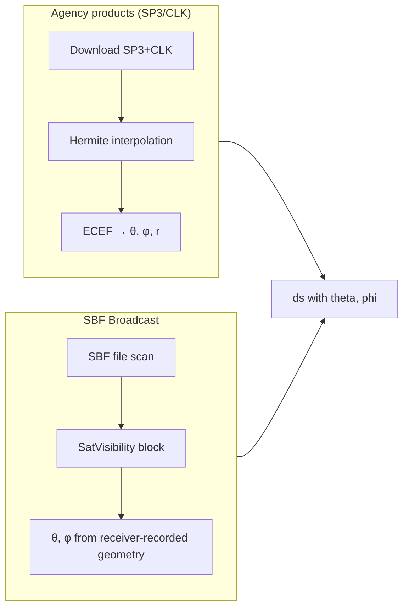
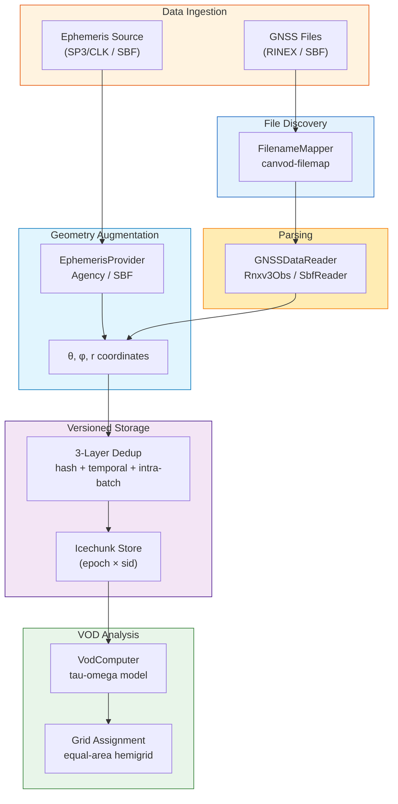

# API Levels

canvodpy exposes four API levels, each targeting a different use case. All levels
produce the same `(epoch, sid)` xarray Dataset format; they differ in how much
infrastructure they manage for you.

**Why four levels?** Scientists come to this package with very different needs.
Some want a single function call that turns a folder of RINEX files into VOD.
Others need to slot individual processing steps into their own pipeline and
inspect intermediate results along the way. Each level trades convenience for
control: Level 1 does everything automatically, Level 4 does nothing you did
not explicitly ask for. Start at Level 1 and move down only when you need to.

---

## Quick Comparison

| | L1: Convenience | L2: Fluent | L3: Objects | L4: Functional |
|---|---|---|---|---|
| **Pattern** | `process_date(...)` | `.read().augment().result()` | `site.pipeline().process_date(...)` | `read_rinex(path)` |
| **Ephemeris** | Automatic (from config) | `.augment(source=...)` | Automatic (from config) | `augment_with_ephemeris(ds, pos, ...)` |
| **Store writes** | Automatic (Icechunk) | Optional `.to_store()` | Automatic (Icechunk) | None (NetCDF / pickle files) |
| **File discovery** | FilenameMapper | FilenameMapper (glob fallback) | FilenameMapper | Caller provides paths |
| **Parallel workers** | Yes | No | Yes | No |
| **Deduplication** | 3-layer | Store guardrails on `.to_store()` | 3-layer | None |
| **Best for** | Daily cron jobs | Interactive exploration | Multi-day batch runs | Airflow / custom pipelines |

---

## Level 1: Convenience Functions

One-liner entry points that handle everything internally.

```python
from canvodpy import process_date, calculate_vod

# Process one day: read → augment → write to store
# Returns dict[str, xr.Dataset], one entry per receiver
datasets = process_date("Rosalia", "2025001")

# Compute VOD for a configured receiver pair and write it to the VOD store
vod = calculate_vod("Rosalia", "canopy_01", "reference_01", "2025001")
```

Both functions accept optional keyword arguments that override the values in
`config/processing.yaml` — for example
`process_date("Rosalia", "2025001", aux_agency="ESA", n_workers=4)`.

Internally, `process_date()` creates a `Pipeline`, discovers files via
`FilenameMapper`, reads them in parallel worker processes, downloads SP3/CLK
ephemerides, runs Hermite interpolation to obtain satellite positions,
computes theta/phi, and writes to Icechunk with 3-layer deduplication
(file hash, temporal overlap, intra-batch overlap).

There is also `preview_processing("Rosalia")`, which returns the processing
plan (dates, receivers, file counts) without executing anything.

---

## Level 2: Fluent Workflow

A *fluent* API is one where each method returns the workflow object itself,
so calls chain together like clauses in a sentence: read the data, *then*
augment it, *then* grid it, *then* compute VOD. Steps are recorded but not
executed until a terminal call (`.result()`, `.to_store()`, `.plot()`)
triggers the whole chain.

```python
import canvodpy

datasets = (
    canvodpy.workflow("Rosalia")
    .read("2025001")
    .augment(source="final")     # SP3/CLK agency ephemeris
    .result()                    # dict of per-receiver Datasets
)
```

=== "With VOD"

    ```python
    vod_ds = (
        canvodpy.workflow("Rosalia")
        .read("2025001")
        .augment(source="final")
        .grid()                          # assign hemisphere grid cells
        .vod("canopy_01", "reference_01")
        .result()                        # returns the VOD Dataset
    )
    ```

=== "Write to store"

    ```python
    (
        canvodpy.workflow("Rosalia")
        .read("2025001")
        .augment(source="final")
        .to_store()    # terminal: writes to Icechunk
    )
    ```

=== "Inspect the plan"

    ```python
    wf = (
        canvodpy.workflow("Rosalia")
        .read("2025001")
        .augment()
    )
    wf.explain()   # describes the recorded steps without executing them
    ```

!!! info "Deferred execution"

    `.read()`, `.augment()`, `.grid()`, `.vod()` do **not** execute
    immediately. They append to an internal plan. Execution happens on
    `.result()`, `.to_store()`, or `.plot()`. Use `.explain()` to inspect
    the plan without running it.

!!! warning "Ephemeris sources at Level 2"

    `.augment()` supports `source="final"` (default) and `source="rapid"`,
    both served by SP3/CLK agency products. Broadcast ephemeris is currently
    only available at Level 4 via `augment_with_ephemeris(..., source="broadcast")`
    or at Levels 1/3 via the `ephemeris_source` config option.

The workflow constructor also accepts component overrides:
`canvodpy.workflow("Rosalia", reader="rinex3", grid_type="equal_area",
vod_calculator="tau_omega")` — any name registered with the corresponding
factory works, which is how community extensions plug in.

---

## Level 3: Site and Pipeline Objects

Object-oriented API for batch processing. A `Pipeline` keeps its pool of
parallel worker processes alive across calls, so processing many days in one
run avoids repeated setup and teardown.

```python
from canvodpy import Site

site = Site("Rosalia")

with site.pipeline(n_workers=8) as pipeline:
    for date_key, datasets in pipeline.process_range("2025001", "2025007"):
        print(f"{date_key}: {sum(ds.sizes['epoch'] for ds in datasets.values())} epochs")

        # Optional: compute VOD inline for a configured analysis pair
        site.vod.compute_day(datasets, "canopy_01_vs_reference_01")
```

Level 3 is functionally identical to Level 1 — the orchestrator runs the same
code path. The difference is ergonomic: you keep the `Site` and `Pipeline`
objects around, reuse the worker pool, and get direct access to the stores.

`Site` exposes:

| Attribute / method | What it gives you |
|---|---|
| `site.receivers` / `site.active_receivers` | Configured receivers |
| `site.vod_analyses` | Configured VOD analysis pairs |
| `site.rinex_store` / `site.vod_store` | The Icechunk stores |
| `site.vod` | `VodComputer` helper (see [VOD Computation](#vod-computation)) |
| `site.pipeline(...)` | Create a `Pipeline` |

`Pipeline` exposes `process_date(date)`, `process_range(start, end)` (a
generator yielding `(date_key, datasets)`), `calculate_vod(canopy, reference,
date)`, `preview()`, and `close()`; it is also a context manager, as shown
above.

### VODWorkflow

`VODWorkflow` is a factory-based alternative to `Site` + `Pipeline` that lets
you swap individual components (reader, grid, VOD calculator) by registered
name:

```python
from canvodpy import VODWorkflow

workflow = VODWorkflow(
    site="Rosalia",
    grid="equal_area",
    grid_params={"angular_resolution": 5.0},
)
datasets = workflow.process_date("2025001")               # load → augment → grid
vod = workflow.calculate_vod("canopy_01", "reference_01", "2025001")
```

---

## Level 4: Functional API

*Functional* here means stateless: each function takes explicit inputs and
returns explicit outputs, with no hidden objects holding state between calls.
That makes the functions easy to test, easy to reason about, and safe to
compose into your own pipeline (or an Airflow DAG). The caller provides file
paths and manages all orchestration.

```python
from canvodpy.functional import read_rinex, augment_with_ephemeris, calculate_vod
from canvod.auxiliary.position.position import ECEFPosition
from canvod.utils.config import load_config

# Read a single file
ds = read_rinex("ROSA01TUW_R_20250010000_15M_05S_AA.rnx")

# Receiver position comes from the RINEX header, not from config
rx_pos = ECEFPosition.from_ds_metadata(ds)

# Add satellite geometry (downloads and caches SP3/CLK for that day)
site_cfg = load_config().sites.sites["Rosalia"]
ds = augment_with_ephemeris(
    ds,
    rx_pos,
    source="final",       # or "rapid"; "broadcast" for SBF-derived geometry
    agency="COD",
    date="2025001",
    site_config=site_cfg,
)

# Compute VOD from two augmented datasets
vod_ds = calculate_vod(canopy_ds, reference_ds)
```

!!! warning "Two functions named `calculate_vod`"

    `from canvodpy import calculate_vod` gives you the **Level 1** function
    (`site, canopy, reference, date` — reads from the store, writes to the
    store). `from canvodpy.functional import calculate_vod` gives you the
    **Level 4** function (`canopy_ds, sky_ds` — pure, in-memory). Import
    from the module that matches your intent.

=== "Grid assignment"

    ```python
    from canvodpy.functional import create_grid, assign_grid_cells

    grid = create_grid("equal_area", angular_resolution=5.0)
    ds_with_cells = assign_grid_cells(ds, grid)
    ```

=== "Airflow-ready variants"

    Every function has a `*_to_file` twin that reads/writes files and returns
    a path string, which Airflow can serialize in XCom:

    ```python
    from canvodpy.functional import (
        read_rinex_to_file,
        create_grid_to_file,
        assign_grid_cells_to_file,
        calculate_vod_to_file,
    )

    canopy = read_rinex_to_file("canopy.rnx", "/tmp/canopy.nc")
    sky = read_rinex_to_file("sky.rnx", "/tmp/sky.nc")
    vod_path = calculate_vod_to_file(canopy, sky, "/tmp/vod.nc")
    ```

    Datasets are stored as NetCDF; grids are stored as pickle
    (`create_grid_to_file` / `assign_grid_cells_to_file`).

At Level 4 file discovery is the caller's job — pass explicit paths (e.g.
from your own `Path.glob`, a workflow scheduler, or the
`canvod.filemap.FilenameMapper` if your site uses the naming
convention).

---

## Ephemeris Sources

Computing the satellite angles theta and phi requires satellite positions,
which come from an ephemeris source.

### Source comparison

| Source | What it is | Internet | Provider class |
|--------|------------|----------|----------------|
| **Agency products** (`"final"`, `"rapid"`) | Post-processed SP3 orbit + CLK clock files from an analysis centre (COD, ESA, ...), downloaded and Hermite-interpolated | Required (results cached locally) | `AgencyEphemerisProvider` |
| **SBF broadcast** (`"broadcast"`) | Satellite geometry the receiver itself recorded (SBF `SatVisibility` block) | None — embedded in the SBF file | `SbfBroadcastProvider` |

A provider for RINEX navigation files (`RinexNavProvider`) is planned but not
yet implemented.

### How each source works



### Usage across levels

```python
# Levels 1/3: config-driven (config/processing.yaml)
# processing.params.ephemeris_source: "final" | "broadcast"

# Level 2: explicit step (agency products only)
.augment(source="final")      # SP3/CLK, default
.augment(source="rapid")      # rapid SP3/CLK products

# Level 4: explicit function (all sources)
augment_with_ephemeris(ds, rx_pos, source="final", date="2025001", site_config=cfg)
augment_with_ephemeris(ds, rx_pos, source="broadcast")   # SBF only
```

### EphemerisProvider architecture

All sources implement the same abstract interface:

```python
class EphemerisProvider(ABC):
    @abstractmethod
    def augment_dataset(self, ds, receiver_position) -> xr.Dataset:
        """Add theta and phi (and optionally r) to the observation dataset."""

    @abstractmethod
    def preprocess_day(self, date, site_config) -> Path | None:
        """Download/prepare ephemeris for a day. Returns cache path or None."""
```

| Provider | `preprocess_day()` | `augment_dataset()` |
|----------|-------------------|---------------------|
| `AgencyEphemerisProvider` | Downloads SP3/CLK, Hermite interpolation → Zarr cache | Opens cache, selects epochs, computes spherical coordinates |
| `SbfBroadcastProvider` | No-op (geometry embedded in file) | Extracts theta/phi from the SBF `sbf_obs` auxiliary dataset |

---

## Data Flow Diagram



### What each level handles

| Step | L1 | L2 | L3 | L4 |
|------|:--:|:--:|:--:|:--:|
| File discovery | :fontawesome-solid-check: | :fontawesome-solid-check: | :fontawesome-solid-check: | caller |
| Reading | :fontawesome-solid-check: | :fontawesome-solid-check: | :fontawesome-solid-check: | :fontawesome-solid-check: |
| Ephemeris augmentation | auto | `.augment()` | auto | `augment_with_ephemeris()` |
| Deduplication | :fontawesome-solid-check: | store guardrails | :fontawesome-solid-check: | — |
| Store write | auto | `.to_store()` | auto | — |
| VOD computation | `calculate_vod()` | `.vod()` | `pipeline.calculate_vod()` / `site.vod` | `functional.calculate_vod()` |
| Parallel workers | :fontawesome-solid-check: | — | :fontawesome-solid-check: | — |

---

## VOD Computation

At Level 3, VOD is computed via `VodComputer` (available as `site.vod`),
which offers two strategies:

=== "Daily (inline)"

    ```python
    # Compute VOD immediately after processing, from the in-memory datasets
    with site.pipeline() as pipeline:
        for date_key, datasets in pipeline.process_range("2025001", "2025007"):
            site.vod.compute_day(datasets, "canopy_01_vs_reference_01")
    ```

=== "Bulk (from store)"

    ```python
    from datetime import datetime

    # Recompute VOD for an entire time range from the RINEX store
    site.vod.compute_bulk(
        "canopy_01_vs_reference_01",
        start=datetime(2025, 1, 1),
        end=datetime(2025, 1, 31),
    )
    ```

Both strategies share the same core: the canopy/reference pair is passed to
`VODFactory.create()`, the calculator's `calculate_vod()` runs the tau-omega
retrieval, and the result is written to the site's VOD store (pass
`write=False` to skip the store write).

---

## Choosing the Right Level

??? question "I want to process data daily as a cron job"

    **Level 1** (`process_date`) or **Level 3** (`site.pipeline()`).
    Both handle everything: file discovery, ephemeris, store writes, dedup.
    Level 3 is better if you process multiple days in one run (reuses the
    worker pool).

??? question "I want to explore data interactively in a notebook"

    **Level 2** (fluent workflow). Chain `.read().augment().result()` to get
    in-memory Datasets without side effects. Add `.grid()` and `.vod()` to
    compute VOD inline.

??? question "I want to integrate with Airflow"

    **Level 4** (functional). Use `*_to_file` variants that return path strings
    for XCom serialization. Each function is stateless.

??? question "I want to read a single file quickly"

    **Level 4**: `read_rinex("file.rnx")` or use the reader directly:
    `SbfReader(fpath="file.sbf").to_ds()`.

---

**Next in the trail:** [Quickstart](quickstart.md) · [Audit Suite](../packages/audit/overview.md) · [Architecture](../architecture.md) · [AI Development](ai-development.md)
