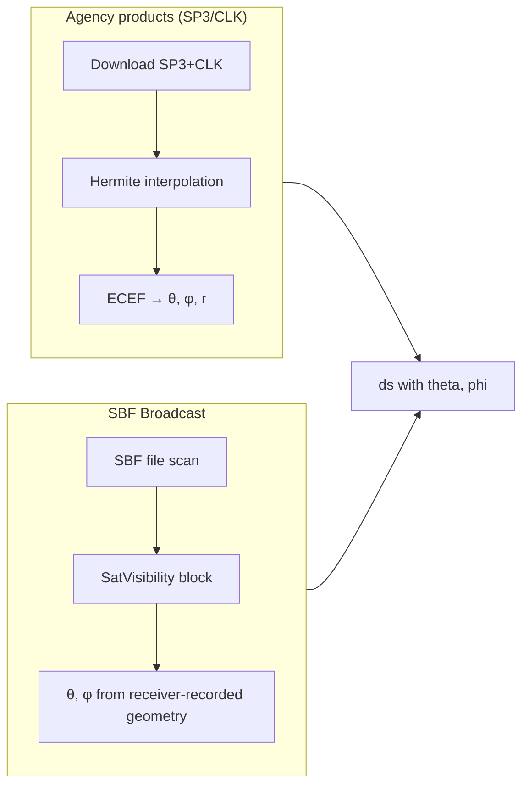
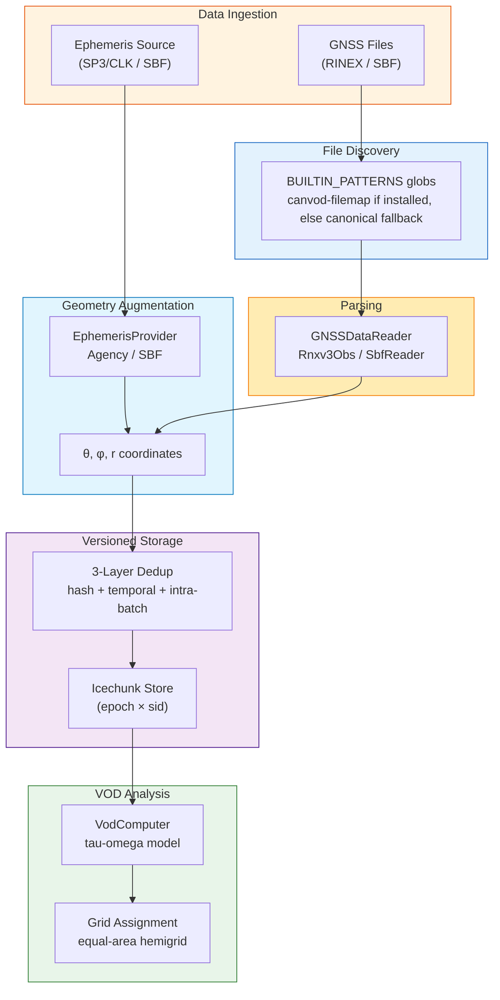

# API Levels

**Two supported surfaces, plus the CLI on top of one of them.**

- **CLI** (`canvodpy run ...`) — recommended way to run the pipeline. Wraps `Site.pipeline()`.
- **`Site.pipeline()`** (L3) — the same thing from Python, when you need to script a
  run rather than shell out (e.g. looping over sites, embedding in a notebook).
- **`canvodpy.functional`** (L4) — stateless, component-level functions for
  custom pipelines, testing, and analysis. Also what Airflow calls directly.

All three produce the same `(epoch, sid)` xarray Dataset format.

!!! warning "Deprecated surfaces"

    `FluentWorkflow` (L2), the flat convenience functions `process_date()` /
    `calculate_vod()` / `preview_processing()` (L1), and `VODWorkflow` are all
    deprecated (`DeprecationWarning` on use) — kept working, no longer taught.
    `VODWorkflow` in particular has a broken augmentation step (`_augment_data`
    is a no-op stub) and should not be used regardless. See the sections at the
    bottom of this page if you're migrating code that still uses them.

---

## Quick Comparison

| | CLI | L3: `Site.pipeline()` | L4: Functional |
|---|---|---|---|
| **Pattern** | `canvodpy run --site ... --start ... --end ...` | `site.pipeline().process_date(...)` | `read_rinex(path)` |
| **Ephemeris** | Automatic (from config) | Automatic (from config) | `augment_with_ephemeris(ds, pos, ...)` |
| **Store writes** | Automatic (Icechunk) | Automatic (Icechunk) | None (NetCDF / pickle files) |
| **File discovery** | `canvod-filemap` `BUILTIN_PATTERNS` if installed, else canonical globs (`*.rnx`/`*.sbf`) | Same as CLI | Caller provides paths |
| **Parallel workers** | Yes | Yes | No |
| **Deduplication** | 3-layer | 3-layer | None |
| **Best for** | Daily cron jobs, production runs | Multi-day batch runs from Python | Airflow / custom pipelines / analysis |

---

## CLI: Running the Pipeline

The recommended way to run the pipeline — production runs, cron jobs, resumable.
`run` is a registered subcommand of the installed `canvodpy` console script
(alongside `config`, `doctor`, `stats`, and `store` — see
[Configuration](configuration.md)):

```bash
# Process a specific range
canvodpy run --site ExampleSite --start 2025001 --end 2025007

# Process new data only — start omitted means "resume from the last
# processed date in the store", end omitted means "today"
canvodpy run --site ExampleSite

# Cron: run daily, picks up new data automatically
# 0 3 * * * cd /path/to/canvodpy && uv run canvodpy run --site ExampleSite

# Observation ingestion only, no VOD
canvodpy run --site ExampleSite --no-vod

# Preview what would be processed, without executing
canvodpy run --site ExampleSite --dry-run

# Multiple sites — repeat --site, processed sequentially
canvodpy run --site ExampleSite --site OtherSite
```

| Flag | Meaning |
|---|---|
| `--site` | Site name from `canvod-settings.yaml` (required). Repeat the flag for multiple sites. |
| `--start` / `--end` | `YYYYDOY`. Omit `--start` to resume from the store; omit `--end` for "up to today" |
| `--no-vod` | Ingest observations only, skip VOD |
| `--dry-run` | Preview the processing plan without executing |
| `--workers` | Override worker count (default: from config) |
| `--days-per-batch` | Override batch size (default: from config) |
| `--config` | Overlay YAML applied on top of `canvod-settings.yaml` |
| `--ephemeris-source` | Override the configured ephemeris source: `final` (agency SP3/CLK) or `broadcast` (SBF SatVisibility) |
| `--vod-calculator` | VOD calculator to use (currently only `tau_omega`) |

Internally the CLI builds a `Site` and calls `.pipeline(...)` — see the next
section for the exact same thing from Python.

---

## Deprecated: `FluentWorkflow` and flat convenience functions

`FluentWorkflow` (`canvodpy.workflow("ExampleSite").read(...).augment(...)...`) and
the flat `process_date()` / `calculate_vod()` / `preview_processing()` functions
are deprecated (`DeprecationWarning` on use). Both are thin wrappers around the
same `Pipeline` class the CLI and `Site.pipeline()` use — they added a second and
third syntax for identical capability without adding flexibility, so they're no
longer taught. Use the CLI or `Site.pipeline()` (next section) instead.

---

## Site and Pipeline Objects

Object-oriented API for batch processing. A `Pipeline` keeps its pool of
parallel worker processes alive across calls, so processing many days in one
run avoids repeated setup and teardown.

```python
from canvodpy import Site

site = Site("ExampleSite")

with site.pipeline(n_workers=8) as pipeline:
    for date_key, datasets in pipeline.process_range("2025001", "2025007"):
        print(f"{date_key}: {sum(ds.sizes['epoch'] for ds in datasets.values())} epochs")

        # Optional: compute VOD inline for a configured analysis pair
        site.vod.compute_day(datasets, "canopy_01_vs_reference_01")
```

This is the same code path the CLI runs — `Site.pipeline()` is what
`canvodpy.cli.run` builds internally. Use this form when you need Python-native
control: looping over sites in a script, embedding a run in a notebook, or
anything the CLI's flags don't expose yet.

`Site` exposes:

| Attribute / method | What it gives you |
|---|---|
| `site.receivers` / `site.active_receivers` | Configured receivers |
| `site.vod_analyses` | Configured VOD analysis pairs |
| `site.rinex_store` / `site.vod_store` | The Icechunk stores |
| `site.vod` | `VodComputer` helper (see [VOD Computation](#vod-computation)) |
| `site.pipeline(...)` | Create a `Pipeline` |

`Pipeline` exposes `process_date(date)`, `process_range(start, end)` (a
generator yielding `(date_key, datasets)`), `calculate_vod(canopy, reference,
date)`, `preview()`, and `close()`; it is also a context manager, as shown
above.

!!! warning "Deprecated: `VODWorkflow`"

    `VODWorkflow` was a factory-based alternative to `Site` + `Pipeline`. It is
    deprecated — its augmentation step (`_augment_data`) is a no-op stub that
    never applies ephemeris augmentation, so VOD computed through it uses
    un-augmented angles. Use `Site.pipeline()` above, or `canvodpy.functional`
    below for component-level control (reader, grid, VOD calculator all as
    direct keyword arguments).

---

## Functional API

*Functional* here means stateless: each function takes explicit inputs and
returns explicit outputs, with no hidden objects holding state between calls.
That makes the functions easy to test, easy to reason about, and safe to
compose into your own pipeline (or an Airflow DAG). The caller provides file
paths and manages all orchestration.

```python
from canvodpy.functional import read_rinex, augment_with_ephemeris, calculate_vod
from canvod.auxiliary.position.position import ECEFPosition
from canvod.config import load_config

# Read a single file
ds = read_rinex("ROSA01TUW_R_20250010000_15M_05S_AA.rnx")

# Receiver position comes from the RINEX header, not from config
rx_pos = ECEFPosition.from_ds_metadata(ds)

# Add satellite geometry (downloads and caches SP3/CLK for that day)
site_cfg = load_config().sites.sites["ExampleSite"]
ds = augment_with_ephemeris(
    ds,
    rx_pos,
    source="final",       # or "rapid"; "broadcast" for SBF-derived geometry
    agency="COD",
    date="2025001",
    site_config=site_cfg,
)

# Compute VOD from two augmented datasets
vod_ds = calculate_vod(canopy_ds, reference_ds)
```

!!! warning "Two functions named `calculate_vod`"

    `from canvodpy import calculate_vod` gives you the **deprecated** flat
    function (`site, canopy, reference, date` — reads from the store, writes
    to the store; use `Site(site).pipeline().calculate_vod(...)` instead).
    `from canvodpy.functional import calculate_vod` gives you the
    **functional API** version (`canopy_ds, sky_ds` — pure, in-memory). Import
    from the module that matches your intent.

=== "Grid assignment"

    ```python
    from canvodpy.functional import create_grid, assign_grid_cells

    grid = create_grid("equal_area", angular_resolution=5.0)
    ds_with_cells = assign_grid_cells(ds, grid)
    ```

=== "Airflow-ready variants"

    Every function has a `*_to_file` twin that reads/writes files and returns
    a path string, which Airflow can serialize in XCom:

    ```python
    from canvodpy.functional import (
        read_rinex_to_file,
        create_grid_to_file,
        assign_grid_cells_to_file,
        calculate_vod_to_file,
    )

    canopy = read_rinex_to_file("canopy.rnx", "/tmp/canopy.nc")
    sky = read_rinex_to_file("sky.rnx", "/tmp/sky.nc")
    vod_path = calculate_vod_to_file(canopy, sky, "/tmp/vod.nc")
    ```

    Datasets are stored as NetCDF; grids are stored as pickle
    (`create_grid_to_file` / `assign_grid_cells_to_file`).

With the functional API, file discovery is the caller's job — pass explicit
paths (e.g. from your own `Path.glob`, a workflow scheduler, or the optional
`canvod.filemap.FilenameMapper` if your site uses non-canonical filenames —
see [Optional Extensions](extensions.md)).

---

## Ephemeris Sources

Computing the satellite angles theta and phi requires satellite positions,
which come from an ephemeris source.

### Source comparison

| Source | What it is | Internet | Provider class |
|--------|------------|----------|----------------|
| **Agency products** (`"final"`, `"rapid"`) | Post-processed SP3 orbit + CLK clock files from an analysis centre (COD, ESA, ...), downloaded and Hermite-interpolated | Required (results cached locally) | `AgencyEphemerisProvider` |
| **SBF broadcast** (`"broadcast"`) | Satellite geometry the receiver itself recorded (SBF `SatVisibility` block) | None — embedded in the SBF file | `SbfBroadcastProvider` |

A provider for RINEX navigation files (`RinexNavProvider`) is planned but not
yet implemented.

### How each source works



### Usage across levels

```python
# CLI / Site.pipeline(): config-driven (canvod-settings.yaml)
# processing.params.ephemeris_source: "final" | "broadcast"
# Not yet a CLI flag — see the note in the CLI section above.

# canvodpy.functional: explicit function (all sources)
augment_with_ephemeris(ds, rx_pos, source="final", date="2025001", site_config=cfg)
augment_with_ephemeris(ds, rx_pos, source="broadcast")   # SBF only
```

### EphemerisProvider architecture

All sources implement the same abstract interface:

```python
class EphemerisProvider(ABC):
    @abstractmethod
    def augment_dataset(self, ds, receiver_position) -> xr.Dataset:
        """Add theta and phi (and optionally r) to the observation dataset."""

    @abstractmethod
    def preprocess_day(self, date, site_config) -> Path | None:
        """Download/prepare ephemeris for a day. Returns cache path or None."""
```

| Provider | `preprocess_day()` | `augment_dataset()` |
|----------|-------------------|---------------------|
| `AgencyEphemerisProvider` | Downloads SP3/CLK, Hermite interpolation → Zarr cache | Opens cache, selects epochs, computes spherical coordinates |
| `SbfBroadcastProvider` | No-op (geometry embedded in file) | Extracts theta/phi from the SBF `sbf_obs` auxiliary dataset |

---

## Data Flow Diagram



### What each surface handles

| Step | CLI | `Site.pipeline()` | Functional |
|------|:--:|:--:|:--:|
| File discovery | :fontawesome-solid-check: | :fontawesome-solid-check: | caller |
| Reading | :fontawesome-solid-check: | :fontawesome-solid-check: | :fontawesome-solid-check: |
| Ephemeris augmentation | auto | auto | `augment_with_ephemeris()` |
| Deduplication | :fontawesome-solid-check: | :fontawesome-solid-check: | — |
| Store write | auto | auto | — |
| VOD computation | `pipeline.calculate_vod()` | `pipeline.calculate_vod()` / `site.vod` | `functional.calculate_vod()` |
| Parallel workers | :fontawesome-solid-check: | :fontawesome-solid-check: | — |

---

## VOD Computation

VOD is computed via `VodComputer` (available as `site.vod`), which offers two
strategies:

=== "Daily (inline)"

    ```python
    # Compute VOD immediately after processing, from the in-memory datasets
    with site.pipeline() as pipeline:
        for date_key, datasets in pipeline.process_range("2025001", "2025007"):
            site.vod.compute_day(datasets, "canopy_01_vs_reference_01")
    ```

=== "Bulk (from store)"

    ```python
    from datetime import datetime

    # Recompute VOD for an entire time range from the RINEX store
    site.vod.compute_bulk(
        "canopy_01_vs_reference_01",
        start=datetime(2025, 1, 1),
        end=datetime(2025, 1, 31),
    )
    ```

Both strategies share the same core: the canopy/reference pair is passed to
`VODFactory.create()`, the calculator's `calculate_vod()` runs the tau-omega
retrieval, and the result is written to the site's VOD store (pass
`write=False` to skip the store write).

---

## Choosing the Right Surface

??? question "I want to process data daily as a cron job"

    **CLI**: `canvodpy run --site ExampleSite`. Omit `--start`
    and it resumes from the last processed date in the store automatically.

??? question "I want to script a multi-day batch run from Python"

    **`Site.pipeline()`**: `site.pipeline(n_workers=8)`, then
    `pipeline.process_range(start, end)`. Reuses the worker pool across days,
    gives direct access to the stores.

??? question "I want to explore data or do custom analysis in a notebook"

    **Functional API**: `read_rinex()`, `augment_with_ephemeris()`,
    `create_grid()`, `calculate_vod()` — stateless, in-memory, no side effects.

??? question "I want to integrate with Airflow"

    **Functional API**. Use `*_to_file` variants that return path strings
    for XCom serialization. Each function is stateless.

??? question "I want to read a single file quickly"

    **Functional API**: `read_rinex("file.rnx")` or use the reader directly:
    `SbfReader(fpath="file.sbf").to_ds()`.

---

**Next in the trail:** [Quickstart](quickstart.md) · [Audit Suite](../packages/audit/overview.md) · [Architecture](../architecture.md) · [AI Development](ai-development.md)
