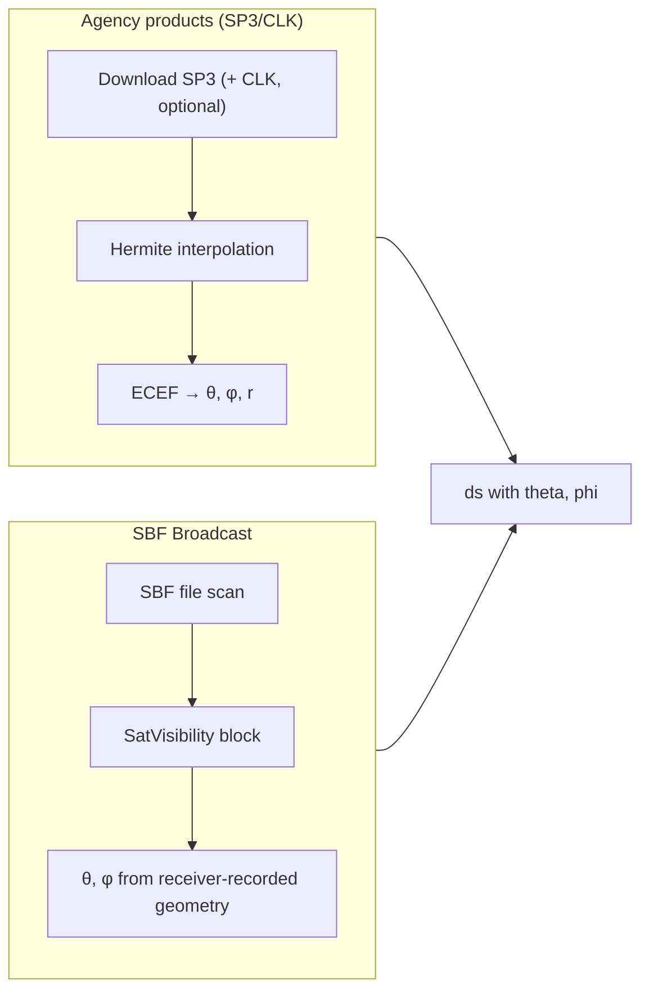
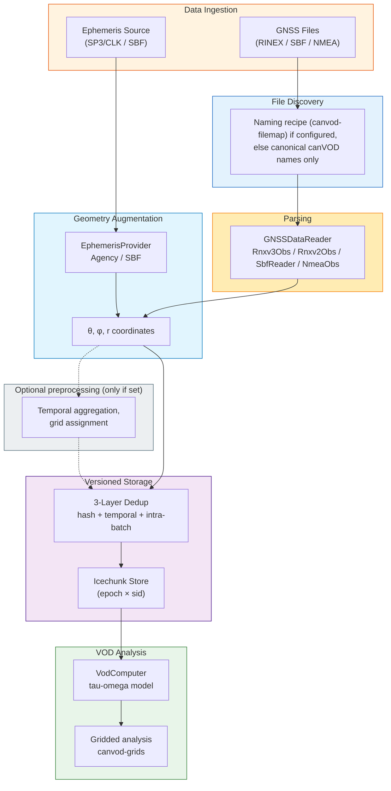

# API Levels

**One supported way to process data, from the terminal or from Python.**

- **CLI** (`canvodpy run ...`) — recommended way to run the pipeline. Wraps `Site.pipeline()`.
- **`Site.pipeline()`** (L3) — the same thing from Python, when you need to script a
  run rather than shell out (e.g. looping over sites, embedding in a notebook).

Both produce the same results.

!!! warning "Deprecated surfaces"

    `FluentWorkflow` (L2), the flat convenience functions `process_date()` /
    `calculate_vod()` / `preview_processing()` (L1), `VODWorkflow`, and the
    single-step functions of `canvodpy.functional` (L4) are all deprecated
    (`FutureWarning` on use). They are left over from development, still work,
    and will be removed with the next major version. `VODWorkflow` in
    particular has a broken augmentation step (`_augment_data` is a no-op
    stub) and should not be used regardless. See the sections below if you're
    migrating code that still uses them.

---

## Quick Comparison

| | CLI | L3: `Site.pipeline()` |
|---|---|---|
| **Pattern** | `canvodpy run --site ... --start ... --end ...` | `site.pipeline().process_date(...)` |
| **Ephemeris** | Automatic (from config) | Automatic (from config) |
| **Store writes** | Automatic (Icechunk) | Automatic (Icechunk) |
| **File discovery** | Naming recipe (`canvod-filemap`) if configured, else canonical canVOD names only | Same as CLI |
| **Parallel workers** | Yes | Yes |
| **Deduplication** | 3-layer | 3-layer |
| **Best for** | Daily cron jobs, production runs | Multi-day batch runs from Python |

---

## CLI: Running the Pipeline

The recommended way to run the pipeline — production runs, cron jobs, resumable.
`run` is a registered subcommand of the installed `canvodpy` console script
(alongside `config`, `doctor`, and `store` — see
[Configuration](configuration.md)):

```bash
# Process a specific range
canvodpy run --site ExampleSite --start 2025001 --end 2025007

# Process new data only — start omitted means "resume from the last
# processed date in the store", end omitted means "today"
canvodpy run --site ExampleSite

# Cron: run daily, picks up new data automatically
# 0 3 * * * cd /path/to/canvodpy && uv run canvodpy run --site ExampleSite

# Observation ingestion only, no VOD
canvodpy run --site ExampleSite --no-vod

# Preview what would be processed, without executing
canvodpy run --site ExampleSite --dry-run

# Multiple sites — repeat --site, processed sequentially
canvodpy run --site ExampleSite --site OtherSite
```

| Flag | Meaning |
|---|---|
| `--site` | Site name from `canvod-settings.yaml` (required). Repeat the flag for multiple sites. |
| `--start` / `--end` | `YYYYDOY`. Omit `--start` to resume from the store; omit `--end` for "up to today" |
| `--no-vod` | Ingest observations only, skip VOD |
| `--dry-run` | Preview the processing plan without executing |
| `--workers` | Override worker count (default: from config) |
| `--days-per-batch` | Override batch size (default: from config) |
| `--config-dir` | Folder with `canvod-settings.yaml` and `recipes/` (default: `config/` of a canvodpy checkout, else `~/.config/canvodpy`) |
| `--config` | Overlay YAML applied on top of `canvod-settings.yaml` |
| `--ephemeris-source` | Override the configured ephemeris source: `final` (agency SP3/CLK) or `broadcast` (SBF SatVisibility) |
| `--vod-calculator` | VOD calculator to use (currently only `tau_omega`) |
| `--dashboard` | Also start the performance dashboard for the run's logs |

Internally the CLI builds a `Site` and calls `.pipeline(...)` — see the next
section for the exact same thing from Python.

---

## Deprecated: `FluentWorkflow` and flat convenience functions

`FluentWorkflow` (`canvodpy.workflow("ExampleSite").read(...).augment(...)...`) and
the flat `process_date()` / `calculate_vod()` / `preview_processing()` functions
are deprecated (`FutureWarning` on use): left over from development, removed with
the next major version. Use the CLI or `Site.pipeline()` (next section) instead.

---

## Site and Pipeline Objects

Object-oriented API for batch processing. A `Pipeline` keeps its pool of
parallel worker processes alive across calls, so processing many days in one
run avoids repeated setup and teardown.

```python
from canvodpy import Site

site = Site("ExampleSite")

with site.pipeline(n_workers=8) as pipeline:
    for date_key, datasets in pipeline.process_range("2025001", "2025007"):
        print(f"{date_key}: {sum(ds.sizes['epoch'] for ds in datasets.values())} epochs")

        # Optional: compute VOD inline for a configured analysis pair
        site.vod.compute_day(datasets, "canopy_01_vs_reference_01")
```

This is the same code path the CLI runs — `Site.pipeline()` is what
`canvodpy.cli.run` builds internally. Use this form when you need Python-native
control: looping over sites in a script, embedding a run in a notebook, or
anything the CLI's flags don't expose yet.

`Site` exposes:

| Attribute / method | What it gives you |
|---|---|
| `site.receivers` / `site.active_receivers` | Configured receivers |
| `site.vod_analyses` | Configured VOD analysis pairs |
| `site.gnss_store` / `site.vod_store` | The Icechunk stores (observations, VOD) |
| `site.vod` | `VodComputer` helper (see [VOD Computation](#vod-computation)) |
| `site.pipeline(...)` | Create a `Pipeline` |

`Pipeline` exposes `process_date(date)`, `process_range(start, end)` (a
generator yielding `(date_key, datasets)`), `preview()`, and `close()`; it is
also a context manager, as shown above. `Pipeline.calculate_vod()` is
deprecated; use `site.vod` (see [VOD Computation](#vod-computation)).

!!! warning "Deprecated: `VODWorkflow`"

    `VODWorkflow` was a factory-based alternative to `Site` + `Pipeline`. It is
    deprecated — its augmentation step (`_augment_data`) is a no-op stub that
    never applies ephemeris augmentation, so VOD computed through it uses
    un-augmented angles. Use `Site.pipeline()` above.

---

## Deprecated: `canvodpy.functional`

!!! warning "Deprecated: `canvodpy.functional`"

    The single-step functions `read_rinex()`, `augment_with_ephemeris()`,
    `create_grid()`, `assign_grid_cells()`, `calculate_vod()` and their
    `*_to_file` twins are left over from development and will be removed with
    the next major version. They are no longer maintained, and some give
    different results than `canvodpy run`:

    - `read_rinex()` reads without the configured observables and signals.
    - `calculate_vod()` skips the configured VOD output options.

    Use `canvodpy run` or `Site.pipeline()` to process data, and `site.vod`
    to compute VOD. For grids, use `canvod.grids.create_hemigrid()` and
    `canvod.grids.add_cell_ids_to_ds_fast()`.

    Note that `from canvodpy import calculate_vod` is a different deprecated
    function (it reads from and writes to the stores); use
    `Site(site).vod.compute_bulk(...)` instead.

---

## Ephemeris Sources

Computing the satellite angles theta and phi requires satellite positions,
which come from an ephemeris source.

### Source comparison

| Source | What it is | Internet | Provider class |
|--------|------------|----------|----------------|
| **Agency products** (`"final"`) | Post-processed SP3 orbit files from an analysis centre (COD, ESA, ...), downloaded and Hermite-interpolated; CLK clock files too, by default (`aux_data.fetch_clock`, unused by VOD, can be disabled) | Required (results cached locally) | `AgencyEphemerisProvider` |
| **SBF broadcast** (`"broadcast"`) | Satellite geometry the receiver itself recorded (SBF `SatVisibility` block); only angles computed from the broadcast ephemeris are used, almanac-based ones become NaN | None — embedded in the SBF file | `SbfBroadcastProvider` |

A provider for RINEX navigation files (`RinexNavProvider`) is planned but not
yet implemented.

### How each source works


```mermaid
flowchart LR
    subgraph Agency["Agency products (SP3/CLK)"]
        A1["Download SP3 (+ CLK, optional)"] --> A2[Hermite interpolation]
        A2 --> A3["ECEF → θ, φ, r"]
    end

    subgraph SBF["SBF Broadcast"]
        B1["SBF file scan"] --> B2["SatVisibility block"]
        B2 --> B3["θ, φ from receiver-recorded geometry"]
    end

    Agency --> DS["ds with theta, phi"]
    SBF --> DS
```

### Usage across levels

Set it in the settings (`processing.params.ephemeris_source: final` or
`broadcast`), or for one run with `canvodpy run --ephemeris-source`.

### EphemerisProvider architecture

All sources implement the same abstract interface:

```python
class EphemerisProvider(ABC):
    @abstractmethod
    def augment_dataset(self, ds, receiver_position) -> xr.Dataset:
        """Add theta and phi (and optionally r) to the observation dataset."""

    @abstractmethod
    def preprocess_day(self, date, site_config) -> Path | None:
        """Download/prepare ephemeris for a day. Returns a cache directory or None."""
```

| Provider | `preprocess_day()` | `augment_dataset()` |
|----------|-------------------|---------------------|
| `AgencyEphemerisProvider` | Downloads and reads SP3 (+ CLK, unless `fetch_clock=False`) | Interpolates the day onto the grid at the dataset's sampling interval (Hermite, once per interval, written to Zarr), takes the nearest grid epoch for each observation, computes spherical coordinates |
| `SbfBroadcastProvider` | No-op (geometry embedded in file) | Extracts theta/phi from the SBF `sbf_obs` auxiliary dataset |

---

## Data Flow Diagram


```mermaid
flowchart TD
    subgraph Input["Data Ingestion"]
        FILES["GNSS Files<br/>(RINEX / SBF / NMEA)"]
        EPHEM["Ephemeris Source<br/>(SP3/CLK / SBF)"]
    end

    subgraph Discovery["File Discovery"]
        FM["Naming recipe (canvod-filemap) if configured,<br/>else canonical canVOD names only"]
    end

    subgraph Reading["Parsing"]
        READER["GNSSDataReader<br/>Rnxv3Obs / Rnxv2Obs / SbfReader / NmeaObs"]
    end

    subgraph Augmentation["Geometry Augmentation"]
        EP["EphemerisProvider<br/>Agency / SBF"]
        SCS["θ, φ, r coordinates"]
    end

    subgraph Prep["Optional preprocessing (only if set)"]
        PRE["Temporal aggregation,<br/>grid assignment"]
    end

    subgraph Storage["Versioned Storage"]
        ICE["Icechunk Store<br/>(epoch × sid)"]
        DEDUP["3-Layer Dedup<br/>hash + temporal + intra-batch"]
    end

    subgraph Analysis["VOD Analysis"]
        VOD["VodComputer<br/>tau-omega model"]
        GRID["Gridded analysis<br/>canvod-grids"]
    end

    FILES --> FM --> READER
    EPHEM --> EP --> SCS
    READER --> SCS
    SCS -.-> PRE -.-> DEDUP
    SCS --> DEDUP --> ICE
    ICE --> VOD --> GRID

    style Input fill:#fff3e0,stroke:#e65100
    style Discovery fill:#e3f2fd,stroke:#1565c0
    style Reading fill:#ffecb3,stroke:#f57c00
    style Augmentation fill:#e1f5fe,stroke:#0277bd
    style Prep fill:#eceff1,stroke:#546e7a
    style Storage fill:#f3e5f5,stroke:#4a148c
    style Analysis fill:#e8f5e9,stroke:#2e7d32
```

### What each surface handles

| Step | CLI | `Site.pipeline()` |
|------|:--:|:--:|
| Optional preprocessing (if set) | auto | auto |
| File discovery | :fontawesome-solid-check: | :fontawesome-solid-check: |
| Reading | :fontawesome-solid-check: | :fontawesome-solid-check: |
| Ephemeris augmentation | auto | auto |
| Deduplication | :fontawesome-solid-check: | :fontawesome-solid-check: |
| Store write | auto | auto |
| VOD computation | auto | `site.vod` |
| Parallel workers | :fontawesome-solid-check: | :fontawesome-solid-check: |

---

## VOD Computation

VOD is computed via `VodComputer` (available as `site.vod`), which offers two
strategies:

=== "Daily (inline)"

    ```python
    # Compute VOD immediately after processing, from the in-memory datasets
    with site.pipeline() as pipeline:
        for date_key, datasets in pipeline.process_range("2025001", "2025007"):
            site.vod.compute_day(datasets, "canopy_01_vs_reference_01")
    ```

=== "Bulk (from store)"

    ```python
    from datetime import datetime

    # Recompute VOD for an entire time range from the RINEX store
    site.vod.compute_bulk(
        "canopy_01_vs_reference_01",
        start=datetime(2025, 1, 1),
        end=datetime(2025, 1, 31),
    )
    ```

Both strategies share the same core: the canopy/reference pair is passed to
`VODFactory.create()`, the calculator's `calculate_vod()` runs the tau-omega
retrieval, and the result is written to the site's VOD store (pass
`write=False` to skip the store write).

---

## Choosing the Right Surface

??? question "I want to process data daily as a cron job"

    **CLI**: `canvodpy run --site ExampleSite`. Omit `--start`
    and it resumes from the last processed date in the store automatically.

??? question "I want to script a multi-day batch run from Python"

    **`Site.pipeline()`**: `site.pipeline(n_workers=8)`, then
    `pipeline.process_range(start, end)`. Reuses the worker pool across days,
    gives direct access to the stores.

??? question "I want to integrate with Airflow"

    Use the canvod-airflow extension. Its DAGs call `check_day` and
    `process_day` from `canvodpy.workflows.tasks`, which run the code of
    `canvodpy run` for one site and day (see [Optional Extensions](extensions.md)).
    The older per-format tasks (`process_rinex`, `process_sbf`, ...) are
    deprecated.

??? question "I want to read a single file quickly"

    Use the reader directly: `SbfReader(fpath="file.sbf").to_ds()`.

---

**Next in the trail:** [Configuration](configuration.md) · [Users guide](../users/index.md) · [Architecture](../architecture.md)

---

!!! example "Try it"
    [12 — API Overview](../notebooks/_build/12_api_overview.html){target=_blank}
    ([source](https://molab.marimo.io/github/nfb2021/canvodpy-demo/blob/main/12_api_overview.py))
    · [14 — Site Pipeline](../notebooks/_build/14_site_pipeline.html){target=_blank}
    ([source](https://molab.marimo.io/github/nfb2021/canvodpy-demo/blob/main/14_site_pipeline.py))
    · [16 — Single-Day Workflow](../notebooks/_build/16_workflow_single_day.html){target=_blank}
    ([source](https://molab.marimo.io/github/nfb2021/canvodpy-demo/blob/main/16_workflow_single_day.py))
