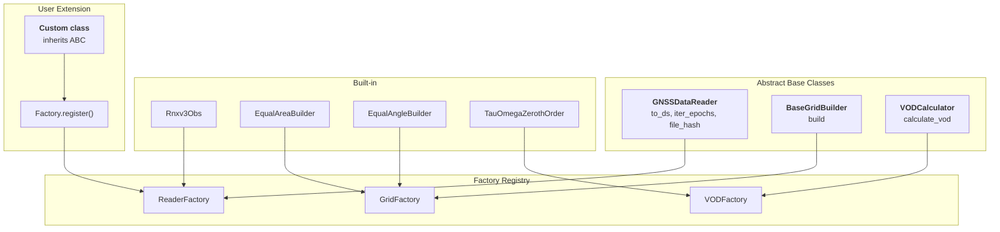
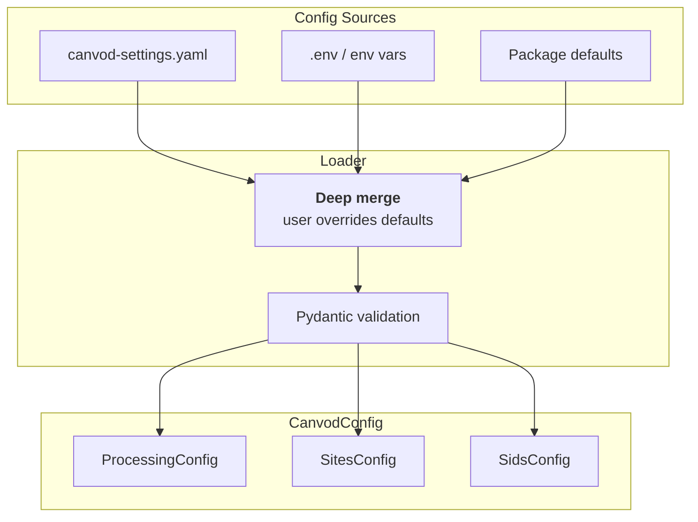

# Architecture and Design Patterns

This page documents the design principles and extensibility patterns used throughout canVODpy.

---

## Design Principles

<div class="grid cards" markdown>

-   :fontawesome-solid-cubes: &nbsp; **Modularity**

    ---

    Independent packages with minimal coupling.
    Install only what you need; replace only what you must.

-   :fontawesome-solid-puzzle-piece: &nbsp; **Extensibility**

    ---

    ABC + Factory pattern throughout. Add a custom reader, grid,
    or VOD algorithm in < 50 lines — no framework internals to understand.

-   :fontawesome-solid-shield-halved: &nbsp; **Type Safety**

    ---

    Modern Python type hints + Pydantic validation at every boundary.
    Errors surface at construction time, not during analysis.

-   :fontawesome-solid-microscope: &nbsp; **Scientific Focus**

    ---

    Explicit over implicit. Reproducible by default — every dataset
    is traceable to a config version, file hash, and Icechunk snapshot ID.

</div>

---

## The Sollbruchstellen Principle

canVODpy applies the engineering concept of *Sollbruchstellen* (predetermined breaking points): packages are designed to be independent so they can be used separately or replaced without affecting the rest of the system.

```
Foundation (0 inter-package dependencies):
  canvod-readers, canvod-grids, canvod-vod, canvod-utils,
  canvod-filemap

Consumer (1–2 dependencies each):
  canvod-auxiliary      → canvod-readers
  canvod-viz            → canvod-grids
  canvod-store          → canvod-grids
  canvod-store-metadata → canvod-utils
  canvod-ops            → canvod-grids, canvod-utils

Orchestration:
  canvodpy              → all packages
```

---

## ABC + Factory Pattern



### Registration + Usage

```python
from pydantic import ConfigDict
from canvodpy import ReaderFactory
from canvod.readers import GNSSDataReader
from canvod.readers.builder import DatasetBuilder

class MyLabReader(GNSSDataReader):
    """GNSSDataReader is a Pydantic BaseModel + ABC — one parent is enough."""

    model_config = ConfigDict(frozen=True)
    # fpath is inherited from GNSSDataReader — no need to redeclare

    def to_ds(self, keep_data_vars=None, **kwargs) -> xr.Dataset:
        builder = DatasetBuilder(self)
        for epoch in self.iter_epochs():
            ei = builder.add_epoch(epoch.timestamp)
            for obs in epoch.observations:
                sig = builder.add_signal(sv=obs.sv, band=obs.band, code=obs.code)
                builder.set_value(ei, sig, "SNR", obs.snr)
        return builder.build(keep_data_vars=keep_data_vars)

    # ... implement remaining abstract methods ...

# Register once (at import time)
ReaderFactory.register("mylab_v1", MyLabReader)

# Use anywhere
reader = ReaderFactory.create("mylab_v1", fpath=path)
ds = reader.to_ds()
```

---

## Unified API Surface

canvodpy exposes two supported surfaces, plus the CLI on top of one of them —
all backed by the same packages. See [API Levels](api-levels.md) for full
detail; `FluentWorkflow`, the flat `process_date()`/`calculate_vod()`/
`preview_processing()` functions, and `VODWorkflow` are deprecated.

=== "CLI — Running the Pipeline"

    ```bash
    canvodpy run --site ExampleSite --start 2025001 --end 2025007
    ```

=== "Site.pipeline() — Python-native"

    ```python
    from canvodpy import Site

    site = Site("ExampleSite")
    with site.pipeline(n_workers=8) as pipeline:
        for date_key, datasets in pipeline.process_range("2025001", "2025007"):
            site.vod.compute_day(datasets, "canopy_01_vs_reference_01")
    ```

=== "Functional — Component-level scripting"

    ```python
    from canvodpy.functional import read_rinex, augment_with_ephemeris, calculate_vod

    ds = read_rinex("ROSA01TUW_R_20250010000_15M_05S_AA.rnx")
    ds = augment_with_ephemeris(ds, rx_pos, source="final", date="2025001", site_config=cfg)
    vod_ds = calculate_vod(canopy_ds, reference_ds)
    ```

=== "Direct Package Access — lowest level"

    Bypassing the orchestrator entirely; used internally by all three surfaces
    above.

    ```python
    from canvod.readers import Rnxv3Obs
    from canvod.grids   import EqualAreaBuilder
    from canvod.vod     import TauOmegaZerothOrder

    reader = Rnxv3Obs(fpath=Path("station.25o"))
    ds = reader.to_ds(keep_data_vars=["SNR"])
    ```

---

## Configuration Management



```python
from canvod.config import load_config

cfg = load_config()
cfg.processing.aux_data.nasa_earthdata_acc_mail
cfg.processing.storage.stores_root_dir
```

```bash
canvodpy config init      # Scaffold canvod-settings.yaml from template
canvodpy config validate  # Validate current config
canvodpy config show      # Print resolved config
```

---

## Provenance and Reproducibility

Every dataset produced by canVODpy is fully traceable:

!!! success "Full provenance chain"
    | Field | Source |
    |-------|--------|
    | `ds.attrs["File Hash"]` | SHA-256 of raw input file |
    | `ds.attrs["Software"]` | `canvod-readers x.y.z` |
    | `ds.attrs["Created"]` | ISO 8601 timestamp |
    | Icechunk snapshot ID | Hash-addressable, immutable |
    | Config version | Committed alongside code |

---

## Airflow / Distributed Execution

Level 1 API functions are stateless and suitable for distributed scheduling:

```python
from airflow.decorators import task

@task
def process_rinex_task(file_path: str, date: str) -> str:
    from canvodpy import read_rinex
    obs = read_rinex(file_path, date)
    obs.to_zarr(f"/data/obs_{date}.zarr")
    return f"/data/obs_{date}.zarr"
```

Factory registration happens at module import time — each worker process has access to all registered implementations automatically.
