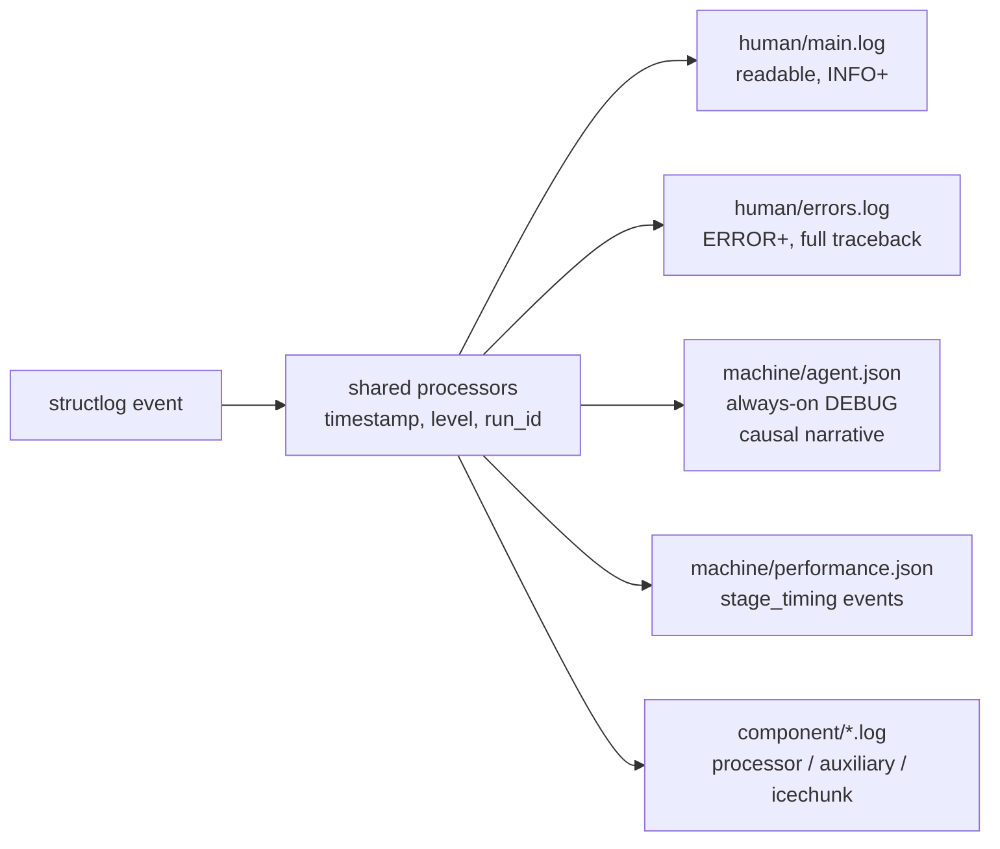

# Diagnostics & Performance Monitoring

canvodpy runs unattended on remote machines — a cron job, a scheduler, a
headless server with no one watching. When something goes wrong there, the
log files written during that run are the only forensic evidence that will
ever exist: there is no re-run, no debugger, no live system to inspect
after the fact. This page describes canvodpy's logging and lightweight
performance-tracking infrastructure, built around that constraint.

!!! note "Superseded content"
    This page previously described `canvod.utils.diagnostics` — a
    SQLite/StatsD/Airflow-metrics module that has been removed (it
    accumulated unused backends nobody exercised). Everything below
    describes what actually exists today.

---

## Two tracks: human and agent

Every log record is written to two purpose-built tracks, plus a couple of
narrower supporting files, all under `.logs/` (or wherever
`processing.logging.get_log_file()` points):



| File | Purpose | Level |
|---|---|---|
| `human/main.log` | Traditional readable text, for a person tailing a run | INFO+ |
| `human/errors.log` | Full stack traces for errors only | ERROR+ |
| `machine/agent.json` | **Always-on** curated JSON causal narrative — the file to hand to an AI agent (or read yourself) for root-cause diagnosis | DEBUG |
| `machine/performance.json` | Timing events (`stage_timing`, plus any event carrying `duration_seconds`) | — |
| `component/{processor,auxiliary,icechunk}.log` | Per-component readable logs | DEBUG |

`machine/agent.json` is deliberately **always on**, never gated behind a
debug flag — on a remote run there is no way to retroactively enable debug
logging after a failure, so it has to already be capturing everything.

Every log record — from any package, any process — automatically carries
the current `run_id` once one is bound (see below), so a human or an agent
can grep a single identifier across every file this run touched.

Multi-process note: each non-main process (a `ProcessPoolExecutor`/loky
worker) gets its own per-PID-suffixed files (`agent.<pid>.json`, etc.) —
`RotatingFileHandler`/`TimedRotatingFileHandler` aren't safe to share across
processes, so rather than coordinate rotation, each process just gets its
own file set.

---

## `run_id`: correlating a single pipeline invocation

```python
from canvodpy.logging import get_run_id, set_run_id, reset_run_id
```

A `run_id` identifies one pipeline invocation for one site — format
`{site}-{YYYYMMDD-HHMMSS}` (e.g. `ExampleSite-20260713-143022`), chosen to
be legible and grep-able over a UUID. The CLI (`canvodpy run`) generates one
automatically per site in a multi-site invocation (`--site A --site B`
gets two independent run_ids — failures are site-scoped, and this keeps
correlation with Icechunk commits, which are also per-site-store, clean).

It's a `contextvars.ContextVar`, so it's bound automatically into every
structlog event via a processor — no call site needs to pass it explicitly.
Contextvars don't cross process boundaries, so worker processes
(`ProcessPoolExecutor`/loky) receive it explicitly at startup via
`initializer`/`initargs` (see `_worker_init_with_run_id` in
`canvodpy.orchestrator.processor`).

It also gets appended to Icechunk commit messages (`(run={run_id})`), so
you can correlate a specific commit with the exact run that wrote it —
across the log files *and* the data.

```python
token = set_run_id("ExampleSite-20260713-143022")
try:
    ...  # process the site
finally:
    reset_run_id(token)
```

---

## Crash handling — logs are the only evidence

Two complementary safety nets guarantee that an uncaught exception is
logged before the process dies, whether it happens in the main process or
a worker:

1. **`sys.excepthook`** (installed in `configure_logging()`): catches
   anything that escapes all other handling in the main process, logs a
   structured `uncaught_exception` event with the full traceback and
   current `run_id`, then chains to the default hook (console output for
   attended sessions is unchanged).
2. **A top-level try/except around each site's processing loop** in
   `cli/run.py`: has access to state `sys.excepthook` can't reconstruct
   after the stack unwinds — the last successfully processed date, which
   stage it was in (`pipeline_process`, `vod_calc`, `vod_store`, ...). Logs
   a `run_crashed` event with that context, then **re-raises** — a
   swallowed crash that silently "succeeds" is worse than a visible
   nonzero exit.
3. **Worker-process failures** (`ProcessPoolExecutor`): existing
   `fut.result()` call sites log a `worker_task_failed` event with the
   task's metadata (date, receiver) before failure handling proceeds, with
   a distinct `worker_pool_broken` event for `BrokenProcessPool` (the
   worker process itself died — OOM, segfault — a different failure class
   than an exception raised inside a task).

Degraded-but-not-crashed states are first-class logged events too, not
just buried warnings: `file_skipped`, `vod_failed`,
`clock_interpolation_skipped`, and similar — so `machine/agent.json` gives
a reconstructable causal narrative even for a run that finished but took a
degraded path.

---

## `stage_timer` — a simplified performance tracker

Deliberately **not** full telemetry: no spans, no collectors, no
exporters, no extra dependency. `canvodpy.utils.telemetry` (an
OpenTelemetry-based tracer) was removed because `opentelemetry` was never
actually installed anywhere in this repo — every span was silently a
no-op. `stage_timer` replaces it, plus the previously ragged mix of field
names (`duration_seconds`, `processing_time_min`, ...) some call sites used.

```python
from canvodpy.logging import stage_timer, timed_stage, emit_run_summary

with stage_timer("icechunk.write", group=group_name, size_mb=12.4):
    to_icechunk(dataset, session, group=group_name)

@timed_stage("rinex.process_file")
def process_one(path):
    ...
```

Emits exactly one event, `stage_timing`, on both success and failure
(`status="ok"`/`"error"`) — on exception, it still emits before
re-raising, so a partial summary exists even for a run that later crashes.
`machine/performance.json` picks these up automatically (it also still
picks up any pre-existing event that carries its own `duration_seconds`
field under a more specific event name — e.g.
`ephemeris_interpolation_complete` — those are deliberately detailed,
named events, not a ragged convention needing consolidation).

`emit_run_summary()` rolls up all `stage_timing` events accumulated for the
current `run_id` into one `run_summary` event — per-stage count, total
seconds, error count. Called at the end of a successful site run, and also
from the crash-handling path (showing whatever stages completed before the
crash). `reset_run_stats(run_id)` clears the in-process accumulator
afterward so a long-lived multi-site invocation doesn't grow it unbounded.

Caveat: the accumulator is per-process. `stage_timer` calls made inside a
`ProcessPoolExecutor`/loky worker land in that worker's own per-PID log
file, but won't roll into the parent process's `run_summary` — solving
that would require exactly the cross-process collector machinery this
module exists to avoid.

The per-file RINEX pipeline emits `stage_timing` for four sub-stages —
`reading`, `validating`, `augmenting`, `writing` — each tagged with
`receiver` and `date_key`, specifically so the performance dashboard (next
section) can break down both "what part of the current iteration is slow"
and "elapsed time per receiver per day" from the same file.

---

## Live performance dashboard

```bash
canvodpy dashboard                    # read-only app view
canvodpy dashboard --edit             # marimo's interactive editor
canvodpy dashboard --logs-dir /path/to/.logs
```

A marimo notebook (`canvodpy/cli/dashboards/performance.py`) that reads
`machine/performance*.json` and shows two views: a per-stage breakdown for
the most recently completed (receiver, date) unit of work, and total
elapsed time per receiver × day across the whole run. Click the refresh
button to reload — works equally well pointed at a run still in progress
(partial data) or a finished one. No new data format: it's the same
`stage_timing` JSONL `stage_timer()` already writes, read directly with
polars — not a separate telemetry backend.

---

## Reading `machine/agent.json` after a failure

The whole point: this file alone should be enough to answer "what
happened?" without re-running anything.

```bash
# Everything for one run, in order
grep '"run_id": "ExampleSite-20260713-143022"' .logs/machine/agent.json

# Just the crash / uncaught exception
grep -E '"event": "(run_crashed|uncaught_exception|worker_task_failed|worker_pool_broken)"' \
    .logs/machine/agent.json

# How far did it get before dying?
grep '"event": "run_summary"' .logs/machine/agent.json
```

Each line is a self-contained JSON object — pipe through `jq` for
formatting, or hand the whole grep'd slice to an LLM for triage.

---

!!! example "Try it"
    [11 — Configuration](../notebooks/_build/11_configuration.html){target=_blank}
    · [view source on molab](https://molab.marimo.io/github/nfb2021/canvodpy-demo/blob/main/11_configuration.py)
