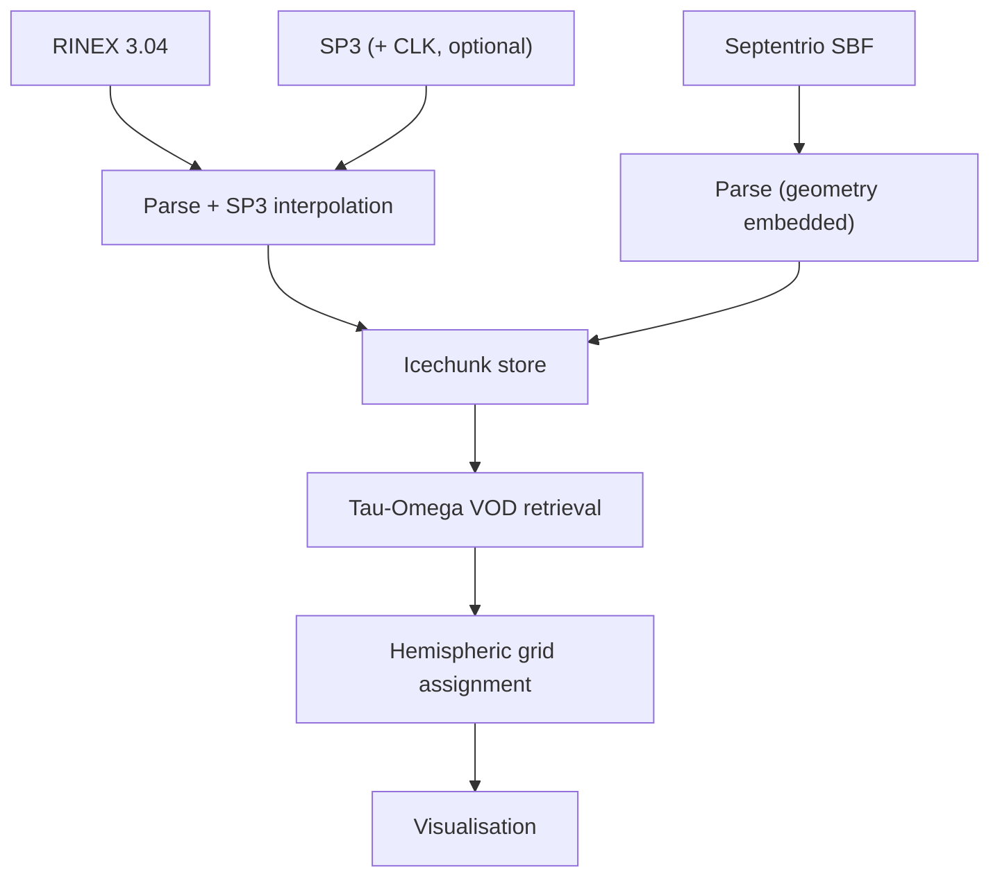

<div class="hero" markdown>

# canVODpy

**An Open Python Ecosystem for GNSS-Transmissometry Canopy VOD Retrievals**

canVODpy aims to be the central community-driven software suite for deriving
and analyzing canopy [Vegetation Optical Depth](https://gsics.nesdis.noaa.gov/wiki/Development/ReferenceDocuments){:target="_blank"} (VOD) from [GNSS](https://gssc.esa.int/navipedia/index.php/GNSS){:target="_blank"}
signal-to-noise ratio observations.

[](https://doi.org/10.5281/zenodo.19445061)
[](https://pypi.org/project/canvodpy/)
[](https://opensource.org/licenses/Apache-2.0)
[](https://fair-software.eu)
[](https://bestpractices.coreinfrastructure.org/projects/12329)
[](https://securityscorecards.dev/viewer/?uri=github.com/nfb2021/canvodpy)
[![VODnet](https://img.shields.io/badge/-VODnet-2d6a4f?labelColor=555555&logo=data:image/png;base64,iVBORw0KGgoAAAANSUhEUgAAAA4AAAAOCAYAAAAfSC3RAAAAAXNSR0IArs4c6QAAAHhlWElmTU0AKgAAAAgABAEaAAUAAAABAAAAPgEbAAUAAAABAAAARgEoAAMAAAABAAIAAIdpAAQAAAABAAAATgAAAAAAAABIAAAAAQAAAEgAAAABAAOgAQADAAAAAQABAACgAgAEAAAAAQAAAA6gAwAEAAAAAQAAAA4AAAAAjn8NzQAAAAlwSFlzAAALEwAACxMBAJqcGAAAAflJREFUKBWtUEtoE1EUPe+9SczHiam/aixtqi1E7aai4kK0CAVBDFZwrQs3xp2KIriYtiKuav3QRVxYKIjFVihWrCBIaaWioKidQBsxi3SwYmMmkxidYWaemYEEKUgRPHDhXu4575x3gf+NKfVD3UQ2u/Zv7wrLF8mPfV2ZH1ZCNIM7xUCAHHjyfN6wQ8mZo3vvE4Av57tzOjfd/WZpivfJSW5wkzvomnzFe2SFTyyU+iFJtCpk1eaRfOIw84TuRsN7kEkVMDzyEjPvUtga2YiDTRFM5+m+F8XYHMZuzDqaWlQf8yVMpmJ0/DUu9g6hVNQAy8au3W04NHAV85oFRulZS+LDkIjtWmcyHT6vQHYoXwrouTWKkv4LLOAHE4N4K6dxZ2AISl4DpawVDVrYcXSFZtTPGSV8IatjUVErJ+Cwbdstx3Vw8CG+pmQIHg+HUVlWo7aSp/qz9Kn3W5p5S/x4DJ8/lfGt4kAow7bmBpQ9fuQ3RUFtM4Uz61Qk/vijbpLbgtc61n05zjQ1hCvXHmB9fT3OnT8NOWfi+uxP0IJxE4S4jrXzxrffm1xlb75Aud/cEFmD9vYW6KaNUoUmCpS3BblUPNk45sR0UBM6Qzx2qd9LVnfqujGS+64puaX8olEuj4uMHHnc2dTrcFZGtCOMxv11KxP/kfEbTTzNcyb5ar0AAAAASUVORK5CYII=&logoColor=white)](https://www.gfz.de/en/section/remote-sensing-and-geoinformatics/projects/vodnet)

[Get started retrieving VOD :fontawesome-solid-arrow-right:](guides/quickstart.md){ .md-button .md-button--primary }
[Get started contributing to the ecosystem :fontawesome-solid-arrow-right:](CONTRIBUTING.md){ .md-button }

</div>

---

## What makes canVODpy different

<div class="grid cards" markdown>


-   :fontawesome-solid-stamp: &nbsp; **No more breaking code - multi-reader support and GNSS data validation**

    ---

    Supports RINEX v2.11, RINEX v3.04, Stripped RINEX v3.05, NMEA v4 and Septentrio SBF. Every supported GNSS reader produces a strcuturally identical xarray Dataset
    that passes structural and content validation at run-time. Downstream code is reader-agnostic.

    [:octicons-arrow-right-24: Reader Architecture](packages/readers/architecture.md)


-   :fontawesome-solid-layer-group: &nbsp; **Single unified & validated dataset format**

    ---

    Every supported GNSS reader produces a strcuturally identical xarray Dataset
    that passes structural and content validation at run-time. Downstream code is reader-agnostic.

    [:octicons-arrow-right-24: Reader Architecture](packages/readers/architecture.md)

-   :fontawesome-solid-database: &nbsp; **Versioned, performant storage, ready for the cloud**

    ---

    Icechunk let's you manage xarray Datasets of your entire network like a database and gives every write a git-like commit snapshot. Scroll through your commit history, branch off into development branches and create immutable tags for releases. Local-storage first, but S3-ready with full write-concurrency when you are.

    [:octicons-arrow-right-24: Storage Engine](packages/store/overview.md)

-   :fontawesome-solid-globe: &nbsp; **Hemispheric grid system**

    ---

    Different hemispheric tessellations (equal-area, equal-angle, geodesic, ...) defined in 3D, enabling full spatial analyses. Supports  KDTree cell assignment and interactive data exploration.

    [:octicons-arrow-right-24: canvod-grids](packages/grids/overview.md)


-   :fontawesome-solid-rotate: &nbsp; **Fully parallel processing**

    ---

    Per default, all file reading and processign is natively parallelized. Sw

    [:octicons-arrow-right-24: Architecture](architecture.md)

</div>

---

## Supported receiver formats

<div class="grid" markdown>

!!! success "RINEX v3.04"

    Text-based standard format from all manufacturers.
    Satellite geometry computed from precise [SP3](https://gssc.esa.int/navipedia/index.php/SP3){:target="_blank"} [ephemerides](https://gssc.esa.int/navipedia/index.php/Precise_GNSS_Orbits){:target="_blank"} (CLK clock corrections fetched too, by default — optional).

    **Reader:** `Rnxv3Obs` — all GNSS constellations, all bands

!!! success "Septentrio Binary Format (SBF)"

    Binary format from [Septentrio](https://www.septentrio.com){:target="_blank"} receivers. Includes [broadcast ephemerides](https://gssc.esa.int/navipedia/index.php/Broadcast_Orbits){:target="_blank"}
    (SatVisibility blocks) for standalone satellite geometry — no SP3/CLK
    download required.

    **Reader:** `SbfReader` — all GNSS constellations, PVT + DOP metadata

</div>

---

## Quick Start

```bash
pip install canvodpy
```

=== "CLI — running the pipeline"

    Recommended for production runs; resumes automatically:

    ```bash
    canvodpy run --site ExampleSite --start 2025001 --end 2025007
    ```

=== "Site.pipeline() — Python-native"

    Same thing, scripted from Python:

    ```python
    from canvodpy import Site

    site = Site("ExampleSite")
    with site.pipeline() as pipeline:
        data = pipeline.process_date("2025001")
        vod = pipeline.calculate_vod("canopy_01", "reference_01", "2025001")
    ```

=== "Functional — component-level"

    Stateless functions for custom pipelines, Airflow, and analysis:

    ```python
    from canvodpy.functional import read_rinex, augment_with_ephemeris, calculate_vod

    ds = read_rinex("ROSA01TUW_R_20250010000_15M_05S_AA.rnx")
    ds = augment_with_ephemeris(ds, rx_pos, source="final", date="2025001", site_config=cfg)
    vod = calculate_vod(canopy_ds, reference_ds)
    ```

---

## Processing Pipeline



---

## Packages

<div class="grid cards" markdown>

-   :fontawesome-solid-book-open: &nbsp; **canvod-readers**

    ---

    RINEX v3.04 parsing with signal ID mapping.
    Unified `(epoch × sid)` output with full validation.

-   :fontawesome-solid-cloud-arrow-down: &nbsp; **canvod-auxiliary**

    ---

    SP3 ephemeris (and optional CLK clock) retrieval.
    Hermite spline interpolation, FTP fallback chain.

-   :fontawesome-solid-border-all: &nbsp; **canvod-grids**

    ---

    7 hemispheric grid types — equal-area, geodesic, HTM and more.
    KDTree-backed O(n log m) cell assignment.

-   :fontawesome-solid-leaf: &nbsp; **canvod-vod**

    ---

    VOD estimation via zeroth-order tau-omega model.
    Extensible `VODCalculator` ABC.

-   :fontawesome-solid-database: &nbsp; **canvod-store**

    ---

    Icechunk versioned storage with per-file hash deduplication.
    S3-compatible backends, ACID commits.

-   :fontawesome-solid-chart-line: &nbsp; **canvod-viz**

    ---

    2D polar hemisphere plots and 3D interactive Plotly surfaces.

-   :fontawesome-solid-sliders: &nbsp; **canvod-config**

    ---

    YAML configuration loading with Pydantic validation, XDG-aware
    defaults, and bundled templates.

-   :fontawesome-solid-gear: &nbsp; **canvod-utils**

    ---

    YYYYDOY date utilities, processing diagnostics, shared tooling.

-   :fontawesome-solid-circle-check: &nbsp; **canvod-preflight**

    ---

    Pre-flight validation of data directories against the canVOD
    naming convention. Hard gate before ingestion.

-   :fontawesome-solid-tag: &nbsp; **canvod-filemap** *(optional)*

    ---

    Virtual renaming engine for non-standard receiver filenames
    (Septentrio SBF, RINEX v2 short names). Lives in the separate
    [canvodpy-extensions](https://github.com/nfb2021/canvodpy-extensions)
    repo — see [Optional Extensions](guides/extensions.md).

-   :fontawesome-solid-wind: &nbsp; **canvod-airflow** *(optional)*

    ---

    Airflow DAG definitions (daily SBF/RINEX/SBF-agency + backfill) for
    canvodpy pipelines. Also lives in
    [canvodpy-extensions](https://github.com/nfb2021/canvodpy-extensions) —
    see [Optional Extensions](guides/extensions.md).

-   :fontawesome-solid-wand-magic-sparkles: &nbsp; **canvod-ops**

    ---

    Configurable preprocessing pipeline: temporal aggregation,
    grid assignment, extensible Op chain.

-   :fontawesome-solid-stamp: &nbsp; **canvod-store-metadata**

    ---

    Store-level provenance (DataCite, ACDD, STAC), compliance validation,
    inventory builder, STAC catalog export.

-   :fontawesome-solid-flask: &nbsp; **canvod-audit**

    ---

    Three-tier verification suite: internal consistency, regression
    snapshots, and comparison against reference implementations.

-   :fontawesome-solid-circle-nodes: &nbsp; **canvodpy**

    ---

    Umbrella package — CLI, `Site.pipeline()`, functional API, factory system.

</div>

---

## Technology

<div class="grid" markdown>

!!! abstract "Scientific stack"

    `xarray` · `NumPy` · `SciPy` · `Polars`

!!! abstract "Storage"

    `Icechunk` · `Zarr` · S3-compatible

!!! abstract "Code quality"

    `ruff` · `ty` · `pytest` · `uv`

!!! abstract "Documentation"

    `Zensical` · `beautiful-mermaid` · `marimo` notebooks

!!! abstract "AI-assisted development"

    [`Claude Code`](guides/ai-development.md) · 15+ domain skills · persistent memory · `CLAUDE.md`

</div>

---

## Affiliation

**Climate and Environmental Remote Sensing Research Unit (CLIMERS)**
Department of Geodesy and Geoinformation, TU Wien

[tuwien.at/en/mg/geo/climers](https://www.tuwien.at/en/mg/geo/climers){ .md-button }
