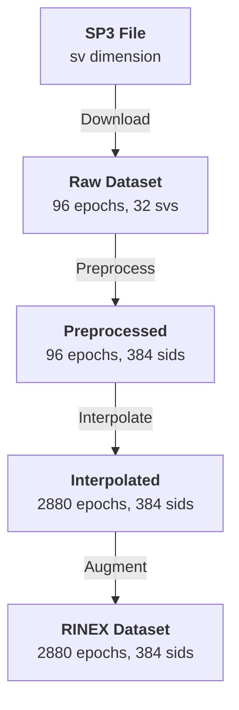

# canvod-auxiliary

## Purpose

The `canvod-auxiliary` package provides auxiliary data management for [GNSS Transmissometry](https://gssc.esa.int/navipedia/index.php/GNSS){:target="_blank"} (GNSS-T) analysis. It handles downloading, parsing, preprocessing, and interpolating [SP3 ephemerides](https://gssc.esa.int/navipedia/index.php/SP3){:target="_blank"} to augment RINEX observation data with precise satellite positions. By default it also fetches CLK [clock corrections](https://gssc.esa.int/navipedia/index.php/Precise_Satellite_Clocks){:target="_blank"}, though these are unused by the VOD formula and can be skipped via `aux_data.fetch_clock: false`.

---

## The Dimension Alignment Problem

GNSS-T analysis requires combining two data sources with fundamentally different indexing:

<div class="grid" markdown>

!!! abstract "RINEX Observations"

    - High temporal resolution: 30 s, 15 s, or sub-second
    - Signal-level indexing by SID: `"G01|L1|C"`
    - Dimensions: `(epoch: 2880, sid: 384)`

!!! abstract "SP3 / CLK Auxiliary"

    - Low temporal resolution: 5–15 min
    - Satellite-level indexing by SV: `"G01"`
    - Dimensions: `(epoch: 96, sv: 32)`
    - CLK is optional (`aux_data.fetch_clock`, default `true`) — SP3 is always required

</div>

Combining these requires:

1. **Dimension conversion** — sv (32 satellites) → sid (384 signal IDs)
2. **Temporal interpolation** — 15 min → the observations' sampling interval, on a grid from 00:00
3. **Coordinate transform** — ECEF → geodetic → spherical (r, θ, φ)
4. **Physically correct interpolation** per data type



---

## Interpolation Strategies

Different data types require different methods based on the underlying physics:

<div class="grid cards" markdown>

-   :fontawesome-solid-circle-nodes: &nbsp; **SP3 — Hermite Cubic Splines**

    ---

    Satellite orbital motion is smooth and predictable.
    Hermite splines exploit available velocity data for C1-continuity
    and sub-millimetre interpolation accuracy.

    ```python
    config = Sp3Config(use_velocities=True, fallback="linear")
    strategy = Sp3InterpolationStrategy(config=config)
    ```

-   :fontawesome-solid-clock: &nbsp; **CLK — Piecewise Linear**

    ---

    Clock corrections may have discontinuities from satellite maneuvers
    and uploads. No derivative information is available.
    Piecewise linear interpolation handles these jumps safely.

    ```python
    config = ClkConfig(window_size=9, jump_threshold=1e-6)
    strategy = ClockInterpolationStrategy(config=config)
    ```

</div>

---

## Key Components

<div class="grid cards" markdown>

-   :fontawesome-solid-file-arrow-down: &nbsp; **File Handlers**

    ---

    `Sp3File` — SP3a/c/d format: positions (X, Y, Z) + velocities (VX, VY, VZ)

    `ClkFile` — RINEX clock format: satellite clock biases

    `ProductSpec` — Declarative config for URLs, latency, and auth

-   :fontawesome-solid-arrows-rotate: &nbsp; **Preprocessing**

    ---

    `prep_aux_ds()` — Full 4-step pipeline: sv→sid mapping, pad to global SID,
    normalise dtype, strip `_FillValue`

    ```python
    sp3_sid = prep_aux_ds(sp3_raw)
    # {'epoch': 96, 'sid': 384}
    ```

-   :fontawesome-solid-location-crosshairs: &nbsp; **Coordinate Classes**

    ---

    `ECEFPosition` — [Earth-Centred Earth-Fixed](https://gssc.esa.int/navipedia/index.php/Reference_Frames_in_GNSS){:target="_blank"} (X, Y, Z)

    `GeodeticPosition` — [WGS84](https://gssc.esa.int/navipedia/index.php/Reference_Frames_in_GNSS){:target="_blank"} latitude, longitude, altitude

    [Spherical coordinates](https://gssc.esa.int/navipedia/index.php/Satellite_Elevation,_Azimuth_and_Visible_Satellites){:target="_blank"} (r, θ, φ) relative to receiver position

-   :fontawesome-solid-cloud-arrow-down: &nbsp; **FTP Download**

    ---

    Primary: ESA/CODE FTP server

    Fallback: NASA CDDIS (requires Earthdata account)

    Per-DOY caching prevents redundant downloads

</div>

---

## Usage

=== "Add satellite geometry to a dataset"

    In a run, an ephemeris provider does every step below; use it the same
    way in your own code:

    ```python
    from canvod.auxiliary import ECEFPosition
    from canvod.auxiliary.ephemeris.provider import AgencyEphemerisProvider
    from canvod.config import load_config
    from canvod.readers import Rnxv3Obs

    site_config = load_config().sites.sites["ExampleSite"]
    ds = Rnxv3Obs(fpath="ROSA01TUW_R_20250010000_01D_05S_AA.rnx").to_ds()

    provider = AgencyEphemerisProvider(agency="COD", product_type="final", fetch_clock=True)
    provider.preprocess_day("2025001", site_config)  # download and read SP3 (and CLK)
    augmented = provider.augment_dataset(ds, ECEFPosition.from_ds_metadata(ds))
    # augmented has theta and phi (radians) on (epoch, sid)
    ```

    `augment_dataset` interpolates the day once onto the epoch grid (00:00 plus
    multiples of the dataset's sampling interval,
    `canvod.auxiliary.interpolation.day_grid`), caches it, gives each observation
    the nearest grid epoch and converts ECEF positions to θ, φ relative to the
    receiver position from the data.

=== "Data flow"

    ```mermaid
    sequenceDiagram
        participant User
        participant Sp3File
        participant Preprocessor
        participant Interpolator
        participant Coordinates

        User->>Sp3File: Sp3File(date, agency, product_type, ...)
        Sp3File->>Sp3File: FTP download + parse
        Sp3File-->>User: to_dataset() {epoch: 96, sv: 32}

        User->>Preprocessor: prep_aux_ds(sp3_raw)
        Preprocessor-->>User: {epoch: 96, sid: 384}

        User->>Interpolator: interpolate onto the day's epoch grid
        Interpolator->>Interpolator: Hermite splines
        Interpolator-->>User: {epoch: 2880, sid: 384}

        User->>Coordinates: compute_spherical_coordinates()
        Coordinates-->>User: (r, θ, φ) arrays

        User->>User: add_spherical_coords_to_dataset()
    ```
