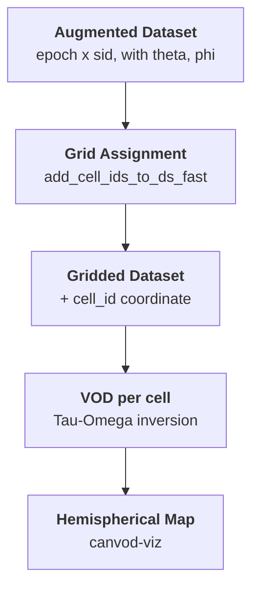

# canvod-grids

## Purpose

The `canvod-grids` package provides spatial grid implementations for hemispheric GNSS signal analysis. It discretizes the hemisphere visible from a ground-based receiver into cells — a prerequisite for spatially resolved VOD estimation.

---

## Grid Types

Seven implementations are available, all inheriting from `BaseGridBuilder`:

<div class="grid cards" markdown>

-   :fontawesome-solid-border-all: &nbsp; **EqualAreaBuilder** *(recommended)*

    ---

    Cells of approximately equal solid angle. Ensures uniform spatial
    sampling across the hemisphere, avoiding zenith over-weighting.

-   :fontawesome-solid-table-cells: &nbsp; **EqualAngleBuilder**

    ---

    Regular angular spacing in θ and φ. Cells near zenith are smaller —
    appropriate when you want uniform angular resolution.

-   :fontawesome-solid-grip: &nbsp; **EquirectangularBuilder**

    ---

    Simple rectangular latitude/longitude grid. Fast to compute;
    strong area distortion at low elevations.

-   :fontawesome-solid-dice-d20: &nbsp; **GeodesicBuilder**

    ---

    Icosahedron subdivision. Near-uniform cell area with triangular
    cell boundaries.

-   :fontawesome-solid-seedling: &nbsp; **FibonacciBuilder**

    ---

    Fibonacci-sphere sampling. Aesthetically uniform point
    distribution; ideal for scatter-plot analyses.
    Requires `scipy`.

-   :fontawesome-solid-globe: &nbsp; **HEALPixBuilder**

    ---

    Hierarchical Equal Area isoLatitude Pixelization. Strictly
    equal-area pixels, the gold standard for unbiased solid-angle
    weighting.
    Requires the optional `healpy` dependency — not installed by
    default (see [Optional dependencies](#optional-dependencies)
    below).

-   :fontawesome-solid-triangle-exclamation: &nbsp; **HTMBuilder**

    ---

    Hierarchical Triangular Mesh. Recursive triangular decomposition
    of the sphere; supports efficient spatial indexing.

</div>

All builders accept `angular_resolution` (degrees) and `cutoff_theta` (maximum polar angle) and return a `GridData` object.

### Optional dependencies

!!! warning "HEALPix requires an explicit install"

    `HEALPixBuilder` delegates pixel geometry entirely to
    [`healpy`](https://healpy.readthedocs.io/), which is **not** installed
    by `uv sync --dev` — it's declared in `canvod-grids`' own `optional`
    dependency group, not the workspace's `dev` group. Install it with:

    ```bash
    uv sync --dev --group optional
    ```

    `healpy` publishes no Windows wheels on PyPI (Linux and macOS only),
    which is the main reason it's kept optional rather than a hard
    dependency — every other grid type only needs `numpy`/`scipy`, which
    install everywhere. Calling `create_hemigrid("healpix", ...)` without
    `healpy` installed raises `ImportError` with the same install
    instructions.

    CI installs the `optional` group on Linux/macOS runners so HEALPix is
    covered by `canvod-grids`' correctness suite
    (`test_grid_correctness_all_types.py`); it's skipped on the Windows
    CI leg for the same wheel-availability reason.

---

## Usage

=== "Factory function"

    ```python
    from canvod.grids import create_hemigrid

    grid = create_hemigrid("equal_area", angular_resolution=5.0)
    print(grid.ncells)   # 216
    print(grid.nbands)   # 18
    ```

=== "Builder pattern"

    ```python
    from canvod.grids import EqualAreaBuilder

    builder = EqualAreaBuilder(angular_resolution=5.0, cutoff_theta=10.0)
    grid = builder.build()
    ```

=== "canvodpy factory"

    ```python
    from canvodpy import GridFactory

    builder = GridFactory.create("equal_area", angular_resolution=5.0)
    grid = builder.build()
    print(grid.grid.head())  # Polars DataFrame with cell geometry
    ```

---

## GridData

The `GridData` object returned by all builders provides:

| Attribute | Type | Description |
| --------- | ---- | ----------- |
| `grid` | `polars.DataFrame` | Cell geometry (boundaries, centres, solid angles) |
| `ncells` | `int` | Total number of grid cells |
| `nbands` | `int` | Number of elevation bands |
| `definition` | `str` | Human-readable grid description |

---

## Grid Operations

`canvod.grids.operations` handles the interface between grids and xarray Datasets:

<div class="grid cards" markdown>

-   :fontawesome-solid-map: &nbsp; **Cell Assignment**

    ---

    `add_cell_ids_to_ds_fast` — KDTree-accelerated assignment of each
    observation to a grid cell. O(n log m) for n observations, m cells.

    `add_cell_ids_to_vod_fast` — Same for VOD datasets.

-   :fontawesome-solid-floppy-disk: &nbsp; **Grid Persistence**

    ---

    `store_grid` / `load_grid` — Save and reload grid definitions
    as Zarr/NetCDF for reproducible workflows.

    `grid_to_dataset` — Convert `GridData` to xarray Dataset.

-   :fontawesome-solid-chart-pie: &nbsp; **Aggregation**

    ---

    `aggregate_data_to_grid` — Assign and aggregate per cell.

    `compute_hemisphere_percell` — Per-cell statistics.

    `compute_zenith_percell` — Zenith-weighted statistics.

    `compute_percell_timeseries` — Per-cell time series.

</div>

---

## Analysis Subpackage

`canvod.grids.analysis` provides filtering, weighting, and pattern analysis:

| Module | Purpose |
| ------ | ------- |
| `filtering` | Global IQR, Z-score, SID pattern filters |
| `per_cell_filtering` | Per-cell variants of the above |
| `hampel_filtering` | Hampel (median-MAD) outlier detection |
| `sigma_clip_filter` | Numba-accelerated sigma-clipping |
| `masking` | Spatial and temporal mask construction |
| `weighting` | Per-cell weight calculators |
| `solar` | Solar geometry (elevation, azimuth) |
| `temporal` | Diurnal aggregation and analysis |
| `spatial` | Per-cell spatial statistics |
| `analysis_storage` | Persistent Icechunk storage for weights, masks, statistics, and per-cell timeseries |

### SIDPatternFilter

`SIDPatternFilter` selects observations by GNSS system, frequency band, and tracking code.
It operates on the `sid` dimension where SIDs have the format `SV|Band|Code` (e.g. `G01|L1|C`).

=== "Slice (drop non-matching SIDs)"

    ```python
    from canvod.grids.analysis import SIDPatternFilter

    filt = SIDPatternFilter(system="G", band="L1", code="C")
    ds_gps_l1c = filt.filter_dataset(ds)  # returns smaller dataset or None
    ```

=== "Mask (NaN non-matching values)"

    ```python
    filt = SIDPatternFilter(system="E")
    ds_masked = filt.apply(ds, "SNR", output_suffix="galileo")
    ```

### Per-Cell Timeseries Storage

`AnalysisStorage` manages persistent Icechunk storage of analysis results.
Per-cell timeseries are stored on a dedicated branch, keyed by `system_band_code`:

```python
from canvod.grids.analysis import AnalysisStorage

storage = AnalysisStorage("/path/to/store")

# Store
storage.store_percell_timeseries(percell_ds, system="G", band="L1", code="C")

# List and load
storage.list_percell_datasets()          # ['C_B2b_I', 'E_E1_C', 'G_L1_C', ...]
ds = storage.load_percell_timeseries(system="G", band="L1", code="C")
```

---

## Coordinate Convention

!!! note "Angles"

    All grids use standard spherical coordinates:

    - **phi** (φ): azimuth 0 → 2π · 0 = North · π/2 = East · clockwise
    - **theta** (θ): polar angle from zenith · 0 = zenith · π/2 = horizon

    This matches the canvod-auxiliary coordinate output — no conversion needed.

---

## Role in the VOD Pipeline



---

!!! example "Try it"
    [06 — Hemispheric Grids](../../notebooks/_build/06_hemispheric_grids.html){target=_blank}
    ([source](https://molab.marimo.io/github/nfb2021/canvodpy-demo/blob/main/06_hemispheric_grids.py))
    · [18 — Grid Exploration](../../notebooks/_build/18_grid_exploration.html){target=_blank}
    ([source](https://molab.marimo.io/github/nfb2021/canvodpy-demo/blob/main/18_grid_exploration.py))
