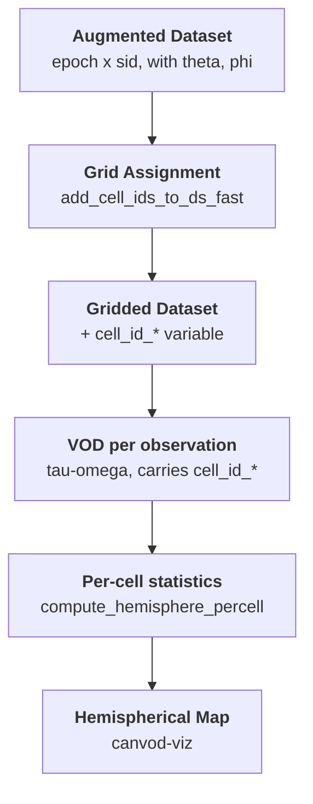

# canvod-grids

## Purpose

The `canvod-grids` package provides spatial grid implementations for hemispheric GNSS signal analysis. It discretizes the hemisphere visible from a ground-based receiver into cells — a prerequisite for spatially resolved VOD estimation.

---

## Grid Types

Seven implementations are available, all inheriting from `BaseGridBuilder`:

<div class="grid cards" markdown>

-   :fontawesome-solid-border-all: &nbsp; **EqualAreaBuilder** *(recommended)*

    ---

    Cells of approximately equal solid angle. Ensures uniform spatial
    sampling across the hemisphere, avoiding zenith over-weighting.

-   :fontawesome-solid-table-cells: &nbsp; **EqualAngleBuilder**

    ---

    Regular angular spacing in θ and φ. Cells near zenith are smaller —
    appropriate when you want uniform angular resolution.

-   :fontawesome-solid-grip: &nbsp; **EquirectangularBuilder**

    ---

    The same number of azimuth sectors in every θ band, no zenith cap.
    Fast to compute; cells shrink strongly toward the zenith.

-   :fontawesome-solid-dice-d20: &nbsp; **GeodesicBuilder**

    ---

    Icosahedron subdivision. Near-uniform cell area with triangular
    cell boundaries.

-   :fontawesome-solid-seedling: &nbsp; **FibonacciBuilder**

    ---

    Fibonacci-sphere sampling: nearly uniform points, each the center
    of its Voronoi cell.

-   :fontawesome-solid-globe: &nbsp; **HEALPixBuilder**

    ---

    Hierarchical Equal Area isoLatitude Pixelization. All pixels of the
    full sphere have the same area; the hemisphere keeps the pixels
    whose center lies at or above the outer edge.
    Requires the optional `healpy` dependency — not installed by
    default (see [Optional dependencies](#optional-dependencies)
    below).

-   :fontawesome-solid-triangle-exclamation: &nbsp; **HTMBuilder**

    ---

    Hierarchical Triangular Mesh. Recursive triangular decomposition
    of the sphere; supports efficient spatial indexing.

</div>

All builders accept `angular_resolution` (degrees), `cutoff_theta` and
`phi_rotation` (degrees) and return a `GridData` object. `cutoff_theta`
(default 0) leaves out the sky within that many degrees of the horizon.
A run's grid assignment uses `cutoff_theta = 0`.

Where a grid ends depends on its type:

| Grid type | Outer edge | Observations near the horizon |
|---|---|---|
| `equal_area`, `equal_angle`, `equirectangular` | exactly θ = 90° − `cutoff_theta`; the last band is narrower when the band width does not divide the range (half a band for `equal_area` and `equal_angle` at a cutoff that is a multiple of the resolution) | all get a cell up to the outer edge, none beyond |
| `htm`, `geodesic` | the triangles whose center lies above the outer edge; some extend below it | all get a cell above the horizon (with `cutoff_theta = 0`) |
| `healpix` | the pixels whose center lies at or above the outer edge; some extend below it | all get a cell above the horizon (with `cutoff_theta = 0`) |
| `fibonacci` | the Voronoi cells whose lattice point lies above the outer edge | some low observations get no cell: up to about 1°, 3° and 6° elevation at 2°, 5° and 10° resolution |

So the solid angles of the ring grids add up to the hemisphere (2π sr
with `cutoff_theta = 0`); those of the triangle and pixel grids add up to
somewhat more (geodesic 1.01 to 1.05 × 2π, HEALPix 1.01 to 1.08 × 2π at
2° to 10°).

!!! bug "`EqualAreaBuilder` with `cutoff_theta > 0`"
    `EqualAreaBuilder` currently applies `cutoff_theta` at the zenith as
    well: with `cutoff_theta=10` it also leaves out the cells near the
    zenith (θ < 7.5° at 5° resolution). Use `cutoff_theta=0` with this grid type
    until this is fixed.

### Optional dependencies

!!! warning "HEALPix requires an explicit install"

    `HEALPixBuilder` delegates pixel geometry entirely to
    [`healpy`](https://healpy.readthedocs.io/), which is **not** installed
    by `uv sync --dev` — it's declared in `canvod-grids`' own `optional`
    dependency group, not the workspace's `dev` group. Install it with:

    ```bash
    uv sync --dev --group optional
    ```

    `healpy` publishes no Windows wheels on PyPI (Linux and macOS only),
    which is the main reason it's kept optional rather than a hard
    dependency — every other grid type only needs `numpy`/`scipy`, which
    install everywhere. Calling `create_hemigrid("healpix", ...)` without
    `healpy` installed raises `ImportError` with the same install
    instructions.

    CI installs the `optional` group on Linux/macOS runners so HEALPix is
    covered by `canvod-grids`' correctness suite
    (`test_grid_correctness_all_types.py`); it's skipped on the Windows
    CI leg for the same wheel-availability reason.

---

## Usage

=== "Factory function"

    ```python
    from canvod.grids import create_hemigrid

    grid = create_hemigrid("equal_area", angular_resolution=5.0)
    print(grid.ncells)           # 1051
    print(len(grid.theta_lims))  # 19 θ bands
    ```

=== "Builder pattern"

    ```python
    from canvod.grids import EqualAreaBuilder

    builder = EqualAreaBuilder(angular_resolution=5.0)
    grid = builder.build()
    ```

=== "canvodpy factory"

    ```python
    from canvodpy import GridFactory

    builder = GridFactory.create("equal_area", angular_resolution=5.0)
    grid = builder.build()
    print(grid.grid.head())  # Polars DataFrame with cell geometry
    ```

---

## GridData

The `GridData` object returned by all builders provides:

| Attribute | Type | Description |
| --------- | ---- | ----------- |
| `grid` | `polars.DataFrame` | One row per cell: centre (`phi`, `theta`), bounds (`phi_min`, `phi_max`, `theta_min`, `theta_max`), `cell_id` |
| `ncells` | `int` | Total number of grid cells |
| `grid_type` | `str` | Grid type, e.g. `"equal_area"` |
| `theta_lims`, `phi_lims`, `cell_ids` | arrays | Band edges, azimuth edges and cell ids per θ band |
| `get_solid_angles()` | `np.ndarray` | Solid angle of each cell (sr) |
| `get_grid_stats()` | `dict` | Summary: cell count, solid-angle statistics |

For the Fibonacci, geodesic, HEALPix and HTM grids the bounds are
bounding boxes, not the true (curved or triangular) cell boundaries.

---

## Grid Operations

`canvod.grids.operations` handles the interface between grids and xarray Datasets:

<div class="grid cards" markdown>

-   :fontawesome-solid-map: &nbsp; **Cell Assignment**

    ---

    `add_cell_ids_to_ds_fast` — assigns each observation to the cell that
    contains it, eagerly or lazily for dask arrays: by band and sector
    edges for the ring grids, by spherical triangle for HTM and geodesic,
    by pixel for HEALPix, by Voronoi cell for Fibonacci. Observations
    outside the grid get NaN (see the table above). The nearest cell
    center is not used: near a cell's corner it often belongs to a
    neighboring cell. `canvodpy run` uses the same function when grid
    assignment is set. The lookup needs the grid's full geometry, so use
    a grid built with `create_hemigrid`; a grid read back with `load_grid`
    works for the ring grids only.

-   :fontawesome-solid-floppy-disk: &nbsp; **Grid Persistence**

    ---

    `store_grid` / `load_grid` — Save and reload grid definitions
    as Zarr/NetCDF for reproducible workflows.

    `grid_to_dataset` — Convert `GridData` to xarray Dataset.

-   :fontawesome-solid-chart-pie: &nbsp; **Aggregation**

    ---

    In `canvod.grids.aggregation` (also importable from `canvod.grids`):

    `aggregate_data_to_grid` — One statistic per cell.

    `compute_percell_timeseries` — Per-cell time series (cell × time).

    `compute_hemisphere_percell` — Daily per-cell time series, full
    hemisphere.

    `compute_zenith_percell` — Daily per-cell time series, θ ≤ 30°.

</div>

---

## Analysis Subpackage

`canvod.grids.analysis` provides filtering, weighting, and pattern analysis:

| Module | Purpose |
| ------ | ------- |
| `filtering` | Global IQR, Z-score, SID pattern filters |
| `per_cell_filtering` | Per-cell variants of the above |
| `masking` | Spatial and temporal mask construction |
| `weighting` | Per-cell weight calculators |
| `solar` | Solar geometry (elevation, azimuth) |
| `temporal` | Diurnal aggregation and analysis |
| `spatial` | Per-cell spatial statistics |
| `analysis_storage` | Persistent Icechunk storage for weights, masks, statistics, and per-cell timeseries |

### SIDPatternFilter

`SIDPatternFilter` selects observations by GNSS system, frequency band, and tracking code.
It operates on the `sid` dimension where SIDs have the format `SV|Band|Code` (e.g. `G01|L1|C`).

=== "Slice (drop non-matching SIDs)"

    ```python
    from canvod.grids.analysis import SIDPatternFilter

    filt = SIDPatternFilter(system="G", band="L1", code="C")
    ds_gps_l1c = filt.filter_dataset(ds)  # returns smaller dataset or None
    ```

=== "Mask (NaN non-matching values)"

    ```python
    filt = SIDPatternFilter(system="E")
    ds_masked = filt.apply(ds, "SNR", output_suffix="galileo")
    ```

### Per-Cell Timeseries Storage

`AnalysisStorage` manages persistent Icechunk storage of analysis results.
Per-cell timeseries are stored on a dedicated branch, keyed by `system_band_code`:

```python
from canvod.grids.analysis import AnalysisStorage

storage = AnalysisStorage("/path/to/store")

# Store
storage.store_percell_timeseries(percell_ds, system="G", band="L1", code="C")

# List and load
storage.list_percell_datasets()          # ['C_B2b_I', 'E_E1_C', 'G_L1_C', ...]
ds = storage.load_percell_timeseries(system="G", band="L1", code="C")
```

---

## Coordinate Convention

!!! note "Angles"

    All grids use standard spherical coordinates:

    - **phi** (φ): azimuth 0 → 2π · 0 = North · π/2 = East · clockwise
    - **theta** (θ): polar angle from zenith · 0 = zenith · π/2 = horizon

    This matches the canvod-auxiliary coordinate output — no conversion needed.

---

## Role in the VOD Pipeline


```mermaid
flowchart TD
    A["`**Augmented Dataset**
    epoch x sid, with theta, phi`"]
    A --> B["`**Grid Assignment**
    add_cell_ids_to_ds_fast`"]
    B --> C["`**Gridded Dataset**
    + cell_id_* variable`"]
    C --> D["`**VOD per observation**
    tau-omega, carries cell_id_*`"]
    D --> F["`**Per-cell statistics**
    compute_hemisphere_percell`"]
    F --> E["`**Hemispherical Map**
    canvod-viz`"]
```

---

!!! example "Try it"
    [06 — Hemispheric Grids](../../notebooks/_build/06_hemispheric_grids.html){target=_blank}
    ([source](https://molab.marimo.io/github/nfb2021/canvodpy-demo/blob/main/06_hemispheric_grids.py))
    · [19 — Grid Exploration](../../notebooks/_build/19_grid_exploration.html){target=_blank}
    ([source](https://molab.marimo.io/github/nfb2021/canvodpy-demo/blob/main/19_grid_exploration.py))
