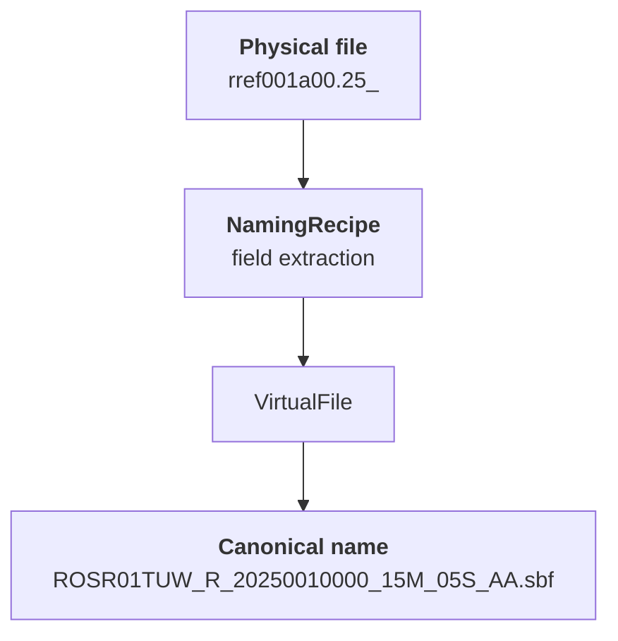

# canvod-virtualiconvname

## Purpose

The `canvod-virtualiconvname` package maps arbitrary GNSS observation filenames
to a canonical naming convention. Physical files on disk keep their original names
-- the package creates a **virtual** mapping layer that gives every file a unique,
self-describing canonical name.

---

## The CanVODFilename Convention

Every canonical filename follows this format:

```
{SIT}{T}{NN}{AGC}_R_{YYYY}{DOY}{HHMM}_{PERIOD}_{SAMPLING}_{CONTENT}.{TYPE}[.{COMPRESSION}]
```


<iframe src="../../diagrams/naming-convention-embed.html" style="width:100%;height:320px;border:none;display:block;margin:1.5rem 0;" loading="lazy"></iframe>

### Fields

| Field | Width | Description | Example |
|-------|-------|-------------|---------|
| `SIT` | 3 | Site ID, uppercase | `ROS`, `HAI` |
| `T` | 1 | Receiver type: **R** = reference, **A** = active (below-canopy) | `R`, `A` |
| `NN` | 2 | Receiver number, zero-padded | `01`, `35` |
| `AGC` | 3 | Data provider / agency ID | `TUW`, `GFZ` |
| `_R` | 2 | Literal separator | `_R` |
| `YYYY` | 4 | Year | `2025` |
| `DOY` | 3 | Day of year (001--366) | `001` |
| `HHMM` | 4 | Start time (hours + minutes) | `0000` |
| `PERIOD` | 3 | Batch duration: value + unit | `01D`, `15M` |
| `SAMPLING` | 3 | Data frequency: value + unit | `05S`, `01S` |
| `CONTENT` | 2 | User-defined content code | `AA` |
| `TYPE` | 2--4 | File format, lowercase | `rnx`, `sbf` |
| `COMPRESSION` | -- | Optional compression extension | `zip`, `gz` |

### Duration codes

| Unit | Meaning | Example |
|------|---------|---------|
| `S` | Seconds | `05S` = 5 seconds |
| `M` | Minutes | `15M` = 15 minutes |
| `H` | Hours | `01H` = 1 hour |
| `D` | Days | `01D` = 1 day |

### Example

```
ROSR01TUW_R_20250010000_01D_05S_AA.rnx
```

| Part | Value | Meaning |
|------|-------|---------|
| `ROS` | Site | Rosalia |
| `R` | Type | Reference (above-canopy) |
| `01` | Number | Receiver 01 |
| `TUW` | Agency | TU Wien |
| `2025001` | Date | 2025, DOY 001 |
| `0000` | Start | 00:00 UTC |
| `01D` | Period | 1-day file |
| `05S` | Sampling | 5-second intervals |
| `AA` | Content | Default |
| `rnx` | Type | RINEX observation |

---

## VirtualFile

A **VirtualFile** pairs a physical file path with its canonical name:

```python
from canvod.virtualiconvname import VirtualFile

vf.physical_path    # Path("/data/rref001a00.25_")
vf.canonical_str    # "ROSR01TUW_R_20250010000_15M_05S_AA.sbf"
vf.open("rb")       # opens the physical file
```

The physical file is never renamed. All downstream processing uses the canonical
name for metadata, deduplication, and storage keys.

---

## NamingRecipe

A **NamingRecipe** tells the system how to parse an arbitrary physical filename
into a canonical name. Recipes are defined in YAML and referenced from `sites.yaml`.

### How it works



The recipe defines:

1. **Identity fields** -- site, agency, receiver number/type (constant for a receiver)
2. **Discovery** -- glob pattern and directory layout to find files
3. **Field extraction** -- a sequence of `{field: width}` entries that parse the
   physical filename left-to-right

### YAML example

```yaml
name: rosalia_reference
description: Septentrio RINEX v2 files from Rosalia reference receiver
site: ROS
agency: TUW
receiver_number: 1
receiver_type: reference
sampling: "05S"
period: "15M"
file_type: rnx
layout: yyddd_subdirs
glob: "*.??o"
fields:
  - skip: 4          # "rref"
  - doy: 3           # "001"
  - hour_letter: 1   # "a"
  - minute: 2        # "15"
  - skip: 1          # "."
  - yy: 2            # "25"
  - skip: 1          # "o"
```

### Recognized fields

| Field | Description |
|-------|-------------|
| `year` | 4-digit year |
| `yy` | 2-digit year (80--99 = 19xx, 00--79 = 20xx) |
| `doy` | Day of year |
| `month` | Month (converted to DOY with `day`) |
| `day` | Day of month |
| `hour` | Hour (0--23) |
| `hour_letter` | RINEX hour letter (a--x = 0--23) |
| `minute` | Minute (0--59) |
| `skip` | Ignore N characters |

### Using recipes

Reference a recipe file from `sites.yaml`:

```yaml
sites:
  rosalia:
    receivers:
      reference_01:
        recipe: rosalia_reference.yaml
```

When `just config-init` copies configuration templates, recipe files are included.

---

## FilenameMapper

The `FilenameMapper` discovers physical files and maps them to VirtualFiles. It
handles three directory layouts, configured via `directory_layout` in the receiver
config or recipe.

### Directory layouts

Most GNSS receivers output files into per-day subdirectories named by day-of-year.
The `directory_layout` setting tells the mapper where to look for files.

| Layout | Structure | When to use |
|--------|-----------|-------------|
| `yyddd_subdirs` | `25001/`, `25002/`, ... | **Default.** Septentrio and most receivers output into 5-digit YYDDD subdirectories. |
| `yyyyddd_subdirs` | `2025001/`, `2025002/`, ... | Some post-processing tools or manual organisation use 7-digit YYYYDDD subdirectories. |
| `flat` | All files in one directory | Data dumped into a single folder (e.g. copied from USB, downloaded archive). |

#### How discovery differs

The layout controls **where** the mapper searches — it does **not** affect how
filenames are parsed (that is determined by the source pattern or recipe).

=== "yyddd_subdirs (default)"

    ```
    receiver_base_dir/
    ├── 25001/
    │   ├── rref001a00.25_     ← discovered
    │   └── rref001a15.25_     ← discovered
    ├── 25002/
    │   └── rref002a00.25_     ← discovered
    └── rref003a00.25_         ← NOT discovered (at root level)
    ```

    Only files **inside** `YYDDD/` subdirectories are found.
    Files at the root level are silently ignored.

=== "yyyyddd_subdirs"

    ```
    receiver_base_dir/
    ├── 2025001/
    │   └── rref001a00.25_     ← discovered
    └── 2025002/
        └── rref002a00.25_     ← discovered
    ```

    Same behaviour, but expects 7-digit directory names.

=== "flat"

    ```
    receiver_base_dir/
    ├── rref001a00.25_         ← discovered
    ├── rref002a00.25_         ← discovered
    └── notes.txt              ← ignored (not a GNSS file)
    ```

    All GNSS files directly in `receiver_base_dir` are found.
    Subdirectories are **not** traversed.

!!! warning "Choosing the wrong layout"

    If you set `flat` but your files are in `25001/` subdirectories (or vice
    versa), the mapper will find **zero files** and the directory will appear
    empty. The validator will pass (empty is valid), but no data will be
    processed. If you expect data but the pipeline produces nothing, check
    `directory_layout` first.

#### Configuration

In `sites.yaml` (legacy naming config):

```yaml
receivers:
  reference_01:
    receiver_number: 1
    source_pattern: auto
    directory_layout: yyddd_subdirs   # or flat, yyyyddd_subdirs
```

In a NamingRecipe:

```yaml
layout: yyddd_subdirs   # default if omitted
```

### Usage

```python
from canvod.virtualiconvname import FilenameMapper

mapper = FilenameMapper(
    site_naming=site_config,
    receiver_naming=receiver_config,
    receiver_type="reference",
    receiver_base_dir=Path("/data/rosalia/reference"),
)

# Discover and map all files
virtual_files = mapper.discover_all()

# Or for a specific date
virtual_files = mapper.discover_for_date(year=2025, doy=1)
```

### Built-in patterns

The `BUILTIN_PATTERNS` registry handles common GNSS filename formats automatically:

| Pattern | Example filename | Description |
|---------|-----------------|-------------|
| `canvod` | `ROSR01TUW_R_...` | Already canonical |
| `rinex_v3_long` | `ROSA00TUW_R_...` | RINEX v3.04 long names |
| `septentrio_rinex_v2` | `ract001a15.25o` | Septentrio RINEX v2 with minute |
| `rinex_v2_short` | `rosl001a.25o` | Standard RINEX v2 |
| `septentrio_sbf` | `rref001a00.25_` | Septentrio binary |

When `source_pattern: auto` (the default), patterns are tried in order until one
matches. Use a NamingRecipe for formats not covered by built-in patterns.

---

## DataDirectoryValidator

The `DataDirectoryValidator` is a **pre-pipeline hard gate**. Before any processing
begins, it checks that:

1. **All files can be mapped** -- every file in the receiver directory matches a
   naming pattern or recipe
2. **No temporal overlaps** -- no two files cover the same time window

If validation fails, the pipeline is blocked with a diagnostic message listing
the unmatched files and/or overlapping pairs.

```python
from canvod.virtualiconvname import DataDirectoryValidator

report = DataDirectoryValidator.validate_receiver(
    site_naming=site_config,
    receiver_naming=receiver_config,
    receiver_type="reference",
    receiver_base_dir=Path("/data/rosalia/reference"),
    reader_format="rinex3",  # optional filter
)

report.is_valid     # True if no unmatched or overlaps
report.matched      # list[VirtualFile]
report.unmatched    # list[Path]
report.overlaps     # list[tuple[VirtualFile, VirtualFile]]
```

---

## FilenameCatalog

The `FilenameCatalog` persists file mappings in a local DuckDB database, enabling
fast lookups without re-scanning directories.

```python
from canvod.virtualiconvname import FilenameCatalog

with FilenameCatalog(db_path) as catalog:
    catalog.record_batch(virtual_files)

    # Lookup by canonical name
    path = catalog.lookup_by_conventional("ROSR01TUW_R_20250010000_01D_05S_AA.rnx")

    # Query a date range
    files = catalog.query_date_range(2025, 1, 2025, 31, receiver_type="R")

    # Export to Polars DataFrame
    df = catalog.to_polars()
```

The catalog stores file hashes (SHA-256 of first 64 KiB), sizes, and modification
times alongside the canonical mapping.
