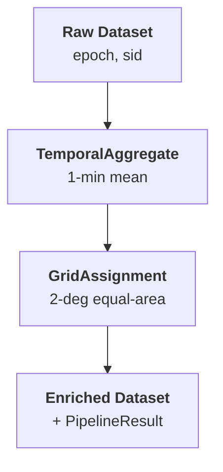

# canvod-ops

## Purpose

The `canvod-ops` package provides a preprocessing pipeline for observation
datasets. `canvodpy run`, the Python API and Airflow apply it before writing to
the GNSS store if the `processing.preprocessing` setting is set (see
[Preprocessing during a run](#preprocessing-during-a-run)); without that setting
the store holds the observations at the receiver's sampling interval. You can
also apply the operations yourself, e.g. to datasets read from a store.
Operations are applied as a chain: each operation receives a dataset,
transforms it, and passes the result to the next.

---

## Pipeline

A `Pipeline` is an ordered sequence of operations (`Op` instances). It processes
a dataset through each operation and collects metadata about what happened:

```python
from canvod.ops import Pipeline, TemporalAggregate, GridAssignment

pipeline = Pipeline([
    TemporalAggregate(freq="1min", method="mean"),
    GridAssignment(grid_type="equal_area", angular_resolution=2.0),
])

ds_out, result = pipeline(ds_in)

# result.to_metadata_dict() → stored in dataset attrs for reproducibility
```


```mermaid
flowchart TD
    RAW["`**Raw Dataset**
    epoch, sid`"]
    RAW --> TA["`**TemporalAggregate**
    1-min mean`"]
    TA --> GA["`**GridAssignment**
    2-deg equal-area`"]
    GA --> OUT["`**Enriched Dataset**
    + PipelineResult`"]
```

---

## Built-in Operations

### TemporalAggregate

Aggregates observations into regular time bins. Reduces the number of epochs by
grouping into frequency buckets and computing the mean or median. Bins start at
multiples of `freq` counted from 00:00 and are labeled with their start.
Missing values (NaN, and -1 in integer variables) are ignored; a bin without
any value stays missing. Integer variables (e.g. `LLI`, `SSI`) are aggregated
as numbers and rounded to the nearest integer, so a bit flag or an indicator
can lose its meaning in a bin (a loss of lock in one epoch of a bin
disappears). A bin keeps no count of the epochs behind it.

The result has the same variables, dimensions, data types, attributes and
encodings as the input, with fewer epochs, so aggregated data cannot be told
apart from unaggregated data by their structure. What was done is reported in
the `result` of the returned `OpResult` instead, e.g.
`{"aggregated": true, "input_sampling_s": 5.0, "output_sampling_s": 60.0}`,
and kept in the stores' log books (see
[The preprocessing record](#the-preprocessing-record)). The aggregation runs on
numpy arrays in blocks of bins of bounded size; a day of 1 s data with 300
signals takes about one second.

`SNR` is averaged as stored, in dB-Hz, not as linear power. Because VOD is
linear in the SNR difference in dB, the mean of the dB values gives the mean of
the per-epoch VOD, provided the canopy and reference bins average the same
epochs and θ changes little within a bin
([issue #192](https://github.com/nfb2021/canvodpy/issues/192)). The median is
the same in dB and in linear power.

```python
from canvod.ops import TemporalAggregate

op = TemporalAggregate(freq="1min", method="mean")
ds_out, result = op(ds_in)
```

| Parameter | Default | Description |
|-----------|---------|-------------|
| `freq` | `"1min"` | Target frequency (pandas offset alias) |
| `method` | `"mean"` | Aggregation: `"mean"` or `"median"` |

If every epoch already is the start of its own bin, the operation is a no-op:
it returns the dataset unchanged and reports `"aggregated": false`. Data at the
target interval but off the bin starts (e.g. epochs at `:02`) are relabeled to
the bin starts.

#### Per-SID independence

`TemporalAggregate` groups by `(time_bin, sid)` before computing the aggregate.
This is critical because each SID (satellite + band + code) observes the canopy
from a different sky position (θ, φ). Mixing VOD or SNR values across satellites
within a time bin conflates spatial variability (different view angles) with
temporal variability — producing a physically meaningless average.

Geometry (θ, φ) is aggregated per SID with the same method, so it describes
where the aggregated value came from; `.first()` would instead assign a single
observation's geometry to it. The azimuth φ is aggregated as an angle: each
value is taken relative to the first value of its bin, so a satellite crossing
north (φ = 0) yields north, not south.

Coordinate handling:

| Coordinate type | Example | Aggregation |
|----------------|---------|-------------|
| Data variables | `VOD`, `SNR` | Mean or median per `(time_bin, sid)` |
| Geometry | `theta` | Mean or median per `(time_bin, sid)` |
| Azimuth | `phi` | Mean or median as an angle per `(time_bin, sid)` |
| SID-only coords | `sv`, `band`, `code` | Preserved unchanged |

!!! warning "Anti-pattern: naive xarray resampling"
    A plain `ds.resample(epoch="1D").mean()` preserves the `sid` dimension
    (xarray resamples along `epoch` only), so per-SID independence is maintained.
    However, it does not distinguish between data variables and geometry
    coordinates, and does not handle sid-only coords explicitly.
    For production use, prefer `TemporalAggregate`.

### GridAssignment

Assigns each observation to the grid cell that contains its direction
(`phi`, `theta`); an observation outside every cell gets NaN. The grid is built
with `create_hemigrid` and its defaults (see
[canvod-grids](../grids/overview.md)). Adds a `cell_id_*` variable to the
dataset.

```python
from canvod.ops import GridAssignment

op = GridAssignment(grid_type="equal_area", angular_resolution=2.0)
ds_out, result = op(ds_in)
# ds_out now has cell_id_equal_area_2.0deg(epoch, sid)
```

| Parameter | Default | Description |
|-----------|---------|-------------|
| `grid_type` | `"equal_area"` | Grid builder name |
| `angular_resolution` | `2.0` | Resolution in degrees |

`phi` and `theta` may be data variables (as the runs write them) or
coordinates, on `(epoch, sid)`. If either is missing, the operation is skipped
with a warning.

---

## Op and OpResult

All operations inherit from the `Op` abstract base class:

```python
from canvod.ops import Op, OpResult

class MyOp(Op):
    @property
    def name(self) -> str:
        return "my_operation"

    def __call__(self, ds: xr.Dataset) -> tuple[xr.Dataset, OpResult]:
        # transform ds
        return ds, OpResult(
            op_name=self.name,
            parameters={...},
            input_shape=dict(ds.sizes),
            output_shape=dict(ds.sizes),
            duration_seconds=elapsed,
        )
```

Each `OpResult` records:

- Operation name and parameters (the settings)
- `result`: what the operation measured or derived (e.g. the input sampling)
- Input/output dataset dimensions
- Execution time
- Optional notes (e.g., "no-op: data already at target frequency")

`OpResult.step()` gives the operation's entry in the preprocessing record,
`{"op", "settings", "result"}`, and `PipelineResult.record()` the record of
all operations in the order they ran. A new operation therefore records itself:
it only has to fill `parameters` and `result`. If it runs code of another
package, it names that package in `packages` (`GridAssignment` sets
`packages = ("canvod-ops", "canvod-grids")`), so the record gives its version
too.

---

## Preprocessing during a run

`canvodpy run`, the Python API and Airflow apply the operations set in the
`processing.preprocessing` section of `canvod-settings.yaml`. Nothing is
applied unless the section is set, and each operation runs only if its own
subsection is set (and not `enabled: false`):

```yaml
processing:
  preprocessing:
    temporal_aggregation:
      freq: "1min"      # whole number + "s", "min" or "h"; must divide one day
      method: "median"  # "mean" or "median"
    grid_assignment:
      grid_type: "equal_area"
      angular_resolution: 2.0
```

The temporal aggregation runs first, then the grid cell assignment. Both run on
all files of one receiver and day together (`preprocess_files`), after azimuth
and elevation are computed and before the data are written to the GNSS store.
A time bin that spans two files is therefore aggregated from the observations of
both; it is stored with the file that holds its first observation. Each
stored file keeps its own attributes (e.g. the file hash) and all `sid`
coordinates. VOD is then
computed from the aggregated data and carries the `cell_id_*` variables along.

### The preprocessing record

For traceability, transparency and reproducibility, every write records which
preprocessing produced the data. The record is written by the operations
themselves and has this form (here for one day of 5 s data):

```json
{
  "format_version": 2,
  "software": {"canvod-grids": "1.0.0", "canvod-ops": "1.0.0"},
  "steps": [
    {
      "op": "temporal_aggregate",
      "settings": {"freq": "1min", "method": "mean"},
      "result": {"aggregated": true, "input_sampling_s": 5.0, "output_sampling_s": 60.0}
    },
    {
      "op": "grid_assign",
      "settings": {"grid_type": "equal_area", "angular_resolution": 2.0},
      "result": {"assigned": true, "variable": "cell_id_equal_area_2.0deg", "n_cells": 6563}
    }
  ]
}
```

`format_version` is the version of the record's layout, not of the software.
`software` gives the version of every package whose code ran the operations
(canVODpy packages are released separately): canvod-ops always, canvod-grids
when cells were assigned. Records of format 1, written by canVODpy up to
0.4.0, name only the canvod-ops version (`canvod_ops_version`) and are still
read.
Without `processing.preprocessing`, `steps` is empty, which records that no
preprocessing was applied.

The record is kept in the log books of the stores, never in the data: stored
data have exactly the variables and attributes of data without preprocessing.

- **GNSS store**: the `preprocessing` column of `{group}/metadata/table` holds
  the record of each file, written in the same commit as the file's data.
- **VOD store**: the `preprocessing` column of the analysis group's log book
  holds, per receiver, the records of the GNSS data the result was computed
  from, e.g. `{"canopy_01": [record], "reference_01": [record]}`.
- **Store history**: each entry (`summaries.history` of the store metadata,
  shown by `canvod.store_metadata.show_metadata`) names the preprocessing of
  every group written and the canVODpy version.

A store group never mixes data preprocessed with different operations or
settings. Before each write, the store compares the settings of the new data
with every record in the group's log book; the results may differ (e.g. data
at 1 s and at 5 s, both aggregated to 1 min). A VOD result is computed only
from canopy and reference data preprocessed with the same settings. On a
mismatch, the write raises `PreprocessingMismatchError` and `canvodpy run`
stops with exit code 1, since every later day would be refused the same way:
keep the setting for the life of a store, or start a new store.

`build_default_pipeline(config)` builds the same pipeline from a
`PreprocessingConfig`; called without one, it reads the setting.
