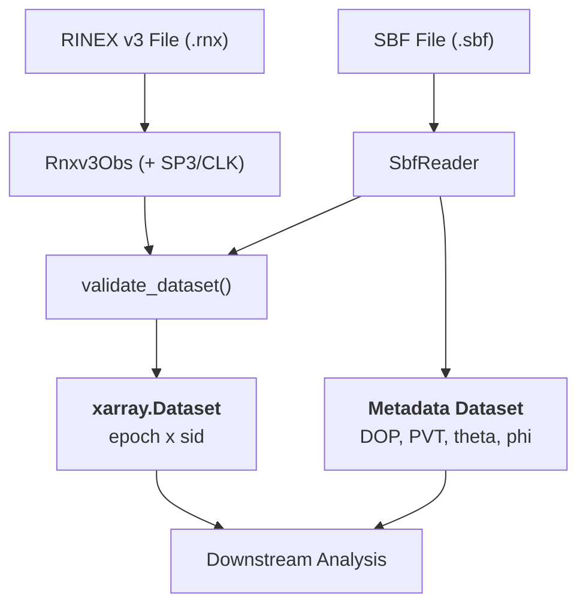

# canvod-readers

## Purpose

The `canvod-readers` package provides validated parsers for [GNSS](https://gssc.esa.int/navipedia/index.php/GNSS){:target="_blank"} observation data. It transforms raw receiver files into analysis-ready [xarray Datasets](https://docs.xarray.dev){:target="_blank"}, serving as the data ingestion layer for GNSS Transmissometry (GNSS-T) analysis.
!!! note "Storage stack"

    [**xarray**](https://docs.xarray.dev){:target="_blank"} provides labelled N-D arrays with named axes and coordinates — think NumPy with named dimensions and attached metadata. Readers output xarray Datasets that flow into [**Zarr**](https://zarr.dev){:target="_blank"} — a chunked, compressed array format designed for parallel cloud reads. [**Icechunk**](https://icechunk.io){:target="_blank"} sits on top of Zarr and adds git-like version control: every append is a commit-snapshot retrievable by ID. Together they form part of the [**Pangeo**](https://pangeo.io){:target="_blank"} open scientific Python ecosystem for large geoscience datasets that canvodpy builds on.

<div class="grid cards" markdown>

-   :fontawesome-solid-file-lines: &nbsp; **RINEX v3.04 — `Rnxv3Obs`**

    ---

    [RINEX](https://igs.org/wg/rinex/){:target="_blank"} (Receiver Independent Exchange Format) is the IGS-standardised
    plain-text format for GNSS observations, supported by every major receiver manufacturer.
    Observation files (`.rnx`) contain timestamped pseudorange, carrier phase, Doppler, and
    signal-to-noise measurements per satellite and signal.
    Satellite geometry is not embedded — it requires external SP3 precise ephemerides
    (CLK clock corrections are fetched too by default, though unused for VOD;
    see `aux_data.fetch_clock`).

    [:octicons-arrow-right-24: RINEX format](rinex-format.md)

-   :fontawesome-solid-satellite-dish: &nbsp; **SBF Binary — `SbfReader`**

    ---

    [SBF](https://customersupport.septentrio.com/s/article/What-is-SBF-and-where-can-I-find-more-information-about-it){:target="_blank"}
    (Septentrio Binary Format) is a compact proprietary binary format with embedded receiver metadata.
    PVT position solution, DOP quality indicators, and SatVisibility satellite geometry are all
    embedded in the file, eliminating the need to download external ephemeris for geometry computation.

    [:octicons-arrow-right-24: SBF reader](sbf.md)

</div>

---

## Supported Formats at a Glance

| Feature | `Rnxv3Obs` | `SbfReader` |
| ------- | ---------- | ----------- |
| Format | Plain text | Binary |
| Extension | `.rnx` | `.sbf` |
| Satellite geometry (θ, φ) | SP3 download | **Embedded** |
| Extra metadata | Header only | PVT · DOP · quality |
| `to_ds()` | ✓ | ✓ |
| `iter_epochs()` | ✓ | ✓ |
| `to_metadata_ds()` | — | ✓ |
| `to_ds_and_auxiliary()` | `{}` aux | `{"sbf_obs": meta_ds}` |

!!! note "Consistent output structure"

    Both readers always produce data with the same two dimensions — time (epoch) and signal (SID) — and the same required attributes, so analysis code works with RINEX and SBF data interchangeably.
    Both readers produce `(epoch × sid)` xarray Datasets that pass
    `validate_dataset()`. Every row is one timestep (an epoch), every column
    is one signal (a SID), and every cell is one observable — for example,
    SNR in dB-Hz. The same dimensions, coordinates, and required attributes
    are guaranteed, so downstream analysis code is reader-agnostic for observables.
    Geometry provisioning differs: RINEX datasets are augmented with satellite
    positions from SP3 files (CLK too, by default — optional, see
    `aux_data.fetch_clock`); SBF datasets carry embedded SatVisibility
    data from the receiver.

---

## Design

### Data flow



### Contract-Based Design

All readers implement the `GNSSDataReader` base class — a Pydantic `BaseModel` + ABC that provides file path validation, model configuration, and a consistent interface:

```python
from pydantic import BaseModel, ConfigDict, field_validator
from abc import ABC, abstractmethod
import xarray as xr

class GNSSDataReader(BaseModel, ABC):
    """Base class for all GNSS data format readers."""

    model_config = ConfigDict(arbitrary_types_allowed=True)
    fpath: Path  # Validated at construction time

    @abstractmethod
    def to_ds(self, **kwargs) -> xr.Dataset:
        """Convert to xarray.Dataset (epoch × sid)."""

    @abstractmethod
    def iter_epochs(self):
        """Iterate through epochs."""

    @property
    @abstractmethod
    def file_hash(self) -> str:
        """SHA-256 hash for deduplication."""

    def to_ds_and_auxiliary(
        self, **kwargs
    ) -> tuple[xr.Dataset, dict[str, xr.Dataset]]:
        """Single-pass scan: obs dataset + any auxiliary datasets.

        Default returns empty aux dict.
        SbfReader overrides for one-pass binary decode.
        """
        return self.to_ds(**kwargs), {}
```

Subclasses only need to inherit from `GNSSDataReader` — no separate `BaseModel` import, no `fpath` field, no file validation boilerplate.

[:octicons-arrow-right-24: Full architecture](architecture.md)

---

## Usage Examples

=== "RINEX — VOD pipeline"

    ```python
    from canvod.readers import Rnxv3Obs

    reader = Rnxv3Obs(fpath="ROSA01TUW_R_20250010000_15M_05S_MO.rnx")
    ds = reader.to_ds(keep_data_vars=["SNR"])

    # Filter L-band signals
    l_band = ds.where(ds.band.isin(["L1", "L2", "L5"]), drop=True)
    ```

=== "SBF — quick-look (no downloads)"

    ```python
    from canvod.readers.sbf import SbfReader

    reader = SbfReader(fpath="rref001a00.sbf")
    obs_ds, aux = reader.to_ds_and_auxiliary(keep_data_vars=["SNR"])
    meta_ds = aux["sbf_obs"]

    # Polar angle filter: elevation ≥ 20°
    snr_filtered = obs_ds["SNR"].where(meta_ds["theta"] <= 70)
    ```

=== "Multi-constellation analysis"

    ```python
    ds = reader.to_ds()

    for system in ["G", "R", "E", "C"]:
        sys_ds = ds.where(ds.system == system, drop=True)
        mean_snr = sys_ds.SNR.mean(dim=["epoch", "sid"])
        print(f"{system}: {mean_snr:.2f} dB")
    ```

=== "ReaderFactory — format registry"

    ```python
    from canvodpy import ReaderFactory

    # By name (works for all registered readers)
    reader = ReaderFactory.create("rinex3", fpath="ROSA01TUW_R_20250010000_15M_05S_MO.rnx")

    # Auto-detect RINEX v2/v3 from file header
    reader = ReaderFactory.create_from_file("ROSA01TUW_R_20250010000_15M_05S_MO.rnx")

    # Both produce identical (epoch × sid) datasets
    ds = reader.to_ds(keep_data_vars=["SNR"])
    ```

=== "Time-series concat"

    ```python
    import xarray as xr
    from pathlib import Path

    datasets = [
        Rnxv3Obs(fpath=f).to_ds(keep_data_vars=["SNR"])
        for f in sorted(Path("/data/").glob("*.rnx"))
    ]

    time_series = xr.concat(datasets, dim="epoch")
    ```

---

## Key Components

<div class="grid cards" markdown>

-   :fontawesome-solid-fingerprint: &nbsp; **`SignalID` — Validated Signal Identifiers**

    ---

    Pydantic model for signal identifiers (`SV|band|code`).
    GNSS observations span six dimensions: epoch, satellite (SV), band, ranging code type, polar angle (θ), and azimuth (φ). Different satellite generations broadcast different signal combinations, and a single SV may simultaneously transmit on multiple ranging code types. `SignalID` collapses the three signal-characterising dimensions — SV, band (RINEX v3.04 nomenclature), and ranging code — into a single composite key, reducing the 6D observation space to 2D: (epoch, SID). Unlike most GNSS tools that aggregate or discard sub-SV signal distinctions at ingestion, canvodpy retains **all signal characteristics** throughout processing — treating signals as non-comparable across codes until explicitly aggregated downstream. This full signal fidelity enables per-band and per-constellation aggregation as an analysis choice, not an ingestion constraint, and is essential for rigorous validation.
    Validates the SV against known GNSS systems at creation time.
    Frozen, hashable, and used throughout the builder and readers.

    ```python
    from canvod.readers import SignalID

    sig = SignalID(sv="G01", band="L1", code="C")
    sig.sid     # → "G01|L1|C"
    sig.system  # → "G"
    ```

-   :fontawesome-solid-hammer: &nbsp; **`DatasetBuilder` — Guided Dataset Construction**

    ---

    Handles coordinate assembly, frequency resolution, dtype enforcement,
    and validation. Readers use `add_epoch()` → `add_signal()` → `set_value()`
    → `build()` instead of manual numpy/xarray assembly.

    ```python
    from canvod.readers.builder import DatasetBuilder

    builder = DatasetBuilder(reader)
    ei = builder.add_epoch(timestamp)
    sig = builder.add_signal(sv="G01", band="L1", code="C")
    builder.set_value(ei, sig, "SNR", 42.0)
    ds = builder.build()  # validated Dataset
    ```

-   :fontawesome-solid-earth-europe: &nbsp; **GNSS Specifications**

    ---

    `gnss_specs` provides constellation definitions for GPS, Galileo,
    GLONASS, BeiDou, QZSS, SBAS, and IRNSS including band mappings and
    centre frequencies.

    ```python
    from canvod.readers.gnss_specs.constellations import GPS
    gps = GPS()  # static SVs from IGS SINEX catalog
    gps.BANDS  # {'1': 'L1', '2': 'L2', '5': 'L5'}
    ```

-   :fontawesome-solid-id-badge: &nbsp; **Signal ID Mapper**

    ---

    `SignalIDMapper` provides frequency, bandwidth, and overlap-group
    lookups for canonical `SV|Band|Code` signal IDs.  SIDs are
    constructed directly from header obs codes in the fast-path reader.

    ```python
    mapper = SignalIDMapper()
    freq = mapper.get_band_frequency("L1")   # → 1575.42
    bw   = mapper.get_band_bandwidth("L1")   # → 30.69
    ```

-   :fontawesome-solid-circle-check: &nbsp; **`validate_dataset()`**

    ---

    Every dataset produced by any reader must pass structural validation
    before it is returned. Checks dimensions, coordinate dtypes, required
    variables, and global attributes — including `"File Hash"`, a SHA-256
    of the source file contents that `canvod-store` uses as its first
    deduplication layer, ensuring the same physical file is never ingested
    twice regardless of when it is processed.

    ```python
    from canvod.readers.base import validate_dataset
    validate_dataset(ds)  # raises ValueError listing ALL violations
    ```

</div>

---

## Performance

### Single-Pass Parser

`Rnxv3Obs` uses a single-pass parser that pre-computes the full Signal ID (SID) space from the RINEX header and fills pre-allocated NumPy arrays in one pass over the file. This avoids the overhead of:

- **Per-observation object allocation** — inline string parsing replaces per-observation model instantiation
- **Repeated signal ID lookups** — a pre-built lookup table maps `(SV, obs_code)` → array index directly
- **Redundant header re-parsing** — SIDs are derived once from header metadata at parse start

### Tips

!!! tip "Memory"

    Use `keep_data_vars=["SNR"]` to load only what you need.
    Full RINEX with phase + Doppler uses ~4× more memory.

!!! tip "Batch processing"

    For many files, the orchestrator parallelises across receivers using
    `ThreadPoolExecutor` (Wave A/B) and across files using
    `ProcessPoolExecutor`. Each worker handles one file at a time.
    See [Parallel Processing](../../guides/parallel-processing.md)
    for configuration and resource limits.

!!! tip "Storage"

    After processing, write to Icechunk via `canvod-store` for
    compressed, versioned storage with O(1) epoch lookups.
