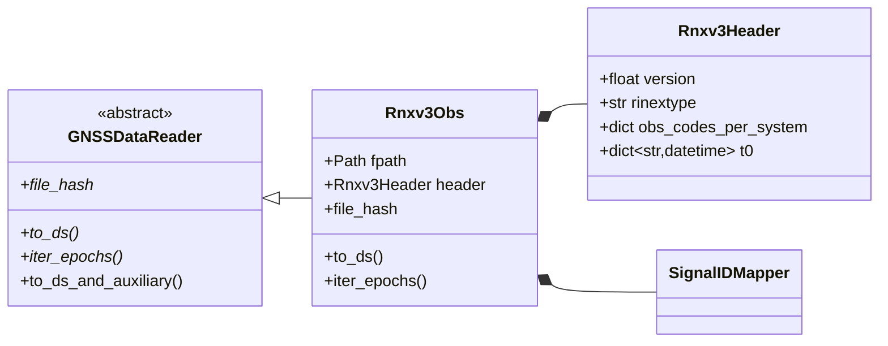

# RINEX v3.04 Parsing

`Rnxv3Obs` implements a full [RINEX v3.04](https://gssc.esa.int/navipedia/index.php/RINEX){:target="_blank"} observation file parser — from raw text to a validated `xarray.Dataset` in a single `to_ds()` call.

---

## File Structure

A RINEX v3 observation file has two sections separated by `END OF HEADER`:

```
+──────────────────────────────────────────────────+
│  HEADER SECTION                                   │
│  RINEX VERSION / TYPE          → 3.04, O          │
│  SYS / # / OBS TYPES           → G: S1C S2W …    │
│  TIME OF FIRST OBS             → 2024 001         │
│  INTERVAL                      → 30.000           │
+──────────────────────────────────────────────────+
│  DATA SECTION                                     │
│  > 2024 01 01 00 00 00.0000000  0  18             │  ← epoch marker
│    G01   41.050  …   22.123456  …                 │  ← observations
│    G03   40.112  …   21.987654  …                 │
│  > 2024 01 01 00 00 30.0000000  0  17             │
│    …                                              │
+──────────────────────────────────────────────────+
```

For RINEX 2.11 files see [RINEX v2.11 Parsing](rinex-v2-format.md).

Supported systems: [GPS](https://gssc.esa.int/navipedia/index.php/GPS){:target="_blank"} (G), [GLONASS](https://gssc.esa.int/navipedia/index.php/GLONASS){:target="_blank"} (R), [Galileo](https://gssc.esa.int/navipedia/index.php/Galileo){:target="_blank"} (E), [BeiDou](https://gssc.esa.int/navipedia/index.php/BeiDou){:target="_blank"} (C), [QZSS](https://gssc.esa.int/navipedia/index.php/QZSS){:target="_blank"} (J), [IRNSS](https://gssc.esa.int/navipedia/index.php/IRNSS){:target="_blank"} (I), [SBAS](https://gssc.esa.int/navipedia/index.php/SBAS){:target="_blank"} (S).

---

## Class Hierarchy



---

## Parsing Pipeline

### Step 1 — Initialization

```python
from pathlib import Path
from canvod.readers import Rnxv3Obs

reader = Rnxv3Obs(fpath=Path("station.24o"))
```

What happens on construction:

1. Pydantic validates that `fpath` exists.
2. The header section is parsed into `Rnxv3Header`; RINEX version (3.x),
   file type (`O`) and the observation type table
   (`SYS / # / OBS TYPES`) are validated.
3. The epoch completeness check runs (`completeness_mode`, default
   `"strict"`; `"warn"` or `"off"` to relax it, see below).
4. The whole file is read into memory and hashed (`file_hash`).

!!! warning "Sampling intervals the reader accepts"
    The completeness check infers the sampling interval from the epochs
    and accepts only 0.1, 0.2, 0.5, 1, 2, 5, 10, 15, 30 or 60 s, or 2, 5,
    10, 15, 30 or 60 min. A file sampled at any other interval (e.g. 3 s
    or 20 s) raises a `ValidationError` on construction, also in a run.
    `Rnxv3Obs(fpath=..., completeness_mode="off")` reads such a file in
    your own scripts; `canvodpy run` has no setting for it yet.

### Step 2 — Epoch Iteration

```python
for epoch in reader.iter_epochs():
    print(epoch.timestamp, epoch.num_satellites)
```

The generator scans the file's lines (already in memory) from `END OF HEADER`, yielding one validated `Rnxv3ObsEpochRecord` per `>` epoch marker; epochs that fail validation are skipped.

### Step 3 — Dataset Construction

```python
ds = reader.to_ds(keep_data_vars=["SNR", "Phase"])
```

The full pipeline:

=== "Collect + Index"

    ```python
    # Build the full SID index from header obs codes (sorted)
    mapper = SignalIDMapper()
    sorted_sids, sid_props = self._precompute_sids_from_header()
    ```

=== "Allocate + Fill"

    ```python
    # Pre-allocate the kept variables, fill value NaN (LLI/SSI: -1)
    arrays = _allocate_obs_arrays(n_epochs, len(sorted_sids), kept_vars)
    sid_to_idx = {sid: i for i, sid in enumerate(sorted_sids)}

    # Default parser: only epochs that pass the Pydantic models
    for t_idx, record in enumerate(self._iter_validated_epochs(rejected)):
        for sat in record.data:
            for (obs_type, sid_suffix), obs in zip(lut[sat.sv[0]], sat.observations):
                _store_observation(arrays, t_idx, sid_to_idx[sat.sv + sid_suffix],
                                   obs_type, obs.value, obs.lli, obs.ssi)
    ```

    The opt-in `parser="unvalidated_fast"` fills the same arrays by slicing
    fixed columns, without any validation (see the warning below).

=== "Build Coordinates"

    ```python
    # _assemble_dataset(): one coordinate per signal property,
    # precomputed from the header for every sid
    coords["sv"]   = ("sid", np.array(sid_prop("sv"), dtype=object), ...)
    coords["band"] = ("sid", np.array(sid_prop("band"), dtype=object), ...)
    for key in ("freq_center", "freq_min", "freq_max"):
        coords[key] = ("sid", np.asarray(sid_prop(key), dtype=np.float32), ...)
    ```

=== "Validate + Return"

    ```python
    ds = xr.Dataset(
        data_vars={"SNR": (("epoch", "sid"), snr_data, snr_meta), ...},
        coords=coords,
        attrs={**self._build_attrs()},   # Created, Software, Institution, File Hash
    )

    validate_dataset(ds, required_vars=keep_data_vars)
    return ds
    ```

---

## Pydantic Data Models

### Header Model

```python
class Rnxv3Header(BaseModel):   # rinex/v3_04.py
    model_config = ConfigDict(frozen=True, arbitrary_types_allowed=True, ...)

    version: float
    rinextype: str
    systems: str
    receiver_type: str
    approx_position: list[pint.Quantity]
    t0: dict[str, datetime]                      # TIME OF FIRST OBS
    obs_codes_per_system: dict[str, list[str]]   # system → observation codes
    signal_strength_unit: pint.Unit | str
    # ... more fields (see source for the full list)
```

### Epoch Record

Pydantic dataclasses in `gnss_specs/models.py`:

```python
class Rnxv3ObsEpochRecordLineModel:   # the "> ..." line
    year: int; month: int; day: int; hour: int; minute: int
    seconds: float
    epoch_flag: int
    num_satellites: int
    receiver_clock_offset: float | None = None

class Rnxv3ObsEpochRecord:
    info: Rnxv3ObsEpochRecordLineModel
    data: list[Satellite]   # must hold num_satellites satellites
```

### Observation and Satellite

```python
class Observation:
    obs_type: str | None
    value: float | None
    lli: int | None   # Loss of Lock Indicator
    ssi: int | None   # Signal Strength Indicator (1–9, 0 = unknown)

class Satellite:
    sv: str                          # e.g. "G01"
    observations: list[Observation]
```

---

## Signal ID Mapping

RINEX observation codes (`S1C`, `L2W`, `C5Q`, …) are mapped to the canonical Signal ID format `SV|BAND|CODE`:

| RINEX code | System | Band | Code | Signal ID |
|------------|--------|------|------|-----------|
| `S1C` on `G01` | GPS | L1 | C | `G01\|L1\|C` |
| `S5Q` on `E08` | Galileo | E5a | Q | `E08\|E5a\|Q` |
| `S2P` on `R05` | GLONASS | G2 | P | `R05\|G2\|P` |

### Constellation Band Mapping

```python
SignalIDMapper().SYSTEM_BANDS == {
    "G": {"1": "L1", "2": "L2", "5": "L5"},
    "R": {"1": "G1", "2": "G2", "3": "G3", "4": "G1a", "6": "G2a"},
    "E": {"1": "E1", "5": "E5a", "7": "E5b", "8": "E5", "6": "E6"},
    "C": {"2": "B1I", "1": "B1C", "5": "B2a", "7": "B2b", "8": "B2", "6": "B3I"},
    "J": {"1": "L1", "2": "L2", "5": "L5", "6": "L6"},
    "I": {"5": "L5", "9": "S"},
    "S": {"1": "L1", "5": "L5"},
}
```

### Satellites

Satellite numbers follow RINEX 3.04 section 8.4. SBAS satellites are `Snn` with `nn` = PRN − 100 (PRN 120 → `S20`, EGNOS PRN 148 → `S48`); the reader recognises `S01`–`S99`. The satellite lists of the other systems come from the [constellation models](satellite-catalog.md#integration-with-constellations).

---

## Loss of Lock and Signal Strength Indicators

Pseudorange, phase, Doppler, and SNR of one signal share one sid (`S1C`, `L1C`, `C1C`, `D1C` → `G01|L1|C`), but each observation field carries its own LLI and SSI digit. The reader stores one LLI and one SSI per sid, following RINEX 3.04 Table A3 notes 1–3:

- **LLI** is taken from the **phase** observation only ("should only be associated with the phase observation"). Flags on the other observables are ignored.
- **SSI** is taken from the **phase**; if the signal has no phase (e.g. `C1W`/`S1W`), from the **pseudorange**. SSI on Doppler or SNR fields is ignored.

The result does not depend on the order of observables in the header.

| LLI bit | Meaning (Table A3) |
|---|---|
| 0 | Lost lock between previous and current observation: cycle slip possible |
| 1 | Half-cycle ambiguity/slip possible |
| 2 | Galileo BOC tracking of an MBOC-modulated signal |

`-1` marks "no indicator written". Table A3 defines no further bits, so the `valid_range` of `LLI` is `[-1, 7]`. The RINEX 3 meaning of `LLI` and `SSI` is shared by all readers; the [RINEX 2 reader](rinex-v2-format.md#loss-of-lock-and-signal-strength-indicators) translates its bits.

## Signal strength unit

The unit of the `S` observations is declared by the optional `SIGNAL STRENGTH UNIT` header record (RINEX 3.04 sect. 5.7), which defines only `DBHZ`. With `DBHZ`, `SNR` is labelled as C/N0 in dB-Hz. Without it, the unit is not declared and `SNR` is labelled dB.

---

## Performance Notes

<div class="grid" markdown>

!!! tip "One read"
    The file is read once, on construction, and kept in memory as lines;
    `iter_epochs()` and `to_ds()` parse from there.

!!! tip "Pre-allocated arrays"
    `to_ds()` pre-allocates NumPy arrays with `np.full(..., np.nan)` before
    filling, avoiding repeated memory reallocation during the fill loop.

</div>

---

## Choosing the parser

`to_ds()` validates every epoch by default. The unvalidated fast parser
exists for users who have checked their files otherwise:

```python
ds = reader.to_ds()                              # validated (default)
ds = reader.to_ds(parser="unvalidated_fast")     # DANGEROUS, see below
```

`to_ds()` itself always defaults to `validated`; a run passes the
`processing.params.rinex_v3_parser` setting (default `validated`). The
stripped v3.05 reader uses the same parsers.

!!! danger "`unvalidated_fast` is your responsibility"

    The unvalidated parser does not check epochs, satellite IDs, satellite
    counts or observation fields. A corrupted record can enter the dataset
    as partial or wrong values. canVODpy takes no responsibility for its
    results; checking the input files is entirely up to you. Every use emits
    an `UnvalidatedParserWarning`. For a valid file both parsers give the
    identical dataset.

## Epoch time

Epochs are stored as written in the file, in the time system of its
`TIME OF FIRST OBS` header record (RINEX 3.04 Table A2: `GPS`, `GLO`, `GAL`,
`QZS`, `BDT`, `IRN`; a single-system file defaults to its own system). No
conversion to another time scale is made. The epoch coordinate records the
time scale in its `time_system` attribute; RINEX `GLO` is defined as UTC and
is recorded as `UTC`. Seconds keep the 100 ns resolution of the epoch
record's `F11.7` field.

## Error Handling

```python
from pydantic import ValidationError

# Construction errors: the header is invalid, or a mandatory record such as
# TIME OF FIRST OBS is missing or malformed
try:
    reader = Rnxv3Obs(fpath=path)
except (ValidationError, ValueError) as e:
    print(f"Invalid RINEX header: {e}")

# Data section: the validated parser drops epochs that fail validation and
# logs them ("rinex_epochs_rejected", with their line numbers). An epoch with
# an impossible date or time (e.g. month 13) rejects the whole file.
try:
    ds = reader.to_ds()
except ValueError as e:
    print(f"Invalid epoch date or time: {e}")
```

!!! info "Exception hierarchy"
    All reader-specific exceptions inherit from `RinexError`, allowing
    broad `except RinexError` handling when needed alongside specific
    sub-class recovery.

---

!!! example "Try it"
    [02 — RINEX v3 Observation Reading](../../notebooks/_build/02_rinex_reading.html){target=_blank}
    · [view source on molab](https://molab.marimo.io/github/nfb2021/canvodpy-demo/blob/main/02_rinex_reading.py)
