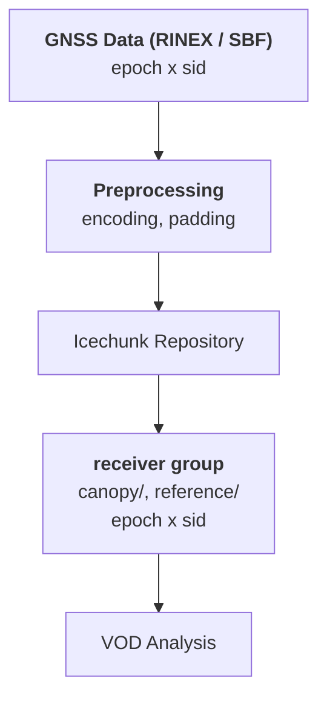

# canvod-store

## Purpose

The `canvod-store` package provides versioned storage management for GNSS vegetation optical depth data using **Icechunk** — a cloud-native transactional format for multidimensional arrays built on Zarr v3.

<div class="grid cards" markdown>

-   :fontawesome-solid-code-branch: &nbsp; **Git-like versioning**

    ---

    Every write produces an Icechunk snapshot with a hash-addressable ID.
    Roll back to any earlier state, audit every append, and reproduce any
    result published from the store.

-   :fontawesome-solid-cloud: &nbsp; **Cloud-native format**

    ---

    Icechunk supports S3-compatible object stores (AWS, MinIO, Cloudflare R2).
    canvod-store currently writes to local filesystem; the underlying library
    is cloud-ready.

-   :fontawesome-solid-gauge-high: &nbsp; **Chunked time-series access**

    ---

    Default chunks: `epoch: 17280, sid: -1` — one receiver-day (17280 epochs
    ≈ 24 h at 5 s sampling). Zstd compression, O(1) epoch-range reads.

-   :fontawesome-solid-fingerprint: &nbsp; **Three-layer deduplication**

    ---

    Hash, temporal overlap, and intra-batch guards prevent any data from
    being written twice — safe to re-run pipelines at any time.

</div>

---

## Why versioned storage?

**Zarr** is chunked, compressed N-dimensional array storage — cloud-native
and parallel-read-friendly. Think HDF5 without the file-locking.

**Icechunk** adds git-like version control on top of Zarr: every
`session.commit()` creates an immutable snapshot with a hash-addressable ID.
This gives the store three properties that matter for reproducible science:

- **ACID commits** — a write either fully lands or it doesn't. No
  half-written stores after a crash or interrupted ingest.
- **Reproducibility** — cite a snapshot ID in a paper and always recover
  the exact dataset state used for that analysis.
- **Auditability** — `store.get_ops_log()` shows what was written, when,
  and by whom; `store.plot_commit_graph()` visualises the full history.

---

## Architecture



---

## Core Components

=== "Storage Manager"

    ```python
    from canvod.store import create_rinex_store, create_vod_store

    # Create or open a RINEX observations store
    store = create_rinex_store(store_path)

    # Write a new group (first ingest for this receiver)
    store.write_initial_group(dataset, group_name="canopy")

    # Append subsequent days
    store.append_to_group(dataset, group_name="canopy")

    # Or let the store decide automatically
    store.write_or_append_group(dataset, group_name="canopy")
    ```

=== "Site Interface"

    ```python
    from canvodpy import Site

    site = Site("ExampleSite")
    site.rinex_store.list_groups()          # ["canopy_01", "reference_01"]
    site.rinex_store.get_group_info("canopy_01")

    # Read a group back as an xarray.Dataset
    ds = site.rinex_store.read_group("canopy_01")

    # Time-range selection is done with xarray after loading
    ds_subset = ds.sel(epoch=slice("2025-01-01", "2025-01-15"))
    ```

---

## Storage Layout

```
{store_root}/
└── {receiver_name}/            # e.g. "canopy", "reference"
    ├── SNR                     # Data variables (epoch × sid), at group root
    ├── Phase
    ├── Pseudorange
    ├── Doppler
    └── metadata/
        └── table               # Per-file ingest ledger (hash, start, end, path)
```

Variables are written directly at the receiver group root — there is no
intermediate `obs/` subgroup. The `metadata/table` sub-path holds the
per-file ingest registry used by the deduplication guardrails.

---

## Data Flow

1. **Ingest** — Raw GNSS data (RINEX via `Rnxv3Obs` or SBF via `SbfReader`) + ephemerides
2. **Preprocess** — Normalise encodings, pad to global SID, strip fill values
3. **Store observations** — Append to `{group}/` with three-layer deduplication
4. **Query** — Retrieve by time range, signal, or group name
5. **Analyse** — VOD calculation using stored observations and grid geometry

Writes are committed one snapshot per receiver-day, sequentially. Icechunk's
local-filesystem backend serialises commits, so parallel receiver processing
converges to a sequential write phase.

---

## Three-Layer Deduplication

Every ingest passes through three independent guards before a byte is
written:

| Layer | What it checks | Guard location |
|-------|----------------|----------------|
| **1. Hash match** | SHA-256 of the source file; identical file is always a no-op | `append_to_group()` internal check |
| **2. Temporal overlap** | A new file covering an already-ingested time range is rejected, even if renamed or re-split (catches daily-vs-sub-daily file overlap) | `_check_existing_with_temporal_overlap()` in orchestrator |
| **3. Intra-batch overlap** | Duplicate epochs within a single ingest batch are caught before the commit | `append_to_group()` batch validation |

All three layers must pass before `session.commit()` is called.

---

## Storage Format

| Property | Value |
| -------- | ----- |
| Backend format | Icechunk (Zarr v3) |
| Default chunks | `epoch: 17280`, `sid: -1` |
| Compression | Zstd level 3 |
| Storage backend | Local filesystem (Icechunk library supports S3) |
| Versioning | Git-like snapshots, hash-addressable |
| Deduplication | Three-layer: hash + temporal overlap + intra-batch |

---

## Versioning and History API

```python
# View ingest history
store.get_ops_log(limit=20)      # Returns list of dicts
store.print_ops_log(limit=50)    # Pretty-prints to console

# Visualise commit graph
store.plot_commit_graph()        # Wraps repo.ancestry_graph()

# Tag and compare snapshots
store.create_release_tag("v1.0", snapshot_id="abc123")
store.list_tags()
store.compare_snapshots(snapshot_id_1="abc123", snapshot_id_2="def456")
```

---

## CLI Quick Reference

`canvodpy store` wraps the Python API above for terminal use — inspecting a
site's store doesn't require dropping into Python or a notebook:

```bash
canvodpy store list                          # every configured site's gnss/vod store paths + status
canvodpy store info ExampleSite                  # tree of branches/groups + compression stats
canvodpy store info ExampleSite --group canopy_01   # full dataset + metadata table for one group
canvodpy store log ExampleSite                   # commit graph (wraps repo.ancestry_graph())
canvodpy store log ExampleSite --ops             # ops audit trail (wraps repo.ops_log())
```

`--store vod` targets the VOD store instead of the default GNSS observation
store; `--branch` selects a non-`main` branch for `info`/`log`.

---

## Store-Level Provenance

Rich DataCite 4.5 / ACDD 1.3 / STAC 1.1 metadata is stored as a root
Zarr attribute (`canvod_metadata`) and managed by the companion package.

[:octicons-arrow-right-24: canvod-store-metadata — provenance and FAIR compliance](../store-metadata/overview.md)

[:octicons-arrow-right-24: Icechunk storage details](icechunk.md)
